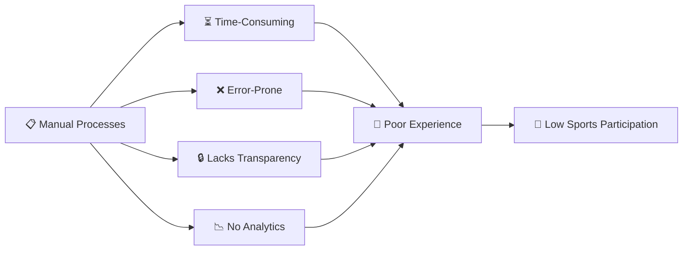
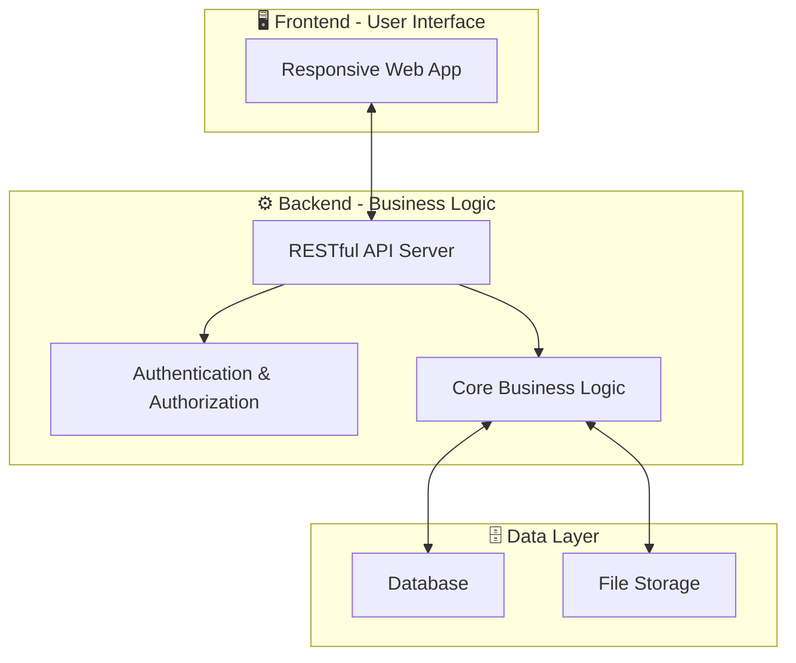
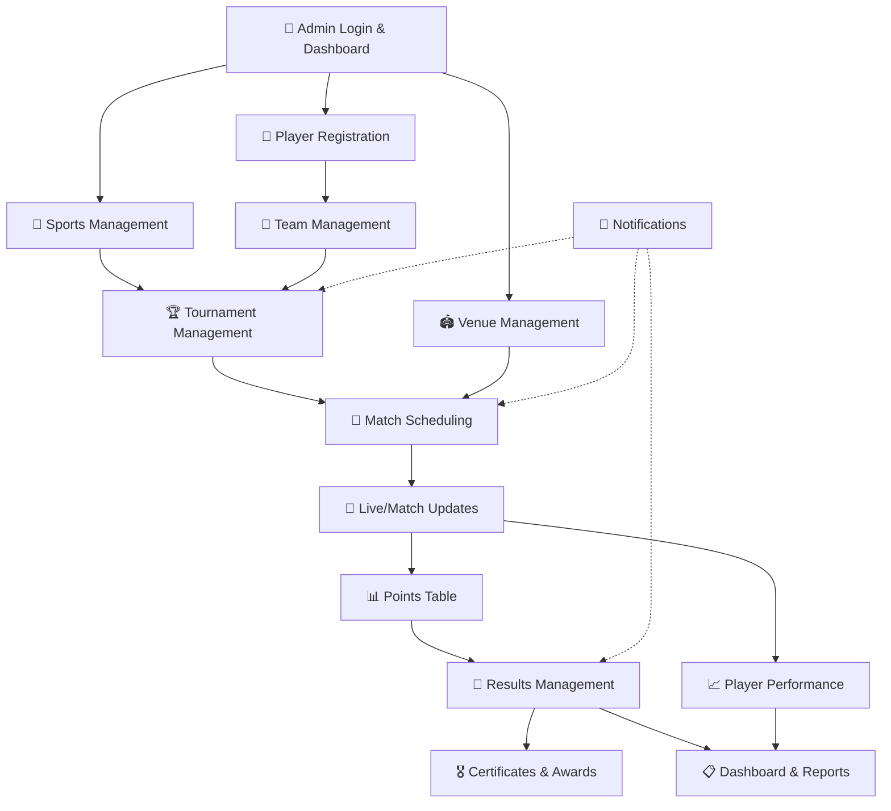
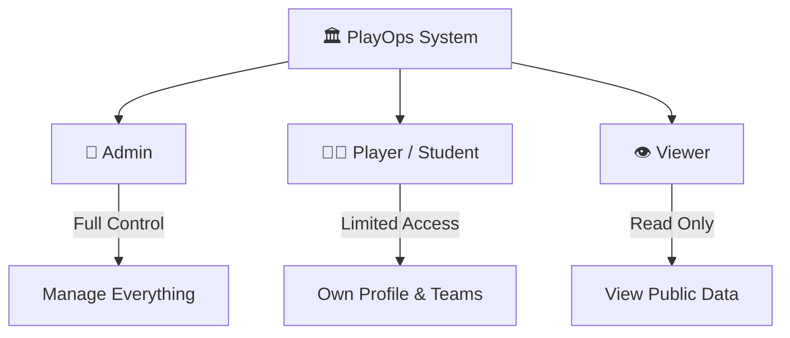
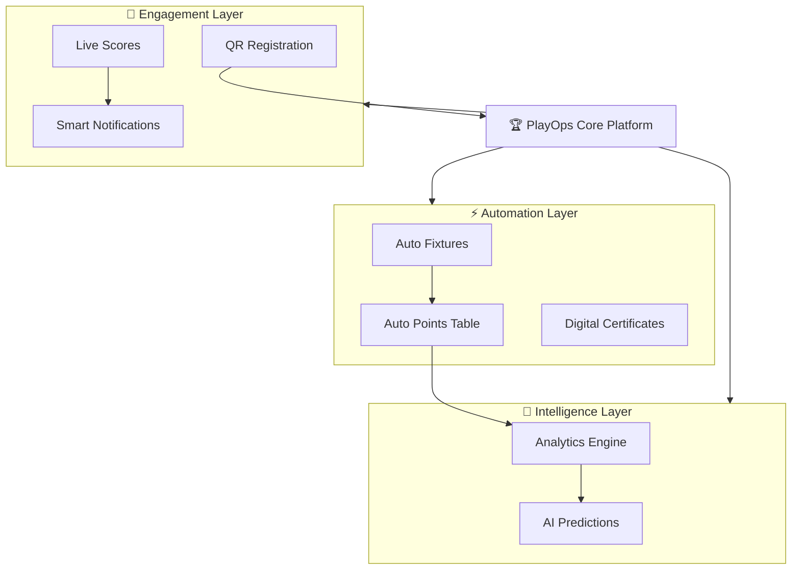
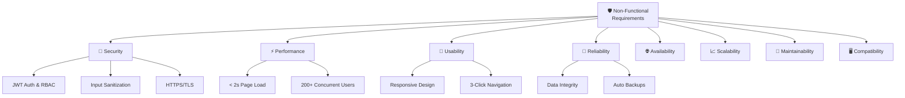

# 🏆 PlayOps — KK Wagh Sports Portal

> **A Full-Stack Digital Platform for College Sports Management**

---

## 📌 Table of Contents

- [Vision \& Mission](#-vision--mission)
- [Problem Statement](#-problem-statement)
- [Our Solution](#-our-solution---playops)
- [Core Modules](#-core-modules)
- [Project Flow](#-project-flow)
- [User Roles \& Permissions](#-user-roles--permissions)
- [Advanced / Smart Features](#-advanced--smart-features)
- [Non-Functional Requirements](#-non-functional-requirements)

---

## 🎯 Vision & Mission

### Vision

To become the **definitive digital sports management platform** for KK Wagh College of Engineering — transforming how sports activities are organized, tracked, and celebrated across the institution.

### Mission

- **Digitize** the entire sports lifecycle from player registration to certificate generation.
- **Empower** administrators with real-time data, analytics, and automation tools.
- **Engage** students through a transparent, accessible, and modern sports portal.
- **Eliminate** manual bottlenecks and bring professional-grade sports management to the campus.

> [!IMPORTANT]
> PlayOps is not just a record-keeping tool — it is a **complete sports ecosystem** designed to enhance participation, fairness, and operational excellence in college sports.

---

## ❗ Problem Statement

Managing sports activities manually in an educational institution introduces a cascade of operational challenges:

| # | Problem | Impact |
|---|---------|--------|
| 1 | **Paper-based registration** | Lost forms, duplicate entries, data inconsistency |
| 2 | **Manual team formation** | Tedious, error-prone, no validation of eligibility |
| 3 | **No centralized scheduling** | Venue clashes, time overlaps, poor communication |
| 4 | **Opaque score tracking** | Delayed results, disputes, lack of live updates |
| 5 | **No analytics or history** | Cannot track player performance across seasons |
| 6 | **Scattered notifications** | Students miss important announcements and deadlines |
| 7 | **Manual certificate generation** | Time-consuming, inconsistent formatting |
| 8 | **No reporting dashboard** | Administrators lack data-driven decision-making tools |

> [!CAUTION]
> Without a digital system, critical data like match results, player statistics, and tournament histories can be **permanently lost** — undermining institutional sports credibility.

---

## 💡 Our Solution — PlayOps

**PlayOps** is a modern, full-stack web portal that digitizes the **entire sports lifecycle** at KK Wagh College — from the moment a student registers as a player to the generation of achievement certificates.

### Key Highlights

- ✅ **End-to-end digitization** — No more paper forms or spreadsheets
- ✅ **Role-based access** — Secure, permission-driven interfaces
- ✅ **Real-time updates** — Live scores and instant notifications
- ✅ **Automated workflows** — Auto fixture generation, auto points tables
- ✅ **Rich analytics** — Dashboards, charts, and exportable reports
- ✅ **Modern UX** — Clean, responsive design accessible on any device

---

## 🧩 Core Modules

PlayOps is composed of **14 tightly integrated modules**, each handling a specific domain of sports management:

### Module Overview

| # | Module | Description | Key Capabilities |
|---|--------|-------------|------------------|
| 1 | **Admin Login & Dashboard** | Secure admin portal with centralized control panel | JWT authentication, role-based dashboards, system health overview |
| 2 | **Student/Player Registration** | Digital onboarding of players with profile management | Form-based & QR registration, eligibility validation, profile photos |
| 3 | **Team Management** | Create, manage, and organize teams across sports | Team creation, captain assignment, roster management, team limits |
| 4 | **Sports Management** | Define and configure all sports offered by the institution | Add/edit sports, set rules, define formats (team/individual), categories |
| 5 | **Tournament Management** | Plan and administer tournaments end-to-end | Tournament creation, format selection (league/knockout/group), season management |
| 6 | **Match Scheduling** | Schedule matches with venue and time allocation | Auto/manual scheduling, conflict detection, calendar view, rescheduling |
| 7 | **Live/Match Updates** | Real-time score tracking during active matches | Live score entry, set/half/quarter tracking, commentary, status updates |
| 8 | **Points Table** | Automated standings and rankings | Auto-calculated tables, tiebreaker rules, group-wise standings |
| 9 | **Results Management** | Finalize and publish match and tournament results | Result declaration, winner/runner-up records, historical archives |
| 10 | **Notifications** | Multi-channel alerts and announcements | In-app notifications, email alerts, schedule reminders, announcements |
| 11 | **Venue Management** | Manage sports facilities and grounds | Venue listing, availability tracking, capacity info, conflict prevention |
| 12 | **Player Performance** | Track individual player stats and achievements | Per-match stats, aggregated performance, leaderboards, comparison |
| 13 | **Certificates & Awards** | Generate digital certificates and recognize achievements | Auto-generated certificates, award categories, digital download |
| 14 | **Dashboard & Reports** | Data visualization and exportable reports | Charts, graphs, season summaries, participation reports, PDF/Excel export |

### Module Relationship Diagram

> [!NOTE]
> Dotted lines (-.->)  indicate **event-driven connections** — notifications are triggered automatically when key events occur in scheduling, results, and tournaments.

---

## 🔄 Project Flow

The following diagram illustrates the **end-to-end lifecycle** of a sports event in PlayOps — from the initial player registration through to final reports:

```mermaid
flowchart LR
    A["🧑 Player\nRegistration"] --> B["👥 Team\nFormation"]
    B --> C["🏆 Tournament\nCreation"]
    C --> D["📅 Match\nScheduling"]
    D --> E["📡 Score\nUpdate"]
    E --> F["📊 Points\nTable"]
    F --> G["🏅 Results\nDeclaration"]
    G --> H["📋 Reports &\nCertificates"]

    style A fill:#4CAF50,stroke:#333,color:#fff
    style B fill:#2196F3,stroke:#333,color:#fff
    style C fill:#FF9800,stroke:#333,color:#fff
    style D fill:#9C27B0,stroke:#333,color:#fff
    style E fill:#F44336,stroke:#333,color:#fff
    style F fill:#00BCD4,stroke:#333,color:#fff
    style G fill:#FFC107,stroke:#333,color:#000
    style H fill:#607D8B,stroke:#333,color:#fff
```

### Flow Description

| Stage | Action | Outcome |
|-------|--------|---------|
| **1. Player Registration** | Students register with profile details, sport preferences | Verified player profiles in the system |
| **2. Team Formation** | Players are grouped into teams with assigned captains | Ready-to-compete teams with validated rosters |
| **3. Tournament Creation** | Admin creates tournaments, selects format and rules | Published tournament with open registration |
| **4. Match Scheduling** | Fixtures are generated (auto or manual) with venue/time slots | Complete match calendar with no conflicts |
| **5. Score Update** | Live scores are entered during matches in real-time | Up-to-the-minute standings and match status |
| **6. Points Table** | System auto-calculates standings based on results | Transparent, accurate rankings |
| **7. Results Declaration** | Final results are published for all matches/tournaments | Official winners, runners-up, and records |
| **8. Reports & Certificates** | Dashboards updated, certificates generated | Actionable insights and player recognition |

---

## 👥 User Roles & Permissions

PlayOps implements a **role-based access control (RBAC)** system with three distinct user roles:

### Permissions Matrix

| Permission / Feature | 🔑 Admin | 🧑‍🎓 Player/Student | 👁️ Viewer |
|---|:---:|:---:|:---:|
| **Login & Authentication** | ✅ | ✅ | ❌ (public access) |
| **View Dashboard** | ✅ Full | ✅ Personal | ✅ Public stats |
| **Register Players** | ✅ Manage all | ✅ Self-register | ❌ |
| **Create/Edit Teams** | ✅ | ✅ Own team | ❌ |
| **Manage Sports** | ✅ | ❌ | ❌ |
| **Create Tournaments** | ✅ | ❌ | ❌ |
| **Schedule Matches** | ✅ | ❌ | ❌ |
| **Update Live Scores** | ✅ | ❌ | ❌ |
| **View Points Table** | ✅ | ✅ | ✅ |
| **View Match Results** | ✅ | ✅ | ✅ |
| **Manage Venues** | ✅ | ❌ | ❌ |
| **View Player Performance** | ✅ All players | ✅ Own stats | ✅ Public stats |
| **Generate Certificates** | ✅ | ❌ | ❌ |
| **Download Certificates** | ✅ | ✅ Own | ❌ |
| **View/Export Reports** | ✅ | ❌ | ❌ |
| **Send Notifications** | ✅ | ❌ | ❌ |
| **Receive Notifications** | ✅ | ✅ | ❌ |
| **Manage System Settings** | ✅ | ❌ | ❌ |

> [!TIP]
> The **Viewer** role requires no authentication — anyone with the portal link can view public match schedules, results, and points tables. This maximizes sports visibility across the campus.

---

## 🚀 Advanced / Smart Features

PlayOps goes beyond basic CRUD operations with intelligent, automation-driven features:

### Feature Catalog

| # | Feature | Description | Benefit |
|---|---------|-------------|---------|
| 1 | **📱 QR Code Registration** | Generate unique QR codes for quick player check-in at events | Eliminates manual attendance, speeds up registration by 10x |
| 2 | **⚙️ Auto Fixture Generation** | Automatically generate match schedules based on tournament format | Saves hours of manual scheduling, ensures fairness |
| 3 | **📊 Auto Points Table** | Real-time, auto-calculated standings after every match result | Zero manual calculation, instant transparency |
| 4 | **📡 Live Score Updates** | Real-time score broadcasting during active matches | Keeps the entire campus engaged and informed |
| 5 | **📈 Analytics Dashboard** | Visual charts, graphs, and trend analysis for all sports data | Data-driven decisions for sports committee |
| 6 | **🔔 Smart Notifications** | Context-aware alerts for upcoming matches, results, and deadlines | No student misses important events |
| 7 | **🎖️ Digital Certificates** | Auto-generated, branded participation and achievement certificates | Instant recognition, no manual design work |
| 8 | **🤖 AI-Powered Predictions** | Machine learning-based match outcome and performance predictions | Adds excitement, identifies talent trends |

### Smart Feature Integration

> [!NOTE]
> AI-Powered Predictions is planned as a **future enhancement** and may leverage historical match data to forecast outcomes and identify standout players using machine learning models.

---

## 🛡️ Non-Functional Requirements

PlayOps is designed to meet enterprise-grade quality attributes:

### NFR Summary

| Category | Requirement | Target / Standard |
|----------|-------------|-------------------|
| 🔐 **Security** | Authentication & authorization for all protected routes | JWT-based auth, bcrypt password hashing, RBAC enforcement |
| | Input validation and sanitization | Protection against SQL injection, XSS, CSRF attacks |
| | Secure data transmission | HTTPS/TLS encryption for all communications |
| | Session management | Token expiry, refresh tokens, secure cookie handling |
| ⚡ **Performance** | Page load time | < 2 seconds for all primary pages |
| | API response time | < 500ms for standard queries, < 1s for complex reports |
| | Concurrent users | Support 200+ simultaneous users without degradation |
| 🎨 **Usability** | Responsive design | Fully functional on desktop, tablet, and mobile devices |
| | Accessibility | WCAG 2.1 AA compliance for core workflows |
| | Intuitive navigation | Maximum 3 clicks to reach any feature |
| | Consistent UI | Unified design language across all modules |
| 🔄 **Reliability** | Data integrity | Transactional operations with rollback support |
| | Error handling | Graceful error messages, no system crashes on invalid input |
| | Data backup | Regular automated backups with recovery procedures |
| 🌐 **Availability** | Uptime target | 99.5% availability during academic hours |
| | Graceful degradation | Core features remain accessible during partial outages |
| 📈 **Scalability** | Horizontal scaling | Architecture supports adding more server instances |
| | Database optimization | Indexed queries, pagination, and caching strategies |
| | Modular design | New modules can be added without affecting existing ones |
| 🔧 **Maintainability** | Code quality | Modular, well-documented, and lint-compliant codebase |
| | Version control | Git-based workflow with branching strategy |
| | Deployment | CI/CD pipeline for automated testing and deployment |
| 🖥️ **Compatibility** | Browser support | Chrome, Firefox, Edge, Safari (latest 2 versions) |
| | Device support | Desktop, laptop, tablet, and smartphone |
| | API standards | RESTful API design following OpenAPI specification |

> [!WARNING]
> All security measures listed above are **mandatory requirements** — not optional enhancements. Any deployment without proper authentication, input validation, and encryption is considered non-compliant.

---

**PlayOps — KK Wagh Sports Portal** · Built with ❤️ for KK Wagh College of Engineering

*Transforming Campus Sports, One Match at a Time*

