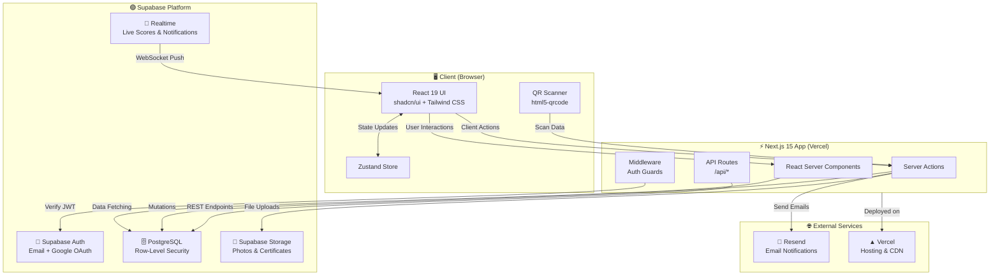
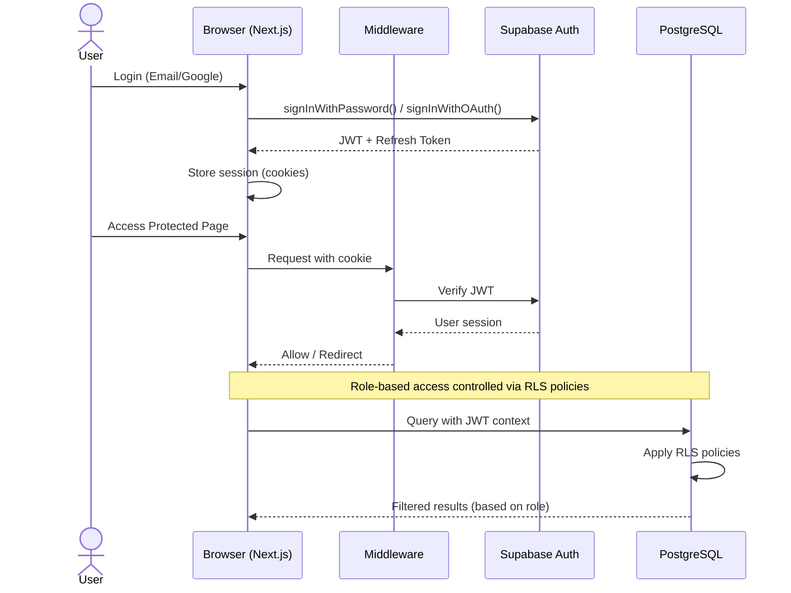
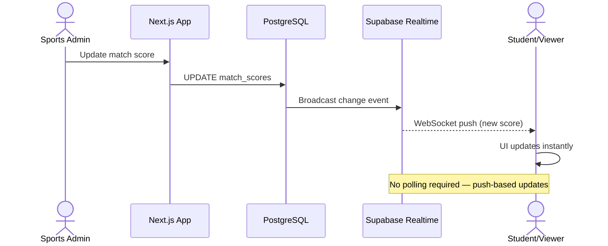
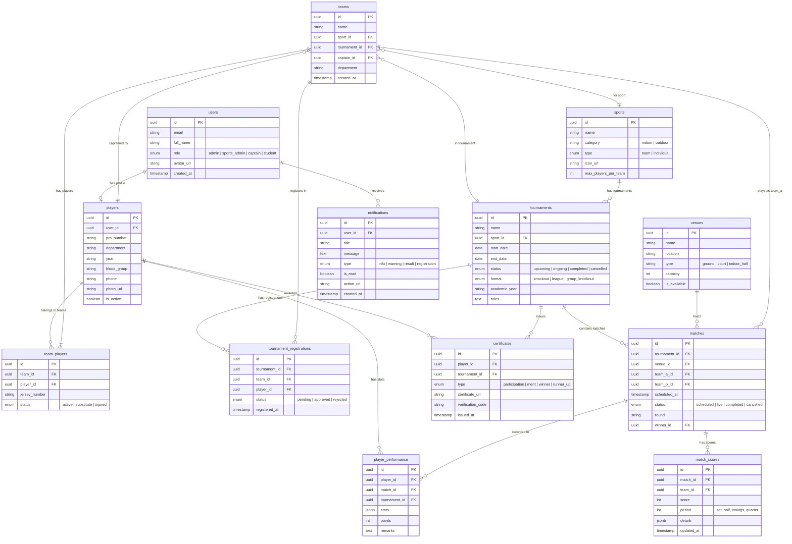
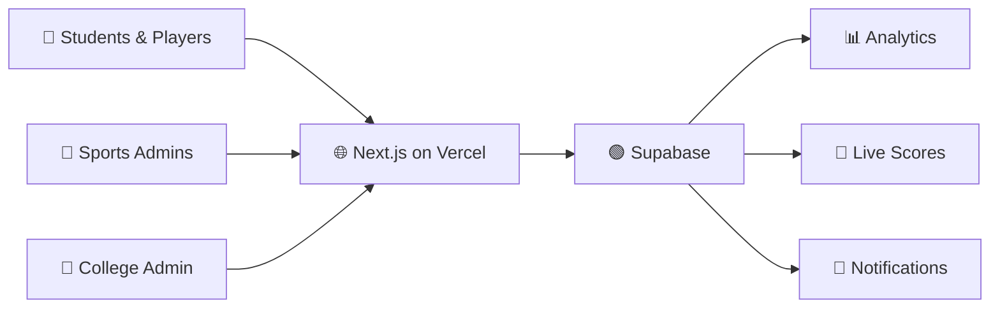

# 📐 PlayOps — Technology Stack & Architecture

> **Project:** PlayOps — KK Wagh Sports Portal  
> **Document:** Technology Stack & System Architecture  
> **Version:** 1.0  
> **Last Updated:** October 2026

---

## Table of Contents

- [1. Recommended Tech Stack](#1-recommended-tech-stack)
- [2. System Architecture](#2-system-architecture)
- [3. Database Architecture](#3-database-architecture)
- [4. API Design](#4-api-design)
- [5. Folder Structure](#5-folder-structure)
- [6. Why This Stack](#6-why-this-stack)

---

## 1. Recommended Tech Stack

| Layer                  | Technology                          | Version / Details                                      |
| ---------------------- | ----------------------------------- | ------------------------------------------------------ |
| **Frontend Framework** | Next.js (App Router)                | v15 — Server Components, Streaming, Parallel Routes    |
| **UI Library**         | React                               | v19 — Concurrent features, `use()` hook, Server Actions|
| **Language**           | TypeScript                          | v5.x — Strict mode enabled                             |
| **Styling**            | Tailwind CSS                        | v3.4+ — Utility-first, JIT compiler                    |
| **Component Library**  | shadcn/ui                           | Radix UI primitives + Tailwind, fully customizable      |
| **Backend**            | Next.js API Routes / Server Actions | Co-located with frontend, edge-ready                   |
| **Database**           | Supabase (PostgreSQL)               | Managed Postgres 15+, Row-Level Security (RLS)         |
| **Authentication**     | Supabase Auth                       | Email/Password + Google OAuth 2.0                      |
| **File Storage**       | Supabase Storage                    | Player photos, certificates, team logos                 |
| **Real-time**          | Supabase Realtime                   | WebSocket-based live score & notification updates       |
| **Email Notifications**| Resend                              | Transactional emails (registration, results, alerts)   |
| **In-app Notifications**| Custom (Supabase Realtime)         | Bell icon notifications with read/unread state          |
| **State Management**   | Zustand + React Context             | Zustand for global state, Context for scoped state      |
| **Charts & Analytics** | Recharts                            | Composable chart components for dashboards              |
| **QR Code**            | qrcode.react + html5-qrcode        | Generation (React) + Scanning (Camera API)              |
| **PDF Generation**     | @react-pdf/renderer                 | Participation & merit certificates                      |
| **Testing**            | Vitest + Playwright                 | Unit/integration (Vitest) + E2E (Playwright)            |
| **Deployment**         | Vercel                              | Edge network, preview deployments, analytics            |
| **Package Manager**    | pnpm                                | Fast, disk-efficient                                    |
| **Linting & Formatting**| ESLint + Prettier                  | Consistent code quality                                 |

> [!TIP]
> All dependencies in this stack are open-source and production-proven. Supabase provides a generous free tier that covers development and early production needs, making it ideal for an institutional project.

---

## 2. System Architecture

### 2.1 High-Level Architecture



### 2.2 Authentication Flow



### 2.3 Real-time Score Update Flow



---

## 3. Database Architecture

### 3.1 Key Tables Overview

| Table                       | Purpose                                       | Key Relationships                          |
| --------------------------- | --------------------------------------------- | ------------------------------------------ |
| `users`                     | All system users with roles                   | Base table for auth                        |
| `players`                   | Student athlete profiles                      | Belongs to `users`                         |
| `teams`                     | Team definitions per sport/tournament         | Has many `team_players`                    |
| `team_players`              | Junction: players assigned to teams           | Links `teams` ↔ `players`                  |
| `sports`                    | Sport catalog (Cricket, Football, etc.)       | Has many `tournaments`                     |
| `tournaments`               | Tournament/event definitions                  | Belongs to `sports`                        |
| `tournament_registrations`  | Team or individual registrations              | Links `tournaments` ↔ `teams`/`players`    |
| `matches`                   | Scheduled matches within tournaments          | Belongs to `tournaments`, uses `venues`    |
| `match_scores`              | Score records, set-by-set or live             | Belongs to `matches`                       |
| `venues`                    | Ground/court locations                        | Referenced by `matches`                    |
| `notifications`             | In-app notification queue                     | Belongs to `users`                         |
| `player_performance`        | Individual stats (goals, runs, points, etc.)  | Links `players` ↔ `matches`               |
| `certificates`              | Generated certificate records                 | Links `players` ↔ `tournaments`           |

### 3.2 Entity-Relationship Diagram



### 3.3 Row-Level Security (RLS) Strategy

| Policy                     | Table(s)                    | Rule                                                      |
| -------------------------- | --------------------------- | --------------------------------------------------------- |
| **Public Read**            | `sports`, `tournaments`, `matches`, `venues` | Anyone can read                                |
| **Authenticated Read**     | `players`, `teams`, `match_scores`           | Logged-in users can read                       |
| **Self-only Write**        | `players`, `notifications`                   | Users can only modify their own records        |
| **Captain Write**          | `teams`, `team_players`, `tournament_registrations` | Captains manage their own teams          |
| **Admin Full Access**      | All tables                                   | `admin` and `sports_admin` roles have full CRUD|
| **Score Update**           | `match_scores`                               | Only `sports_admin` can update live scores     |

> [!IMPORTANT]
> Row-Level Security must be enabled on **every table** in Supabase. Policies should be defined before any data is inserted. This is the primary authorization mechanism — the application layer should not be the sole gatekeeper.

---

## 4. API Design

All API endpoints follow RESTful conventions. Server Actions are preferred for mutations from the UI; API Routes are provided for programmatic/external access.

### 4.1 Authentication

| Method | Endpoint              | Description                    | Auth Required |
| ------ | --------------------- | ------------------------------ | ------------- |
| POST   | `/api/auth/signup`    | Register new user              | No            |
| POST   | `/api/auth/login`     | Email/password login           | No            |
| POST   | `/api/auth/oauth`     | Google OAuth redirect          | No            |
| POST   | `/api/auth/logout`    | End session                    | Yes           |
| GET    | `/api/auth/me`        | Get current user profile       | Yes           |
| PATCH  | `/api/auth/me`        | Update profile                 | Yes           |

### 4.2 Players

| Method | Endpoint                      | Description                     | Auth / Role          |
| ------ | ----------------------------- | ------------------------------- | -------------------- |
| GET    | `/api/players`                | List all players (filterable)   | Authenticated        |
| GET    | `/api/players/:id`            | Get player details              | Authenticated        |
| POST   | `/api/players`                | Create player profile           | Self                 |
| PATCH  | `/api/players/:id`            | Update player profile           | Self / Admin         |
| GET    | `/api/players/:id/stats`      | Get player performance stats    | Authenticated        |
| GET    | `/api/players/:id/certificates` | List player certificates      | Self / Admin         |

### 4.3 Sports

| Method | Endpoint                      | Description                     | Auth / Role          |
| ------ | ----------------------------- | ------------------------------- | -------------------- |
| GET    | `/api/sports`                 | List all sports                 | Public               |
| GET    | `/api/sports/:id`             | Get sport details               | Public               |
| POST   | `/api/sports`                 | Add a new sport                 | Admin                |
| PATCH  | `/api/sports/:id`             | Update sport                    | Admin                |
| DELETE | `/api/sports/:id`             | Remove sport                    | Admin                |

### 4.4 Tournaments

| Method | Endpoint                                  | Description                       | Auth / Role       |
| ------ | ----------------------------------------- | --------------------------------- | ----------------- |
| GET    | `/api/tournaments`                        | List tournaments (filter by status, sport) | Public   |
| GET    | `/api/tournaments/:id`                    | Get tournament details + schedule | Public            |
| POST   | `/api/tournaments`                        | Create tournament                 | Sports Admin      |
| PATCH  | `/api/tournaments/:id`                    | Update tournament                 | Sports Admin      |
| DELETE | `/api/tournaments/:id`                    | Cancel/delete tournament          | Admin             |
| GET    | `/api/tournaments/:id/registrations`      | List registrations                | Sports Admin      |
| POST   | `/api/tournaments/:id/registrations`      | Register team/player              | Captain / Student  |
| PATCH  | `/api/tournaments/:id/registrations/:rid` | Approve/reject registration       | Sports Admin      |
| GET    | `/api/tournaments/:id/bracket`            | Get tournament bracket            | Public            |

### 4.5 Teams

| Method | Endpoint                          | Description                        | Auth / Role       |
| ------ | --------------------------------- | ---------------------------------- | ----------------- |
| GET    | `/api/teams`                      | List teams (filter by sport, dept) | Authenticated     |
| GET    | `/api/teams/:id`                  | Get team details + roster          | Authenticated     |
| POST   | `/api/teams`                      | Create a team                      | Captain           |
| PATCH  | `/api/teams/:id`                  | Update team details                | Captain / Admin   |
| POST   | `/api/teams/:id/players`          | Add player to team                 | Captain           |
| DELETE | `/api/teams/:id/players/:pid`     | Remove player from team            | Captain / Admin   |

### 4.6 Matches & Scores

| Method | Endpoint                          | Description                        | Auth / Role       |
| ------ | --------------------------------- | ---------------------------------- | ----------------- |
| GET    | `/api/matches`                    | List matches (filter by date, tournament) | Public    |
| GET    | `/api/matches/:id`                | Get match details + scores         | Public            |
| POST   | `/api/matches`                    | Schedule a match                   | Sports Admin      |
| PATCH  | `/api/matches/:id`                | Update match details               | Sports Admin      |
| POST   | `/api/matches/:id/scores`         | Submit/update score                | Sports Admin      |
| GET    | `/api/matches/:id/scores/live`    | SSE stream for live scores         | Public            |
| POST   | `/api/matches/:id/performance`    | Record player performance          | Sports Admin      |

### 4.7 Venues

| Method | Endpoint             | Description                  | Auth / Role    |
| ------ | -------------------- | ---------------------------- | -------------- |
| GET    | `/api/venues`        | List all venues              | Public         |
| GET    | `/api/venues/:id`    | Get venue details            | Public         |
| POST   | `/api/venues`        | Add venue                    | Admin          |
| PATCH  | `/api/venues/:id`    | Update venue                 | Admin          |
| DELETE | `/api/venues/:id`    | Remove venue                 | Admin          |

### 4.8 Notifications

| Method | Endpoint                       | Description                      | Auth / Role    |
| ------ | ------------------------------ | -------------------------------- | -------------- |
| GET    | `/api/notifications`           | Get user's notifications         | Self           |
| PATCH  | `/api/notifications/:id/read`  | Mark notification as read        | Self           |
| POST   | `/api/notifications/read-all`  | Mark all as read                 | Self           |
| POST   | `/api/notifications/send`      | Send notification (broadcast)    | Admin          |

### 4.9 Certificates & QR

| Method | Endpoint                           | Description                        | Auth / Role    |
| ------ | ---------------------------------- | ---------------------------------- | -------------- |
| POST   | `/api/certificates/generate`       | Generate certificates for tournament | Sports Admin |
| GET    | `/api/certificates/:code/verify`   | Verify certificate via QR code     | Public         |
| GET    | `/api/certificates/:id/download`   | Download certificate PDF           | Self / Admin   |

### 4.10 Analytics & Dashboard

| Method | Endpoint                          | Description                          | Auth / Role    |
| ------ | --------------------------------- | ------------------------------------ | -------------- |
| GET    | `/api/analytics/dashboard`        | Admin dashboard summary stats        | Admin          |
| GET    | `/api/analytics/sports/:id/stats` | Sport-wise participation analytics   | Admin          |
| GET    | `/api/analytics/departments`      | Department-wise participation        | Admin          |
| GET    | `/api/analytics/players/top`      | Top performers across tournaments    | Authenticated  |

---

## 5. Folder Structure

```
playops/
├── public/
│   ├── images/                     # Static images, logos
│   ├── icons/                      # Favicon, PWA icons
│   └── manifest.json
│
├── src/
│   ├── app/                        # Next.js App Router
│   │   ├── (auth)/                 # Auth route group (no layout chrome)
│   │   │   ├── login/
│   │   │   │   └── page.tsx
│   │   │   ├── signup/
│   │   │   │   └── page.tsx
│   │   │   └── layout.tsx
│   │   │
│   │   ├── (dashboard)/            # Protected route group
│   │   │   ├── dashboard/
│   │   │   │   └── page.tsx        # Role-based dashboard home
│   │   │   ├── sports/
│   │   │   │   ├── page.tsx        # Sports listing
│   │   │   │   └── [id]/
│   │   │   │       └── page.tsx    # Sport detail
│   │   │   ├── tournaments/
│   │   │   │   ├── page.tsx        # Tournament listing
│   │   │   │   ├── [id]/
│   │   │   │   │   ├── page.tsx    # Tournament detail
│   │   │   │   │   ├── bracket/
│   │   │   │   │   │   └── page.tsx
│   │   │   │   │   └── register/
│   │   │   │   │       └── page.tsx
│   │   │   │   └── create/
│   │   │   │       └── page.tsx
│   │   │   ├── matches/
│   │   │   │   ├── page.tsx        # Match schedule
│   │   │   │   ├── [id]/
│   │   │   │   │   └── page.tsx    # Match detail + live score
│   │   │   │   └── live/
│   │   │   │       └── page.tsx    # All live matches
│   │   │   ├── teams/
│   │   │   │   ├── page.tsx
│   │   │   │   ├── [id]/
│   │   │   │   │   └── page.tsx
│   │   │   │   └── create/
│   │   │   │       └── page.tsx
│   │   │   ├── players/
│   │   │   │   ├── page.tsx
│   │   │   │   └── [id]/
│   │   │   │       └── page.tsx    # Player profile + stats
│   │   │   ├── venues/
│   │   │   │   └── page.tsx
│   │   │   ├── certificates/
│   │   │   │   └── page.tsx
│   │   │   ├── notifications/
│   │   │   │   └── page.tsx
│   │   │   ├── analytics/
│   │   │   │   └── page.tsx        # Admin analytics dashboard
│   │   │   ├── settings/
│   │   │   │   └── page.tsx
│   │   │   └── layout.tsx          # Dashboard shell (sidebar, topbar)
│   │   │
│   │   ├── api/                    # API Route Handlers
│   │   │   ├── auth/
│   │   │   │   └── [...supabase]/
│   │   │   │       └── route.ts
│   │   │   ├── players/
│   │   │   │   └── route.ts
│   │   │   ├── tournaments/
│   │   │   │   └── route.ts
│   │   │   ├── matches/
│   │   │   │   └── route.ts
│   │   │   ├── certificates/
│   │   │   │   └── route.ts
│   │   │   ├── notifications/
│   │   │   │   └── route.ts
│   │   │   └── analytics/
│   │   │       └── route.ts
│   │   │
│   │   ├── verify/                 # Public certificate verification
│   │   │   └── [code]/
│   │   │       └── page.tsx
│   │   │
│   │   ├── layout.tsx              # Root layout
│   │   ├── page.tsx                # Landing page
│   │   ├── loading.tsx             # Global loading UI
│   │   ├── error.tsx               # Global error boundary
│   │   ├── not-found.tsx           # 404 page
│   │   └── globals.css
│   │
│   ├── components/
│   │   ├── ui/                     # shadcn/ui components
│   │   │   ├── button.tsx
│   │   │   ├── card.tsx
│   │   │   ├── dialog.tsx
│   │   │   ├── data-table.tsx
│   │   │   ├── badge.tsx
│   │   │   └── ...
│   │   ├── layout/                 # Layout components
│   │   │   ├── sidebar.tsx
│   │   │   ├── topbar.tsx
│   │   │   ├── footer.tsx
│   │   │   └── mobile-nav.tsx
│   │   ├── forms/                  # Form components
│   │   │   ├── player-form.tsx
│   │   │   ├── team-form.tsx
│   │   │   ├── tournament-form.tsx
│   │   │   └── score-form.tsx
│   │   ├── cards/                  # Display cards
│   │   │   ├── match-card.tsx
│   │   │   ├── tournament-card.tsx
│   │   │   ├── player-card.tsx
│   │   │   └── stat-card.tsx
│   │   ├── charts/                 # Analytics charts
│   │   │   ├── participation-chart.tsx
│   │   │   ├── department-chart.tsx
│   │   │   └── performance-chart.tsx
│   │   ├── live/                   # Real-time components
│   │   │   ├── live-score.tsx
│   │   │   └── score-ticker.tsx
│   │   ├── certificates/
│   │   │   ├── certificate-template.tsx
│   │   │   └── qr-scanner.tsx
│   │   └── shared/                 # Shared/common components
│   │       ├── avatar.tsx
│   │       ├── role-badge.tsx
│   │       ├── empty-state.tsx
│   │       └── confirm-dialog.tsx
│   │
│   ├── lib/                        # Core utilities
│   │   ├── supabase/
│   │   │   ├── client.ts           # Browser Supabase client
│   │   │   ├── server.ts           # Server Supabase client
│   │   │   ├── admin.ts            # Service-role client (server only)
│   │   │   └── middleware.ts       # Auth middleware helper
│   │   ├── utils.ts                # General utilities (cn, formatDate, etc.)
│   │   ├── constants.ts            # App-wide constants
│   │   └── validations.ts          # Zod schemas for forms & API
│   │
│   ├── actions/                    # Server Actions
│   │   ├── auth.ts
│   │   ├── players.ts
│   │   ├── teams.ts
│   │   ├── tournaments.ts
│   │   ├── matches.ts
│   │   ├── scores.ts
│   │   ├── certificates.ts
│   │   └── notifications.ts
│   │
│   ├── hooks/                      # Custom React hooks
│   │   ├── use-user.ts
│   │   ├── use-realtime.ts
│   │   ├── use-notifications.ts
│   │   └── use-debounce.ts
│   │
│   ├── stores/                     # Zustand stores
│   │   ├── auth-store.ts
│   │   ├── notification-store.ts
│   │   └── live-score-store.ts
│   │
│   ├── types/                      # TypeScript type definitions
│   │   ├── database.ts             # Supabase generated types
│   │   ├── api.ts                  # API request/response types
│   │   └── index.ts                # Shared app types
│   │
│   └── middleware.ts               # Next.js middleware (auth guard)
│
├── supabase/
│   ├── migrations/                 # SQL migrations
│   │   ├── 001_create_users.sql
│   │   ├── 002_create_sports.sql
│   │   ├── 003_create_tournaments.sql
│   │   ├── 004_create_teams.sql
│   │   ├── 005_create_matches.sql
│   │   └── ...
│   ├── seed.sql                    # Seed data
│   └── config.toml                 # Supabase local config
│
├── tests/
│   ├── unit/                       # Vitest unit tests
│   │   ├── utils.test.ts
│   │   └── validations.test.ts
│   ├── integration/                # Vitest integration tests
│   │   ├── auth.test.ts
│   │   └── tournaments.test.ts
│   └── e2e/                        # Playwright E2E tests
│       ├── login.spec.ts
│       ├── tournament-flow.spec.ts
│       └── live-score.spec.ts
│
├── .env.local                      # Local environment variables
├── .env.example                    # Environment template
├── next.config.ts                  # Next.js configuration
├── tailwind.config.ts              # Tailwind configuration
├── tsconfig.json                   # TypeScript configuration
├── vitest.config.ts                # Vitest configuration
├── playwright.config.ts            # Playwright configuration
├── components.json                 # shadcn/ui configuration
├── package.json
├── pnpm-lock.yaml
└── README.md
```

> [!NOTE]
> The `(auth)` and `(dashboard)` route groups in the App Router use parentheses to create logical groupings without affecting the URL structure. The dashboard layout includes the sidebar and navigation shell, while auth pages use a minimal layout.

---

## 6. Why This Stack

### 6.1 Frontend — Next.js 15 + React 19

| Aspect          | Justification                                                                                        |
| --------------- | ---------------------------------------------------------------------------------------------------- |
| **Next.js 15**  | App Router provides server-side rendering, streaming, and server components out of the box. Reduces client bundle size and improves SEO for public pages (tournament listings, results). |
| **React 19**    | Server Components and Actions simplify data fetching and mutations. The `use()` hook and concurrent features improve UX for real-time score updates. |
| **TypeScript**  | Catches bugs at compile time, provides autocompletion for Supabase-generated types, and makes the codebase maintainable as the team scales. |
| **Tailwind CSS**| Utility-first approach eliminates CSS naming conflicts and reduces bundle size. JIT compiler ensures only used classes ship to production. |
| **shadcn/ui**   | Not a black-box component library — components are copied into the project and fully customizable. Built on accessible Radix UI primitives. Perfect for matching institutional branding. |

### 6.2 Backend — Next.js API Routes + Server Actions

| Aspect              | Justification                                                                                    |
| ------------------- | ------------------------------------------------------------------------------------------------ |
| **Server Actions**  | Co-located form handling eliminates boilerplate. Progressive enhancement means forms work without JS. Ideal for mutations like registration, score updates, and team management. |
| **API Routes**      | Provide RESTful endpoints for any future mobile app or external integration. Also used for webhook receivers (e.g., Supabase Auth callbacks). |
| **No separate backend** | Eliminates deployment complexity. A single Vercel deployment serves both the UI and API, reducing operational overhead for a college project. |

### 6.3 Database & Backend Services — Supabase

| Aspect              | Justification                                                                                    |
| ------------------- | ------------------------------------------------------------------------------------------------ |
| **PostgreSQL**      | Industry-standard relational database. Perfect for the structured, highly relational data model (teams, players, matches, scores). Supports JSONB for flexible stats storage. |
| **Row-Level Security** | Authorization enforced at the database level — even if the application has bugs, data access is restricted by policy. Critical for multi-role access patterns. |
| **Supabase Auth**   | Pre-built Google OAuth + email/password flows. JWT-based sessions integrate seamlessly with Next.js middleware. No need to build auth from scratch. |
| **Supabase Storage** | S3-compatible storage with access policies. Handles player photos and certificate PDFs without a separate file service. Automatic image transformations for thumbnails. |
| **Supabase Realtime**| WebSocket-based database change subscriptions. Enables live score updates without polling or a separate WebSocket server. Simply subscribe to `match_scores` table changes. |
| **Generous Free Tier** | 500 MB database, 1 GB storage, 50,000 monthly active users, unlimited API requests — more than sufficient for a college sports portal. |

### 6.4 Supporting Libraries

| Library                 | Why Chosen                                                                                      |
| ----------------------- | ----------------------------------------------------------------------------------------------- |
| **Zustand**             | Lightweight (1 KB) global state manager. Simpler than Redux, no boilerplate. Perfect for auth state and live score caching. |
| **Recharts**            | Declarative, composable React chart library. Easy to create participation analytics, department-wise breakdowns, and player performance visualizations. |
| **qrcode.react**        | Generates QR codes as React components for certificate verification. Each certificate gets a unique QR code linking to its verification URL. |
| **html5-qrcode**        | Camera-based QR scanning for physical certificate verification at events. Works on mobile browsers without a native app. |
| **@react-pdf/renderer** | Generates professional certificate PDFs entirely on the server or client. React-based API makes templates easy to design and maintain. |
| **Resend**              | Modern email API with React-based templates. Reliable delivery for registration confirmations, match results, and admin notifications. Free tier includes 3,000 emails/month. |
| **Vitest**              | Blazing-fast test runner compatible with Vite. Native TypeScript support, Jest-compatible API, and excellent DX for unit/integration tests. |
| **Playwright**          | Cross-browser E2E testing. Tests critical flows (login → register → view scores) to prevent regressions before deployment. |

### 6.5 Deployment — Vercel

| Aspect                   | Justification                                                                          |
| ------------------------ | -------------------------------------------------------------------------------------- |
| **Zero-config deploys**  | Push to GitHub → automatic deployment. No Docker, no server management.                |
| **Preview deployments**  | Every pull request gets a unique preview URL for testing before merging.                |
| **Edge Network**         | Global CDN ensures fast load times for users across the campus network.                |
| **Serverless Functions** | API routes auto-scale to zero. No cost when not in use — ideal for a seasonal sports portal that sees peak traffic during tournament weeks. |
| **Analytics**            | Built-in Web Vitals monitoring to track performance.                                   |

> [!CAUTION]
> Environment variables (Supabase URL, API keys, Resend API key) must be stored in Vercel's encrypted environment settings — **never commit `.env.local` to version control**. Add `.env.local` to `.gitignore` immediately upon project initialization.

---

## Summary

PlayOps is built on a **modern, type-safe, full-stack JavaScript architecture** that prioritizes developer productivity, real-time capabilities, and institutional scalability. By leveraging Supabase as a unified backend platform and Next.js as the full-stack framework, the project minimizes infrastructure complexity while delivering a feature-rich sports management experience.



---

*This document is part of the PlayOps project documentation suite. See [01-PROJECT-OVERVIEW.md](./01-PROJECT-OVERVIEW.md) for the project overview and [03-USER-STORIES.md](./03-USER-STORIES.md) for detailed user stories.*
