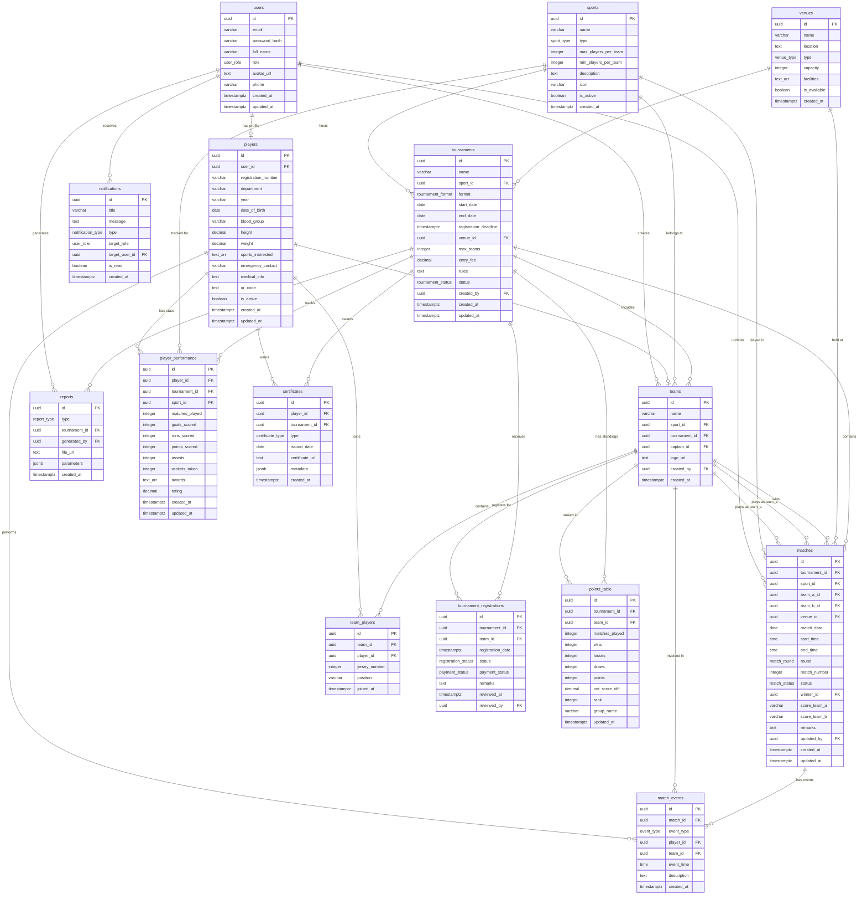

# 🗄️ PlayOps — Database Schema

> **Supabase (PostgreSQL) Database Design — Production-Ready Schema**

---

## 📌 Table of Contents

- [Schema Overview](#-schema-overview)
- [Custom Enum Types](#-custom-enum-types)
- [Entity-Relationship Diagram](#-entity-relationship-diagram)
- [Table Definitions](#-table-definitions)
  - [users](#1-users)
  - [players](#2-players)
  - [sports](#3-sports)
  - [teams](#4-teams)
  - [team_players](#5-team_players)
  - [venues](#6-venues)
  - [tournaments](#7-tournaments)
  - [tournament_registrations](#8-tournament_registrations)
  - [matches](#9-matches)
  - [match_events](#10-match_events)
  - [points_table](#11-points_table)
  - [player_performance](#12-player_performance)
  - [notifications](#13-notifications)
  - [certificates](#14-certificates)
  - [reports](#15-reports)
- [Indexes & Performance](#-indexes--performance)
- [Row Level Security (RLS) Policies](#-row-level-security-rls-policies)
- [Database Functions & Triggers](#-database-functions--triggers)
- [Seed Data](#-seed-data)

---

## 📊 Schema Overview

PlayOps uses **Supabase** as the Backend-as-a-Service layer, powered by **PostgreSQL 15+**. The schema consists of **15 interconnected tables** designed around the sports management lifecycle.

| # | Table | Description | Primary Relationships |
|---|-------|-------------|-----------------------|
| 1 | **users** | Authentication & user profile management | Base table for all authenticated users |
| 2 | **players** | Extended player profiles with sports-specific data | Extends `users` with athletic details |
| 3 | **sports** | Sports catalog with configuration rules | Referenced by `tournaments`, `matches`, `teams` |
| 4 | **teams** | Team entities tied to specific sports and tournaments | Links `players`, `sports`, and `tournaments` |
| 5 | **team_players** | Many-to-many junction: players ↔ teams | Bridges `teams` and `players` |
| 6 | **venues** | Sports facilities and grounds | Referenced by `tournaments` and `matches` |
| 7 | **tournaments** | Tournament definitions, rules, and lifecycle | Central entity linking sports, venues, and teams |
| 8 | **tournament_registrations** | Team registration requests for tournaments | Links `tournaments` and `teams` |
| 9 | **matches** | Individual match records with scheduling and results | Core operational table for live tracking |
| 10 | **match_events** | Granular in-match events (goals, fouls, etc.) | Child of `matches`, references `players` and `teams` |
| 11 | **points_table** | Computed standings per tournament group | Derived from `matches` results |
| 12 | **player_performance** | Aggregated player statistics per tournament | Derived from `match_events` |
| 13 | **notifications** | In-app alerts and announcements | Targets `users` by role or individual ID |
| 14 | **certificates** | Digital certificate records for achievements | Links `players` and `tournaments` |
| 15 | **reports** | Generated report files (PDF/Excel) | Links to `tournaments` |

```mermaid
flowchart LR
    subgraph Core ["🏛️ Core Entities"]
        U["users"]
        P["players"]
        S["sports"]
        V["venues"]
    end

    subgraph Competition ["🏆 Competition"]
        T["tournaments"]
        TM["teams"]
        TP["team_players"]
        TR["tournament_registrations"]
    end

    subgraph Operations ["⚡ Operations"]
        M["matches"]
        ME["match_events"]
        PT["points_table"]
        PP["player_performance"]
    end

    subgraph Output ["📋 Output"]
        N["notifications"]
        C["certificates"]
        R["reports"]
    end

    Core --> Competition --> Operations --> Output
```



> [!IMPORTANT]
> All tables use `uuid` primary keys generated via `gen_random_uuid()` for Supabase compatibility. Timestamps default to `now()` and use `timestamptz` (timezone-aware) for global consistency.

---

## 🏷️ Custom Enum Types

The following PostgreSQL `ENUM` types enforce data integrity at the database level:

```sql
-- User role classification
CREATE TYPE user_role AS ENUM ('admin', 'player', 'viewer');

-- Sport venue classification
CREATE TYPE sport_type AS ENUM ('indoor', 'outdoor');

-- Venue type classification
CREATE TYPE venue_type AS ENUM ('indoor', 'outdoor', 'multipurpose');

-- Tournament format options
CREATE TYPE tournament_format AS ENUM ('knockout', 'league', 'group+knockout');

-- Tournament lifecycle status
CREATE TYPE tournament_status AS ENUM ('upcoming', 'ongoing', 'completed', 'cancelled');

-- Registration approval status
CREATE TYPE registration_status AS ENUM ('pending', 'approved', 'rejected');

-- Payment status for registrations
CREATE TYPE payment_status AS ENUM ('unpaid', 'paid', 'refunded', 'waived');

-- Match lifecycle status
CREATE TYPE match_status AS ENUM ('scheduled', 'live', 'completed', 'cancelled', 'postponed');

-- Match round classification
CREATE TYPE match_round AS ENUM ('group', 'round_of_16', 'quarter_final', 'semi_final', 'third_place', 'final');

-- In-match event types
CREATE TYPE event_type AS ENUM (
    'goal', 'assist', 'wicket', 'run', 'foul', 'yellow_card',
    'red_card', 'timeout', 'substitution', 'injury', 'penalty',
    'point', 'ace', 'smash', 'other'
);

-- Certificate category types
CREATE TYPE certificate_type AS ENUM ('winner', 'runner_up', 'mvp', 'best_player', 'participation');

-- Notification category types
CREATE TYPE notification_type AS ENUM ('tournament', 'match', 'result', 'registration', 'general');

-- Report category types
CREATE TYPE report_type AS ENUM ('tournament_summary', 'player_stats', 'participation', 'financial', 'annual');
```

> [!TIP]
> Using PostgreSQL `ENUM` types instead of plain strings provides compile-time validation, prevents typos, and makes the schema self-documenting. New values can be added with `ALTER TYPE ... ADD VALUE`.

---

## 🔗 Entity-Relationship Diagram



---

## 📋 Table Definitions

### 1. `users`

> Core authentication and profile table. Integrates with Supabase Auth.

| Column | Type | Constraints | Default | Description |
|--------|------|-------------|---------|-------------|
| `id` | `uuid` | `PRIMARY KEY` | `gen_random_uuid()` | Unique user identifier |
| `email` | `varchar(255)` | `NOT NULL`, `UNIQUE` | — | User email address (login credential) |
| `password_hash` | `varchar(255)` | `NOT NULL` | — | bcrypt-hashed password |
| `full_name` | `varchar(150)` | `NOT NULL` | — | Full display name |
| `role` | `user_role` | `NOT NULL` | `'viewer'` | Role-based access classification |
| `avatar_url` | `text` | — | `NULL` | Profile picture URL (Supabase Storage) |
| `phone` | `varchar(15)` | — | `NULL` | Contact phone number |
| `created_at` | `timestamptz` | `NOT NULL` | `now()` | Account creation timestamp |
| `updated_at` | `timestamptz` | `NOT NULL` | `now()` | Last profile update timestamp |

```sql
CREATE TABLE users (
    id          uuid PRIMARY KEY DEFAULT gen_random_uuid(),
    email       varchar(255) NOT NULL UNIQUE,
    password_hash varchar(255) NOT NULL,
    full_name   varchar(150) NOT NULL,
    role        user_role NOT NULL DEFAULT 'viewer',
    avatar_url  text,
    phone       varchar(15),
    created_at  timestamptz NOT NULL DEFAULT now(),
    updated_at  timestamptz NOT NULL DEFAULT now()
);

-- Auto-update updated_at on row modification
CREATE TRIGGER set_users_updated_at
    BEFORE UPDATE ON users
    FOR EACH ROW
    EXECUTE FUNCTION update_updated_at_column();
```

> [!NOTE]
> If using Supabase Auth's built-in `auth.users` table, this `public.users` table acts as an extended profile table. The `id` should then reference `auth.users.id` directly and `password_hash` can be omitted (handled by Supabase Auth internally).

---

### 2. `players`

> Extended player profile with sports-specific attributes. One-to-one relationship with `users`.

| Column | Type | Constraints | Default | Description |
|--------|------|-------------|---------|-------------|
| `id` | `uuid` | `PRIMARY KEY` | `gen_random_uuid()` | Unique player identifier |
| `user_id` | `uuid` | `NOT NULL`, `UNIQUE`, `FK → users.id` | — | Linked user account |
| `registration_number` | `varchar(30)` | `NOT NULL`, `UNIQUE` | — | College registration / roll number |
| `department` | `varchar(100)` | `NOT NULL` | — | Academic department (e.g., CSE, MECH) |
| `year` | `varchar(20)` | `NOT NULL` | — | Current academic year (e.g., FE, SE, TE, BE) |
| `date_of_birth` | `date` | `NOT NULL` | — | Player's date of birth |
| `blood_group` | `varchar(5)` | — | `NULL` | Blood group (for medical emergencies) |
| `height` | `decimal(5,2)` | — | `NULL` | Height in centimeters |
| `weight` | `decimal(5,2)` | — | `NULL` | Weight in kilograms |
| `sports_interested` | `text[]` | — | `'{}'` | Array of sport names the player is interested in |
| `emergency_contact` | `varchar(15)` | `NOT NULL` | — | Emergency contact phone number |
| `medical_info` | `text` | — | `NULL` | Known medical conditions or allergies |
| `qr_code` | `text` | `UNIQUE` | `NULL` | Unique QR code data for event check-in |
| `is_active` | `boolean` | `NOT NULL` | `true` | Whether the player is currently active |
| `created_at` | `timestamptz` | `NOT NULL` | `now()` | Profile creation timestamp |
| `updated_at` | `timestamptz` | `NOT NULL` | `now()` | Last profile update timestamp |

```sql
CREATE TABLE players (
    id                  uuid PRIMARY KEY DEFAULT gen_random_uuid(),
    user_id             uuid NOT NULL UNIQUE REFERENCES users(id) ON DELETE CASCADE,
    registration_number varchar(30) NOT NULL UNIQUE,
    department          varchar(100) NOT NULL,
    year                varchar(20) NOT NULL,
    date_of_birth       date NOT NULL,
    blood_group         varchar(5),
    height              decimal(5,2),
    weight              decimal(5,2),
    sports_interested   text[] DEFAULT '{}',
    emergency_contact   varchar(15) NOT NULL,
    medical_info        text,
    qr_code             text UNIQUE,
    is_active           boolean NOT NULL DEFAULT true,
    created_at          timestamptz NOT NULL DEFAULT now(),
    updated_at          timestamptz NOT NULL DEFAULT now()
);

CREATE TRIGGER set_players_updated_at
    BEFORE UPDATE ON players
    FOR EACH ROW
    EXECUTE FUNCTION update_updated_at_column();
```

---

### 3. `sports`

> Master catalog of all sports offered at the institution.

| Column | Type | Constraints | Default | Description |
|--------|------|-------------|---------|-------------|
| `id` | `uuid` | `PRIMARY KEY` | `gen_random_uuid()` | Unique sport identifier |
| `name` | `varchar(100)` | `NOT NULL`, `UNIQUE` | — | Sport name (e.g., Cricket, Football) |
| `type` | `sport_type` | `NOT NULL` | — | Indoor or outdoor classification |
| `max_players_per_team` | `integer` | `NOT NULL` | — | Maximum roster size per team |
| `min_players_per_team` | `integer` | `NOT NULL` | — | Minimum players required to compete |
| `description` | `text` | — | `NULL` | Brief description and rules summary |
| `icon` | `varchar(100)` | — | `NULL` | Icon identifier or emoji for the sport |
| `is_active` | `boolean` | `NOT NULL` | `true` | Whether the sport is currently offered |
| `created_at` | `timestamptz` | `NOT NULL` | `now()` | Record creation timestamp |

```sql
CREATE TABLE sports (
    id                   uuid PRIMARY KEY DEFAULT gen_random_uuid(),
    name                 varchar(100) NOT NULL UNIQUE,
    type                 sport_type NOT NULL,
    max_players_per_team integer NOT NULL CHECK (max_players_per_team > 0),
    min_players_per_team integer NOT NULL CHECK (min_players_per_team > 0),
    description          text,
    icon                 varchar(100),
    is_active            boolean NOT NULL DEFAULT true,
    created_at           timestamptz NOT NULL DEFAULT now(),

    CONSTRAINT chk_player_limits CHECK (min_players_per_team <= max_players_per_team)
);
```

---

### 4. `teams`

> Team entities created for specific sports and tournament participation.

| Column | Type | Constraints | Default | Description |
|--------|------|-------------|---------|-------------|
| `id` | `uuid` | `PRIMARY KEY` | `gen_random_uuid()` | Unique team identifier |
| `name` | `varchar(100)` | `NOT NULL` | — | Team display name |
| `sport_id` | `uuid` | `NOT NULL`, `FK → sports.id` | — | Sport this team competes in |
| `tournament_id` | `uuid` | `FK → tournaments.id` | `NULL` | Tournament the team is registered for |
| `captain_id` | `uuid` | `FK → players.id` | `NULL` | Team captain (player reference) |
| `logo_url` | `text` | — | `NULL` | Team logo image URL |
| `created_by` | `uuid` | `NOT NULL`, `FK → users.id` | — | User who created the team |
| `created_at` | `timestamptz` | `NOT NULL` | `now()` | Team creation timestamp |

```sql
CREATE TABLE teams (
    id            uuid PRIMARY KEY DEFAULT gen_random_uuid(),
    name          varchar(100) NOT NULL,
    sport_id      uuid NOT NULL REFERENCES sports(id) ON DELETE RESTRICT,
    tournament_id uuid REFERENCES tournaments(id) ON DELETE SET NULL,
    captain_id    uuid REFERENCES players(id) ON DELETE SET NULL,
    logo_url      text,
    created_by    uuid NOT NULL REFERENCES users(id) ON DELETE RESTRICT,
    created_at    timestamptz NOT NULL DEFAULT now(),

    CONSTRAINT uq_team_name_per_tournament UNIQUE (name, tournament_id)
);
```

> [!NOTE]
> The `UNIQUE (name, tournament_id)` constraint ensures no two teams share the same name within a single tournament, while allowing the same team name across different tournaments.

---

### 5. `team_players`

> Junction table mapping players to teams. Supports many-to-many relationships.

| Column | Type | Constraints | Default | Description |
|--------|------|-------------|---------|-------------|
| `id` | `uuid` | `PRIMARY KEY` | `gen_random_uuid()` | Unique membership record ID |
| `team_id` | `uuid` | `NOT NULL`, `FK → teams.id` | — | Team reference |
| `player_id` | `uuid` | `NOT NULL`, `FK → players.id` | — | Player reference |
| `jersey_number` | `integer` | — | `NULL` | Player's jersey number for this team |
| `position` | `varchar(50)` | — | `NULL` | Playing position (sport-dependent) |
| `joined_at` | `timestamptz` | `NOT NULL` | `now()` | Date the player joined the team |

```sql
CREATE TABLE team_players (
    id            uuid PRIMARY KEY DEFAULT gen_random_uuid(),
    team_id       uuid NOT NULL REFERENCES teams(id) ON DELETE CASCADE,
    player_id     uuid NOT NULL REFERENCES players(id) ON DELETE CASCADE,
    jersey_number integer,
    position      varchar(50),
    joined_at     timestamptz NOT NULL DEFAULT now(),

    CONSTRAINT uq_player_per_team UNIQUE (team_id, player_id),
    CONSTRAINT uq_jersey_per_team UNIQUE (team_id, jersey_number),
    CONSTRAINT chk_jersey_number CHECK (jersey_number > 0 AND jersey_number <= 99)
);
```

---

### 6. `venues`

> Physical sports facilities available for scheduling matches and tournaments.

| Column | Type | Constraints | Default | Description |
|--------|------|-------------|---------|-------------|
| `id` | `uuid` | `PRIMARY KEY` | `gen_random_uuid()` | Unique venue identifier |
| `name` | `varchar(150)` | `NOT NULL`, `UNIQUE` | — | Venue display name |
| `location` | `text` | `NOT NULL` | — | Physical address or campus location |
| `type` | `venue_type` | `NOT NULL` | — | Indoor, outdoor, or multipurpose |
| `capacity` | `integer` | — | `NULL` | Spectator/player capacity |
| `facilities` | `text[]` | — | `'{}'` | Available amenities (changing rooms, floodlights, etc.) |
| `is_available` | `boolean` | `NOT NULL` | `true` | Current availability status |
| `created_at` | `timestamptz` | `NOT NULL` | `now()` | Record creation timestamp |

```sql
CREATE TABLE venues (
    id           uuid PRIMARY KEY DEFAULT gen_random_uuid(),
    name         varchar(150) NOT NULL UNIQUE,
    location     text NOT NULL,
    type         venue_type NOT NULL,
    capacity     integer CHECK (capacity > 0),
    facilities   text[] DEFAULT '{}',
    is_available boolean NOT NULL DEFAULT true,
    created_at   timestamptz NOT NULL DEFAULT now()
);
```

---

### 7. `tournaments`

> Central tournament management table governing the competition lifecycle.

| Column | Type | Constraints | Default | Description |
|--------|------|-------------|---------|-------------|
| `id` | `uuid` | `PRIMARY KEY` | `gen_random_uuid()` | Unique tournament identifier |
| `name` | `varchar(200)` | `NOT NULL` | — | Tournament display name |
| `sport_id` | `uuid` | `NOT NULL`, `FK → sports.id` | — | Sport this tournament is for |
| `format` | `tournament_format` | `NOT NULL` | — | Competition format (knockout/league/group+knockout) |
| `start_date` | `date` | `NOT NULL` | — | Tournament start date |
| `end_date` | `date` | `NOT NULL` | — | Tournament end date |
| `registration_deadline` | `timestamptz` | `NOT NULL` | — | Last date/time for team registration |
| `venue_id` | `uuid` | `FK → venues.id` | `NULL` | Primary venue for the tournament |
| `max_teams` | `integer` | `NOT NULL` | — | Maximum number of participating teams |
| `entry_fee` | `decimal(10,2)` | — | `0.00` | Registration fee per team |
| `rules` | `text` | — | `NULL` | Detailed tournament rules and regulations |
| `status` | `tournament_status` | `NOT NULL` | `'upcoming'` | Current tournament lifecycle status |
| `created_by` | `uuid` | `NOT NULL`, `FK → users.id` | — | Admin who created the tournament |
| `created_at` | `timestamptz` | `NOT NULL` | `now()` | Record creation timestamp |
| `updated_at` | `timestamptz` | `NOT NULL` | `now()` | Last update timestamp |

```sql
CREATE TABLE tournaments (
    id                    uuid PRIMARY KEY DEFAULT gen_random_uuid(),
    name                  varchar(200) NOT NULL,
    sport_id              uuid NOT NULL REFERENCES sports(id) ON DELETE RESTRICT,
    format                tournament_format NOT NULL,
    start_date            date NOT NULL,
    end_date              date NOT NULL,
    registration_deadline timestamptz NOT NULL,
    venue_id              uuid REFERENCES venues(id) ON DELETE SET NULL,
    max_teams             integer NOT NULL CHECK (max_teams >= 2),
    entry_fee             decimal(10,2) DEFAULT 0.00,
    rules                 text,
    status                tournament_status NOT NULL DEFAULT 'upcoming',
    created_by            uuid NOT NULL REFERENCES users(id) ON DELETE RESTRICT,
    created_at            timestamptz NOT NULL DEFAULT now(),
    updated_at            timestamptz NOT NULL DEFAULT now(),

    CONSTRAINT chk_tournament_dates CHECK (end_date >= start_date),
    CONSTRAINT chk_registration_before_start CHECK (registration_deadline <= start_date + interval '1 day')
);

CREATE TRIGGER set_tournaments_updated_at
    BEFORE UPDATE ON tournaments
    FOR EACH ROW
    EXECUTE FUNCTION update_updated_at_column();
```

> [!WARNING]
> The `chk_registration_before_start` constraint ensures registrations close no later than the tournament start date. Adjust the interval if a buffer period is needed between registration close and tournament start.

---

### 8. `tournament_registrations`

> Tracks team registration requests and their approval/payment status.

| Column | Type | Constraints | Default | Description |
|--------|------|-------------|---------|-------------|
| `id` | `uuid` | `PRIMARY KEY` | `gen_random_uuid()` | Unique registration record ID |
| `tournament_id` | `uuid` | `NOT NULL`, `FK → tournaments.id` | — | Tournament being registered for |
| `team_id` | `uuid` | `NOT NULL`, `FK → teams.id` | — | Team submitting registration |
| `registration_date` | `timestamptz` | `NOT NULL` | `now()` | When the registration was submitted |
| `status` | `registration_status` | `NOT NULL` | `'pending'` | Approval workflow status |
| `payment_status` | `payment_status` | `NOT NULL` | `'unpaid'` | Fee payment tracking |
| `remarks` | `text` | — | `NULL` | Admin remarks on approval/rejection |
| `reviewed_at` | `timestamptz` | — | `NULL` | When the registration was reviewed |
| `reviewed_by` | `uuid` | `FK → users.id` | `NULL` | Admin who reviewed the registration |

```sql
CREATE TABLE tournament_registrations (
    id                uuid PRIMARY KEY DEFAULT gen_random_uuid(),
    tournament_id     uuid NOT NULL REFERENCES tournaments(id) ON DELETE CASCADE,
    team_id           uuid NOT NULL REFERENCES teams(id) ON DELETE CASCADE,
    registration_date timestamptz NOT NULL DEFAULT now(),
    status            registration_status NOT NULL DEFAULT 'pending',
    payment_status    payment_status NOT NULL DEFAULT 'unpaid',
    remarks           text,
    reviewed_at       timestamptz,
    reviewed_by       uuid REFERENCES users(id) ON DELETE SET NULL,

    CONSTRAINT uq_team_per_tournament UNIQUE (tournament_id, team_id)
);
```

---

### 9. `matches`

> Individual match records including scheduling, live status, and final results.

| Column | Type | Constraints | Default | Description |
|--------|------|-------------|---------|-------------|
| `id` | `uuid` | `PRIMARY KEY` | `gen_random_uuid()` | Unique match identifier |
| `tournament_id` | `uuid` | `NOT NULL`, `FK → tournaments.id` | — | Parent tournament |
| `sport_id` | `uuid` | `NOT NULL`, `FK → sports.id` | — | Sport being played |
| `team_a_id` | `uuid` | `NOT NULL`, `FK → teams.id` | — | First competing team |
| `team_b_id` | `uuid` | `NOT NULL`, `FK → teams.id` | — | Second competing team |
| `venue_id` | `uuid` | `FK → venues.id` | `NULL` | Match venue |
| `match_date` | `date` | `NOT NULL` | — | Scheduled match date |
| `start_time` | `time` | — | `NULL` | Scheduled start time |
| `end_time` | `time` | — | `NULL` | Actual/scheduled end time |
| `round` | `match_round` | `NOT NULL` | — | Tournament round classification |
| `match_number` | `integer` | `NOT NULL` | — | Sequential match number within tournament |
| `status` | `match_status` | `NOT NULL` | `'scheduled'` | Current match lifecycle status |
| `winner_id` | `uuid` | `FK → teams.id` | `NULL` | Winning team (set after completion) |
| `score_team_a` | `varchar(50)` | — | `NULL` | Team A's score (flexible format for any sport) |
| `score_team_b` | `varchar(50)` | — | `NULL` | Team B's score (flexible format for any sport) |
| `remarks` | `text` | — | `NULL` | Match notes, weather conditions, etc. |
| `updated_by` | `uuid` | `FK → users.id` | `NULL` | Admin who last updated the match |
| `created_at` | `timestamptz` | `NOT NULL` | `now()` | Record creation timestamp |
| `updated_at` | `timestamptz` | `NOT NULL` | `now()` | Last update timestamp |

```sql
CREATE TABLE matches (
    id            uuid PRIMARY KEY DEFAULT gen_random_uuid(),
    tournament_id uuid NOT NULL REFERENCES tournaments(id) ON DELETE CASCADE,
    sport_id      uuid NOT NULL REFERENCES sports(id) ON DELETE RESTRICT,
    team_a_id     uuid NOT NULL REFERENCES teams(id) ON DELETE RESTRICT,
    team_b_id     uuid NOT NULL REFERENCES teams(id) ON DELETE RESTRICT,
    venue_id      uuid REFERENCES venues(id) ON DELETE SET NULL,
    match_date    date NOT NULL,
    start_time    time,
    end_time      time,
    round         match_round NOT NULL,
    match_number  integer NOT NULL,
    status        match_status NOT NULL DEFAULT 'scheduled',
    winner_id     uuid REFERENCES teams(id) ON DELETE SET NULL,
    score_team_a  varchar(50),
    score_team_b  varchar(50),
    remarks       text,
    updated_by    uuid REFERENCES users(id) ON DELETE SET NULL,
    created_at    timestamptz NOT NULL DEFAULT now(),
    updated_at    timestamptz NOT NULL DEFAULT now(),

    CONSTRAINT chk_different_teams CHECK (team_a_id <> team_b_id),
    CONSTRAINT chk_winner_is_participant CHECK (
        winner_id IS NULL OR winner_id = team_a_id OR winner_id = team_b_id
    ),
    CONSTRAINT uq_match_number_per_tournament UNIQUE (tournament_id, match_number)
);

CREATE TRIGGER set_matches_updated_at
    BEFORE UPDATE ON matches
    FOR EACH ROW
    EXECUTE FUNCTION update_updated_at_column();
```

> [!IMPORTANT]
> Score columns use `varchar(50)` instead of integers to accommodate varied sport scoring formats — e.g., Cricket: `"185/4 (20)"`, Football: `"3"`, Badminton: `"21-18, 21-15"`, Tennis: `"6-4, 3-6, 7-5"`.

---

### 10. `match_events`

> Granular, time-stamped events occurring during a match (goals, fouls, wickets, etc.).

| Column | Type | Constraints | Default | Description |
|--------|------|-------------|---------|-------------|
| `id` | `uuid` | `PRIMARY KEY` | `gen_random_uuid()` | Unique event identifier |
| `match_id` | `uuid` | `NOT NULL`, `FK → matches.id` | — | Parent match |
| `event_type` | `event_type` | `NOT NULL` | — | Category of the event |
| `player_id` | `uuid` | `FK → players.id` | `NULL` | Player involved (if applicable) |
| `team_id` | `uuid` | `FK → teams.id` | `NULL` | Team associated with the event |
| `event_time` | `time` | — | `NULL` | Time within the match when the event occurred |
| `description` | `text` | — | `NULL` | Free-text description of the event |
| `created_at` | `timestamptz` | `NOT NULL` | `now()` | When the event was recorded |

```sql
CREATE TABLE match_events (
    id          uuid PRIMARY KEY DEFAULT gen_random_uuid(),
    match_id    uuid NOT NULL REFERENCES matches(id) ON DELETE CASCADE,
    event_type  event_type NOT NULL,
    player_id   uuid REFERENCES players(id) ON DELETE SET NULL,
    team_id     uuid REFERENCES teams(id) ON DELETE SET NULL,
    event_time  time,
    description text,
    created_at  timestamptz NOT NULL DEFAULT now()
);
```

---

### 11. `points_table`

> Computed standings for teams within a tournament. Updated after each match result.

| Column | Type | Constraints | Default | Description |
|--------|------|-------------|---------|-------------|
| `id` | `uuid` | `PRIMARY KEY` | `gen_random_uuid()` | Unique record identifier |
| `tournament_id` | `uuid` | `NOT NULL`, `FK → tournaments.id` | — | Parent tournament |
| `team_id` | `uuid` | `NOT NULL`, `FK → teams.id` | — | Team being ranked |
| `matches_played` | `integer` | `NOT NULL` | `0` | Total matches played |
| `wins` | `integer` | `NOT NULL` | `0` | Total wins |
| `losses` | `integer` | `NOT NULL` | `0` | Total losses |
| `draws` | `integer` | `NOT NULL` | `0` | Total draws |
| `points` | `integer` | `NOT NULL` | `0` | Total points earned |
| `net_score_diff` | `decimal(10,4)` | — | `0.0` | Net run rate / goal difference (sport-dependent) |
| `rank` | `integer` | — | `NULL` | Current position in standings |
| `group_name` | `varchar(50)` | — | `NULL` | Group identifier (for group-stage formats) |
| `updated_at` | `timestamptz` | `NOT NULL` | `now()` | Last recalculation timestamp |

```sql
CREATE TABLE points_table (
    id              uuid PRIMARY KEY DEFAULT gen_random_uuid(),
    tournament_id   uuid NOT NULL REFERENCES tournaments(id) ON DELETE CASCADE,
    team_id         uuid NOT NULL REFERENCES teams(id) ON DELETE CASCADE,
    matches_played  integer NOT NULL DEFAULT 0,
    wins            integer NOT NULL DEFAULT 0,
    losses          integer NOT NULL DEFAULT 0,
    draws           integer NOT NULL DEFAULT 0,
    points          integer NOT NULL DEFAULT 0,
    net_score_diff  decimal(10,4) DEFAULT 0.0,
    rank            integer,
    group_name      varchar(50),
    updated_at      timestamptz NOT NULL DEFAULT now(),

    CONSTRAINT uq_team_per_tournament_points UNIQUE (tournament_id, team_id),
    CONSTRAINT chk_matches_sum CHECK (matches_played = wins + losses + draws)
);
```

---

### 12. `player_performance`

> Aggregated player statistics per tournament and sport. Enables leaderboards and analytics.

| Column | Type | Constraints | Default | Description |
|--------|------|-------------|---------|-------------|
| `id` | `uuid` | `PRIMARY KEY` | `gen_random_uuid()` | Unique record identifier |
| `player_id` | `uuid` | `NOT NULL`, `FK → players.id` | — | Player being tracked |
| `tournament_id` | `uuid` | `NOT NULL`, `FK → tournaments.id` | — | Tournament context |
| `sport_id` | `uuid` | `NOT NULL`, `FK → sports.id` | — | Sport context |
| `matches_played` | `integer` | `NOT NULL` | `0` | Total matches played |
| `goals_scored` | `integer` | — | `0` | Goals (football, hockey, etc.) |
| `runs_scored` | `integer` | — | `0` | Runs (cricket) |
| `points_scored` | `integer` | — | `0` | Points (basketball, badminton, etc.) |
| `assists` | `integer` | — | `0` | Assists (football, basketball, etc.) |
| `wickets_taken` | `integer` | — | `0` | Wickets (cricket) |
| `awards` | `text[]` | — | `'{}'` | Awards earned (e.g., MVP, Best Batsman) |
| `rating` | `decimal(3,1)` | — | `NULL` | Performance rating (0.0 – 10.0) |
| `created_at` | `timestamptz` | `NOT NULL` | `now()` | Record creation timestamp |
| `updated_at` | `timestamptz` | `NOT NULL` | `now()` | Last update timestamp |

```sql
CREATE TABLE player_performance (
    id              uuid PRIMARY KEY DEFAULT gen_random_uuid(),
    player_id       uuid NOT NULL REFERENCES players(id) ON DELETE CASCADE,
    tournament_id   uuid NOT NULL REFERENCES tournaments(id) ON DELETE CASCADE,
    sport_id        uuid NOT NULL REFERENCES sports(id) ON DELETE RESTRICT,
    matches_played  integer NOT NULL DEFAULT 0,
    goals_scored    integer DEFAULT 0,
    runs_scored     integer DEFAULT 0,
    points_scored   integer DEFAULT 0,
    assists         integer DEFAULT 0,
    wickets_taken   integer DEFAULT 0,
    awards          text[] DEFAULT '{}',
    rating          decimal(3,1) CHECK (rating >= 0 AND rating <= 10),
    created_at      timestamptz NOT NULL DEFAULT now(),
    updated_at      timestamptz NOT NULL DEFAULT now(),

    CONSTRAINT uq_player_per_tournament_perf UNIQUE (player_id, tournament_id)
);

CREATE TRIGGER set_player_performance_updated_at
    BEFORE UPDATE ON player_performance
    FOR EACH ROW
    EXECUTE FUNCTION update_updated_at_column();
```

> [!TIP]
> The sport-agnostic column design (goals, runs, points, wickets) avoids the need for separate tables per sport. Only populate the relevant columns based on `sport_id`. Unused columns default to `0` and are ignored in queries.

---

### 13. `notifications`

> In-app notification system for targeted alerts and announcements.

| Column | Type | Constraints | Default | Description |
|--------|------|-------------|---------|-------------|
| `id` | `uuid` | `PRIMARY KEY` | `gen_random_uuid()` | Unique notification identifier |
| `title` | `varchar(200)` | `NOT NULL` | — | Notification headline |
| `message` | `text` | `NOT NULL` | — | Notification body content |
| `type` | `notification_type` | `NOT NULL` | — | Category for filtering |
| `target_role` | `user_role` | — | `NULL` | Broadcast to all users with this role (NULL = all) |
| `target_user_id` | `uuid` | `FK → users.id` | `NULL` | Specific user target (NULL = broadcast) |
| `is_read` | `boolean` | `NOT NULL` | `false` | Read receipt flag |
| `created_at` | `timestamptz` | `NOT NULL` | `now()` | When the notification was created |

```sql
CREATE TABLE notifications (
    id              uuid PRIMARY KEY DEFAULT gen_random_uuid(),
    title           varchar(200) NOT NULL,
    message         text NOT NULL,
    type            notification_type NOT NULL,
    target_role     user_role,
    target_user_id  uuid REFERENCES users(id) ON DELETE CASCADE,
    is_read         boolean NOT NULL DEFAULT false,
    created_at      timestamptz NOT NULL DEFAULT now()
);
```

> [!NOTE]
> Notifications support two targeting modes: **broadcast** (set `target_role`, leave `target_user_id` NULL) and **direct** (set `target_user_id`, leave `target_role` NULL). If both are NULL, the notification is visible to all authenticated users.

---

### 14. `certificates`

> Digital certificate records for tournament achievements and participation.

| Column | Type | Constraints | Default | Description |
|--------|------|-------------|---------|-------------|
| `id` | `uuid` | `PRIMARY KEY` | `gen_random_uuid()` | Unique certificate identifier |
| `player_id` | `uuid` | `NOT NULL`, `FK → players.id` | — | Recipient player |
| `tournament_id` | `uuid` | `NOT NULL`, `FK → tournaments.id` | — | Associated tournament |
| `type` | `certificate_type` | `NOT NULL` | — | Category of achievement |
| `issued_date` | `date` | `NOT NULL` | `CURRENT_DATE` | Date of issuance |
| `certificate_url` | `text` | — | `NULL` | URL to generated certificate file |
| `metadata` | `jsonb` | — | `'{}'` | Flexible metadata (template, signatures, etc.) |
| `created_at` | `timestamptz` | `NOT NULL` | `now()` | Record creation timestamp |

```sql
CREATE TABLE certificates (
    id              uuid PRIMARY KEY DEFAULT gen_random_uuid(),
    player_id       uuid NOT NULL REFERENCES players(id) ON DELETE CASCADE,
    tournament_id   uuid NOT NULL REFERENCES tournaments(id) ON DELETE CASCADE,
    type            certificate_type NOT NULL,
    issued_date     date NOT NULL DEFAULT CURRENT_DATE,
    certificate_url text,
    metadata        jsonb DEFAULT '{}',
    created_at      timestamptz NOT NULL DEFAULT now(),

    CONSTRAINT uq_certificate_per_player UNIQUE (player_id, tournament_id, type)
);
```

---

### 15. `reports`

> Generated report files (PDF, Excel) for administrative and analytical purposes.

| Column | Type | Constraints | Default | Description |
|--------|------|-------------|---------|-------------|
| `id` | `uuid` | `PRIMARY KEY` | `gen_random_uuid()` | Unique report identifier |
| `type` | `report_type` | `NOT NULL` | — | Report category |
| `tournament_id` | `uuid` | `FK → tournaments.id` | `NULL` | Associated tournament (if applicable) |
| `generated_by` | `uuid` | `NOT NULL`, `FK → users.id` | — | Admin who generated the report |
| `file_url` | `text` | `NOT NULL` | — | URL to the generated report file |
| `parameters` | `jsonb` | — | `'{}'` | Report generation parameters (filters, date range, etc.) |
| `created_at` | `timestamptz` | `NOT NULL` | `now()` | When the report was generated |

```sql
CREATE TABLE reports (
    id            uuid PRIMARY KEY DEFAULT gen_random_uuid(),
    type          report_type NOT NULL,
    tournament_id uuid REFERENCES tournaments(id) ON DELETE SET NULL,
    generated_by  uuid NOT NULL REFERENCES users(id) ON DELETE RESTRICT,
    file_url      text NOT NULL,
    parameters    jsonb DEFAULT '{}',
    created_at    timestamptz NOT NULL DEFAULT now()
);
```

---

## ⚡ Indexes & Performance

Strategic indexes to optimize the most frequent query patterns:

### Primary Query Indexes

```sql
-- ============================================================
-- USERS
-- ============================================================
CREATE INDEX idx_users_email ON users (email);
CREATE INDEX idx_users_role ON users (role);

-- ============================================================
-- PLAYERS
-- ============================================================
CREATE INDEX idx_players_user_id ON players (user_id);
CREATE INDEX idx_players_department ON players (department);
CREATE INDEX idx_players_year ON players (year);
CREATE INDEX idx_players_registration_number ON players (registration_number);
CREATE INDEX idx_players_is_active ON players (is_active) WHERE is_active = true;
CREATE INDEX idx_players_sports_interested ON players USING GIN (sports_interested);

-- ============================================================
-- SPORTS
-- ============================================================
CREATE INDEX idx_sports_type ON sports (type);
CREATE INDEX idx_sports_is_active ON sports (is_active) WHERE is_active = true;

-- ============================================================
-- TEAMS
-- ============================================================
CREATE INDEX idx_teams_sport_id ON teams (sport_id);
CREATE INDEX idx_teams_tournament_id ON teams (tournament_id);
CREATE INDEX idx_teams_captain_id ON teams (captain_id);
CREATE INDEX idx_teams_created_by ON teams (created_by);

-- ============================================================
-- TEAM_PLAYERS
-- ============================================================
CREATE INDEX idx_team_players_team_id ON team_players (team_id);
CREATE INDEX idx_team_players_player_id ON team_players (player_id);

-- ============================================================
-- VENUES
-- ============================================================
CREATE INDEX idx_venues_type ON venues (type);
CREATE INDEX idx_venues_is_available ON venues (is_available) WHERE is_available = true;

-- ============================================================
-- TOURNAMENTS
-- ============================================================
CREATE INDEX idx_tournaments_sport_id ON tournaments (sport_id);
CREATE INDEX idx_tournaments_venue_id ON tournaments (venue_id);
CREATE INDEX idx_tournaments_status ON tournaments (status);
CREATE INDEX idx_tournaments_start_date ON tournaments (start_date);
CREATE INDEX idx_tournaments_created_by ON tournaments (created_by);
CREATE INDEX idx_tournaments_registration_deadline ON tournaments (registration_deadline);

-- ============================================================
-- TOURNAMENT_REGISTRATIONS
-- ============================================================
CREATE INDEX idx_tournament_reg_tournament_id ON tournament_registrations (tournament_id);
CREATE INDEX idx_tournament_reg_team_id ON tournament_registrations (team_id);
CREATE INDEX idx_tournament_reg_status ON tournament_registrations (status);
CREATE INDEX idx_tournament_reg_payment ON tournament_registrations (payment_status);

-- ============================================================
-- MATCHES
-- ============================================================
CREATE INDEX idx_matches_tournament_id ON matches (tournament_id);
CREATE INDEX idx_matches_sport_id ON matches (sport_id);
CREATE INDEX idx_matches_team_a_id ON matches (team_a_id);
CREATE INDEX idx_matches_team_b_id ON matches (team_b_id);
CREATE INDEX idx_matches_venue_id ON matches (venue_id);
CREATE INDEX idx_matches_match_date ON matches (match_date);
CREATE INDEX idx_matches_status ON matches (status);
CREATE INDEX idx_matches_round ON matches (round);
CREATE INDEX idx_matches_winner_id ON matches (winner_id);
-- Composite index for schedule conflict detection
CREATE INDEX idx_matches_venue_date_time ON matches (venue_id, match_date, start_time);
-- Composite index for tournament bracket queries
CREATE INDEX idx_matches_tournament_round ON matches (tournament_id, round, match_number);

-- ============================================================
-- MATCH_EVENTS
-- ============================================================
CREATE INDEX idx_match_events_match_id ON match_events (match_id);
CREATE INDEX idx_match_events_player_id ON match_events (player_id);
CREATE INDEX idx_match_events_team_id ON match_events (team_id);
CREATE INDEX idx_match_events_event_type ON match_events (event_type);

-- ============================================================
-- POINTS_TABLE
-- ============================================================
CREATE INDEX idx_points_table_tournament_id ON points_table (tournament_id);
CREATE INDEX idx_points_table_team_id ON points_table (team_id);
-- Composite index for leaderboard queries
CREATE INDEX idx_points_table_ranking ON points_table (tournament_id, group_name, points DESC, net_score_diff DESC);

-- ============================================================
-- PLAYER_PERFORMANCE
-- ============================================================
CREATE INDEX idx_player_perf_player_id ON player_performance (player_id);
CREATE INDEX idx_player_perf_tournament_id ON player_performance (tournament_id);
CREATE INDEX idx_player_perf_sport_id ON player_performance (sport_id);
CREATE INDEX idx_player_perf_rating ON player_performance (rating DESC NULLS LAST);

-- ============================================================
-- NOTIFICATIONS
-- ============================================================
CREATE INDEX idx_notifications_target_user ON notifications (target_user_id);
CREATE INDEX idx_notifications_target_role ON notifications (target_role);
CREATE INDEX idx_notifications_type ON notifications (type);
CREATE INDEX idx_notifications_is_read ON notifications (is_read) WHERE is_read = false;
CREATE INDEX idx_notifications_created_at ON notifications (created_at DESC);

-- ============================================================
-- CERTIFICATES
-- ============================================================
CREATE INDEX idx_certificates_player_id ON certificates (player_id);
CREATE INDEX idx_certificates_tournament_id ON certificates (tournament_id);
CREATE INDEX idx_certificates_type ON certificates (type);

-- ============================================================
-- REPORTS
-- ============================================================
CREATE INDEX idx_reports_type ON reports (type);
CREATE INDEX idx_reports_tournament_id ON reports (tournament_id);
CREATE INDEX idx_reports_generated_by ON reports (generated_by);
CREATE INDEX idx_reports_created_at ON reports (created_at DESC);
```

> [!TIP]
> **Partial indexes** (using `WHERE` clauses) like `idx_players_is_active` and `idx_notifications_is_read` only index rows matching the condition — keeping them small and fast for the most common queries.

---

## 🔐 Row Level Security (RLS) Policies

Supabase RLS policies enforce access control at the database level, ensuring security even if the API layer is bypassed.

### Enable RLS on All Tables

```sql
-- Enable RLS on every public table
ALTER TABLE users ENABLE ROW LEVEL SECURITY;
ALTER TABLE players ENABLE ROW LEVEL SECURITY;
ALTER TABLE sports ENABLE ROW LEVEL SECURITY;
ALTER TABLE teams ENABLE ROW LEVEL SECURITY;
ALTER TABLE team_players ENABLE ROW LEVEL SECURITY;
ALTER TABLE venues ENABLE ROW LEVEL SECURITY;
ALTER TABLE tournaments ENABLE ROW LEVEL SECURITY;
ALTER TABLE tournament_registrations ENABLE ROW LEVEL SECURITY;
ALTER TABLE matches ENABLE ROW LEVEL SECURITY;
ALTER TABLE match_events ENABLE ROW LEVEL SECURITY;
ALTER TABLE points_table ENABLE ROW LEVEL SECURITY;
ALTER TABLE player_performance ENABLE ROW LEVEL SECURITY;
ALTER TABLE notifications ENABLE ROW LEVEL SECURITY;
ALTER TABLE certificates ENABLE ROW LEVEL SECURITY;
ALTER TABLE reports ENABLE ROW LEVEL SECURITY;
```

### Helper Functions

```sql
-- Get the current user's role from the users table
CREATE OR REPLACE FUNCTION auth.user_role()
RETURNS user_role AS $$
    SELECT role FROM public.users WHERE id = auth.uid();
$$ LANGUAGE sql SECURITY DEFINER STABLE;

-- Check if the current user is an admin
CREATE OR REPLACE FUNCTION auth.is_admin()
RETURNS boolean AS $$
    SELECT EXISTS (
        SELECT 1 FROM public.users
        WHERE id = auth.uid() AND role = 'admin'
    );
$$ LANGUAGE sql SECURITY DEFINER STABLE;

-- Get the current user's player ID
CREATE OR REPLACE FUNCTION auth.player_id()
RETURNS uuid AS $$
    SELECT id FROM public.players WHERE user_id = auth.uid();
$$ LANGUAGE sql SECURITY DEFINER STABLE;
```

### RLS Policy Definitions

#### `users` Table

```sql
-- Users can read their own profile
CREATE POLICY "users_select_own"
    ON users FOR SELECT
    USING (id = auth.uid());

-- Admins can read all user profiles
CREATE POLICY "users_select_admin"
    ON users FOR SELECT
    USING (auth.is_admin());

-- Users can update their own profile
CREATE POLICY "users_update_own"
    ON users FOR UPDATE
    USING (id = auth.uid())
    WITH CHECK (id = auth.uid());

-- Admins can update any user profile
CREATE POLICY "users_update_admin"
    ON users FOR UPDATE
    USING (auth.is_admin());

-- Only admins can delete users
CREATE POLICY "users_delete_admin"
    ON users FOR DELETE
    USING (auth.is_admin());
```

#### `players` Table

```sql
-- Anyone authenticated can view player profiles
CREATE POLICY "players_select_authenticated"
    ON players FOR SELECT
    USING (auth.uid() IS NOT NULL);

-- Players can insert their own profile
CREATE POLICY "players_insert_own"
    ON players FOR INSERT
    WITH CHECK (user_id = auth.uid());

-- Players can update their own profile
CREATE POLICY "players_update_own"
    ON players FOR UPDATE
    USING (user_id = auth.uid())
    WITH CHECK (user_id = auth.uid());

-- Admins can manage all player profiles
CREATE POLICY "players_all_admin"
    ON players FOR ALL
    USING (auth.is_admin());
```

#### `sports` Table

```sql
-- Public read access (viewers can see sports)
CREATE POLICY "sports_select_public"
    ON sports FOR SELECT
    USING (true);

-- Only admins can manage sports
CREATE POLICY "sports_insert_admin"
    ON sports FOR INSERT
    WITH CHECK (auth.is_admin());

CREATE POLICY "sports_update_admin"
    ON sports FOR UPDATE
    USING (auth.is_admin());

CREATE POLICY "sports_delete_admin"
    ON sports FOR DELETE
    USING (auth.is_admin());
```

#### `teams` Table

```sql
-- Authenticated users can view teams
CREATE POLICY "teams_select_authenticated"
    ON teams FOR SELECT
    USING (auth.uid() IS NOT NULL);

-- Players and admins can create teams
CREATE POLICY "teams_insert_player"
    ON teams FOR INSERT
    WITH CHECK (
        auth.uid() IS NOT NULL
        AND (auth.user_role() = 'player' OR auth.is_admin())
    );

-- Team creators and admins can update teams
CREATE POLICY "teams_update_own_or_admin"
    ON teams FOR UPDATE
    USING (created_by = auth.uid() OR auth.is_admin());

-- Only admins can delete teams
CREATE POLICY "teams_delete_admin"
    ON teams FOR DELETE
    USING (auth.is_admin());
```

#### `venues` Table

```sql
-- Public read access
CREATE POLICY "venues_select_public"
    ON venues FOR SELECT
    USING (true);

-- Only admins can manage venues
CREATE POLICY "venues_manage_admin"
    ON venues FOR ALL
    USING (auth.is_admin());
```

#### `tournaments` Table

```sql
-- Public read access for tournaments
CREATE POLICY "tournaments_select_public"
    ON tournaments FOR SELECT
    USING (true);

-- Only admins can create/update/delete tournaments
CREATE POLICY "tournaments_manage_admin"
    ON tournaments FOR ALL
    USING (auth.is_admin());
```

#### `tournament_registrations` Table

```sql
-- Teams can view their own registrations; admins can view all
CREATE POLICY "registrations_select"
    ON tournament_registrations FOR SELECT
    USING (
        auth.is_admin()
        OR team_id IN (
            SELECT t.id FROM teams t WHERE t.created_by = auth.uid()
        )
    );

-- Players can register their own teams
CREATE POLICY "registrations_insert_player"
    ON tournament_registrations FOR INSERT
    WITH CHECK (
        team_id IN (
            SELECT t.id FROM teams t WHERE t.created_by = auth.uid()
        )
    );

-- Only admins can update registrations (approve/reject)
CREATE POLICY "registrations_update_admin"
    ON tournament_registrations FOR UPDATE
    USING (auth.is_admin());
```

#### `matches` Table

```sql
-- Public read access for match schedules and results
CREATE POLICY "matches_select_public"
    ON matches FOR SELECT
    USING (true);

-- Only admins can manage matches
CREATE POLICY "matches_manage_admin"
    ON matches FOR ALL
    USING (auth.is_admin());
```

#### `match_events` Table

```sql
-- Public read access for match events
CREATE POLICY "match_events_select_public"
    ON match_events FOR SELECT
    USING (true);

-- Only admins can record match events
CREATE POLICY "match_events_manage_admin"
    ON match_events FOR ALL
    USING (auth.is_admin());
```

#### `points_table` Table

```sql
-- Public read access for standings
CREATE POLICY "points_table_select_public"
    ON points_table FOR SELECT
    USING (true);

-- Only admins (or system functions) can modify standings
CREATE POLICY "points_table_manage_admin"
    ON points_table FOR ALL
    USING (auth.is_admin());
```

#### `player_performance` Table

```sql
-- Public read access for performance stats
CREATE POLICY "player_perf_select_public"
    ON player_performance FOR SELECT
    USING (true);

-- Only admins can modify performance stats
CREATE POLICY "player_perf_manage_admin"
    ON player_performance FOR ALL
    USING (auth.is_admin());
```

#### `notifications` Table

```sql
-- Users see notifications targeted to them or their role
CREATE POLICY "notifications_select_own"
    ON notifications FOR SELECT
    USING (
        target_user_id = auth.uid()
        OR target_role = auth.user_role()
        OR (target_user_id IS NULL AND target_role IS NULL)
    );

-- Users can mark their own notifications as read
CREATE POLICY "notifications_update_own"
    ON notifications FOR UPDATE
    USING (target_user_id = auth.uid())
    WITH CHECK (target_user_id = auth.uid());

-- Only admins can create/delete notifications
CREATE POLICY "notifications_insert_admin"
    ON notifications FOR INSERT
    WITH CHECK (auth.is_admin());

CREATE POLICY "notifications_delete_admin"
    ON notifications FOR DELETE
    USING (auth.is_admin());
```

#### `certificates` Table

```sql
-- Players can view their own certificates; admins can view all
CREATE POLICY "certificates_select"
    ON certificates FOR SELECT
    USING (
        auth.is_admin()
        OR player_id = auth.player_id()
    );

-- Only admins can manage certificates
CREATE POLICY "certificates_manage_admin"
    ON certificates FOR ALL
    USING (auth.is_admin());
```

#### `reports` Table

```sql
-- Only admins can access reports
CREATE POLICY "reports_all_admin"
    ON reports FOR ALL
    USING (auth.is_admin());
```

> [!CAUTION]
> RLS policies are the **last line of defense** for data security. Always test policies thoroughly in a staging environment before deploying to production. Misconfigured policies can either leak data or completely block access.

---

## ⚙️ Database Functions & Triggers

### Auto-Update `updated_at` Timestamp

```sql
-- Reusable trigger function for auto-updating the updated_at column
CREATE OR REPLACE FUNCTION update_updated_at_column()
RETURNS TRIGGER AS $$
BEGIN
    NEW.updated_at = now();
    RETURN NEW;
END;
$$ LANGUAGE plpgsql;
```

### Auto-Generate QR Code for Players

```sql
-- Generate a unique QR code string on player creation
CREATE OR REPLACE FUNCTION generate_player_qr_code()
RETURNS TRIGGER AS $$
BEGIN
    IF NEW.qr_code IS NULL THEN
        NEW.qr_code = 'PLAYOPS-' || UPPER(REPLACE(NEW.id::text, '-', ''));
    END IF;
    RETURN NEW;
END;
$$ LANGUAGE plpgsql;

CREATE TRIGGER trg_generate_qr_code
    BEFORE INSERT ON players
    FOR EACH ROW
    EXECUTE FUNCTION generate_player_qr_code();
```

### Auto-Create Points Table Entry on Registration Approval

```sql
-- When a tournament registration is approved, create a points_table entry
CREATE OR REPLACE FUNCTION create_points_table_entry()
RETURNS TRIGGER AS $$
BEGIN
    IF NEW.status = 'approved' AND OLD.status <> 'approved' THEN
        INSERT INTO points_table (tournament_id, team_id)
        VALUES (NEW.tournament_id, NEW.team_id)
        ON CONFLICT (tournament_id, team_id) DO NOTHING;
    END IF;
    RETURN NEW;
END;
$$ LANGUAGE plpgsql;

CREATE TRIGGER trg_create_points_entry
    AFTER UPDATE ON tournament_registrations
    FOR EACH ROW
    EXECUTE FUNCTION create_points_table_entry();
```

### Auto-Update Points Table After Match Completion

```sql
-- Update points table when a match is completed
CREATE OR REPLACE FUNCTION update_points_after_match()
RETURNS TRIGGER AS $$
BEGIN
    IF NEW.status = 'completed' AND OLD.status <> 'completed' THEN
        -- Update Team A stats
        UPDATE points_table
        SET
            matches_played = matches_played + 1,
            wins = wins + CASE WHEN NEW.winner_id = NEW.team_a_id THEN 1 ELSE 0 END,
            losses = losses + CASE WHEN NEW.winner_id = NEW.team_b_id THEN 1 ELSE 0 END,
            draws = draws + CASE WHEN NEW.winner_id IS NULL THEN 1 ELSE 0 END,
            points = points
                + CASE WHEN NEW.winner_id = NEW.team_a_id THEN 3 ELSE 0 END
                + CASE WHEN NEW.winner_id IS NULL THEN 1 ELSE 0 END,
            updated_at = now()
        WHERE tournament_id = NEW.tournament_id AND team_id = NEW.team_a_id;

        -- Update Team B stats
        UPDATE points_table
        SET
            matches_played = matches_played + 1,
            wins = wins + CASE WHEN NEW.winner_id = NEW.team_b_id THEN 1 ELSE 0 END,
            losses = losses + CASE WHEN NEW.winner_id = NEW.team_a_id THEN 1 ELSE 0 END,
            draws = draws + CASE WHEN NEW.winner_id IS NULL THEN 1 ELSE 0 END,
            points = points
                + CASE WHEN NEW.winner_id = NEW.team_b_id THEN 3 ELSE 0 END
                + CASE WHEN NEW.winner_id IS NULL THEN 1 ELSE 0 END,
            updated_at = now()
        WHERE tournament_id = NEW.tournament_id AND team_id = NEW.team_b_id;
    END IF;
    RETURN NEW;
END;
$$ LANGUAGE plpgsql;

CREATE TRIGGER trg_update_points
    AFTER UPDATE ON matches
    FOR EACH ROW
    EXECUTE FUNCTION update_points_after_match();
```

### Auto-Generate Match Notification

```sql
-- Send notification when a match is scheduled or results are updated
CREATE OR REPLACE FUNCTION notify_match_update()
RETURNS TRIGGER AS $$
DECLARE
    match_title text;
BEGIN
    SELECT CONCAT(ta.name, ' vs ', tb.name)
    INTO match_title
    FROM teams ta, teams tb
    WHERE ta.id = NEW.team_a_id AND tb.id = NEW.team_b_id;

    IF TG_OP = 'INSERT' THEN
        INSERT INTO notifications (title, message, type, target_role)
        VALUES (
            'New Match Scheduled',
            'Match scheduled: ' || match_title || ' on ' || NEW.match_date::text,
            'match',
            'player'
        );
    ELSIF NEW.status = 'completed' AND OLD.status <> 'completed' THEN
        INSERT INTO notifications (title, message, type)
        VALUES (
            'Match Result',
            'Match completed: ' || match_title || ' | Score: ' || COALESCE(NEW.score_team_a, '?') || ' - ' || COALESCE(NEW.score_team_b, '?'),
            'result'
        );
    END IF;
    RETURN NEW;
END;
$$ LANGUAGE plpgsql;

CREATE TRIGGER trg_notify_match
    AFTER INSERT OR UPDATE ON matches
    FOR EACH ROW
    EXECUTE FUNCTION notify_match_update();
```

---

## 🌱 Seed Data

Initial seed data to populate the system after schema creation:

```sql
-- ============================================================
-- Default Admin User
-- ============================================================
INSERT INTO users (email, password_hash, full_name, role, phone)
VALUES (
    'admin@kkwagh.edu.in',
    '$2a$12$placeholder_hash_replace_with_actual', -- Replace with bcrypt hash
    'Sports Administrator',
    'admin',
    '9876543210'
);

-- ============================================================
-- Default Sports Catalog
-- ============================================================
INSERT INTO sports (name, type, max_players_per_team, min_players_per_team, icon) VALUES
    ('Cricket',      'outdoor', 15, 11, '🏏'),
    ('Football',     'outdoor', 18, 11, '⚽'),
    ('Basketball',   'outdoor', 12,  5, '🏀'),
    ('Volleyball',   'outdoor', 12,  6, '🏐'),
    ('Badminton',    'indoor',   2,  1, '🏸'),
    ('Table Tennis', 'indoor',   2,  1, '🏓'),
    ('Chess',        'indoor',   1,  1, '♟️'),
    ('Kho-Kho',     'outdoor', 12,  9, '🏃'),
    ('Kabaddi',      'outdoor',  12, 7, '🤼'),
    ('Athletics',    'outdoor',  1,  1, '🏃‍♂️');

-- ============================================================
-- Default Venues
-- ============================================================
INSERT INTO venues (name, location, type, capacity, facilities) VALUES
    ('Main Cricket Ground',   'Behind Main Building',       'outdoor',     500, ARRAY['Changing Rooms', 'Scoreboard', 'Seating Gallery']),
    ('Football Field',        'Sports Complex - North',     'outdoor',     300, ARRAY['Floodlights', 'Changing Rooms', 'First Aid']),
    ('Basketball Court',      'Sports Complex - Central',   'outdoor',     200, ARRAY['Floodlights', 'Scoreboard']),
    ('Indoor Sports Hall',    'Sports Complex - Building A','indoor',      150, ARRAY['AC', 'Badminton Nets', 'TT Tables', 'Seating']),
    ('Volleyball Court',      'Sports Complex - South',     'outdoor',     200, ARRAY['Net Post', 'Sand Pit', 'Seating']),
    ('Multipurpose Auditorium','Main Building - Ground Floor','multipurpose', 400, ARRAY['Stage', 'Projector', 'Seating', 'AC']);
```

---

<div align="center">

**PlayOps — KK Wagh Sports Portal** · Built with ❤️ for KK Wagh College of Engineering

*Database Schema v1.0 — Powered by Supabase & PostgreSQL*

</div>
