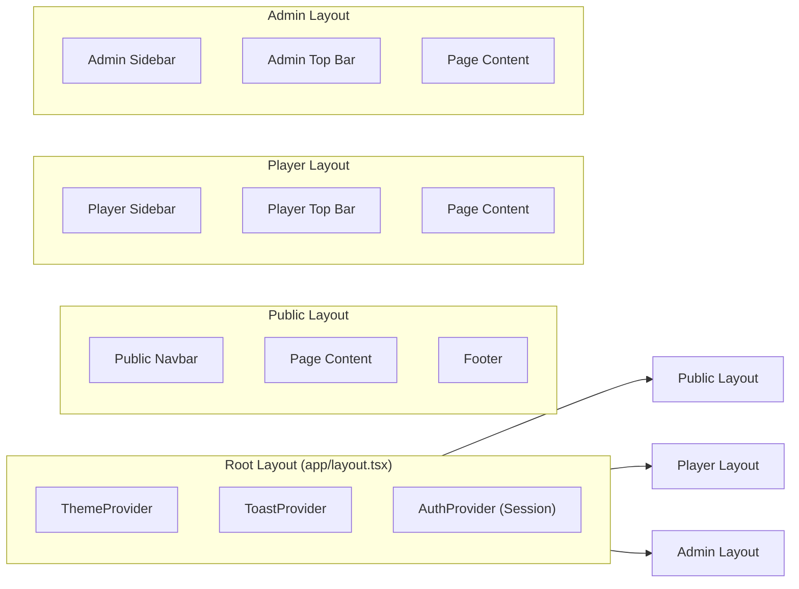

# 📄 PlayOps — Pages & UI Design Document

> **Project:** PlayOps — KK Wagh College of Engineering Sports Portal
> **Stack:** Next.js 14+ (App Router), React, Tailwind CSS, shadcn/ui
> **Last Updated:** October 2026

---

## Table of Contents

- [1. Sitemap Overview](#1-sitemap-overview)
- [2. Navigation & Layout](#2-navigation--layout)
- [3. Public Pages](#3-public-pages)
- [4. Player Dashboard](#4-player-dashboard)
- [5. Admin Dashboard](#5-admin-dashboard)
- [6. Shared Components](#6-shared-components)
- [7. Wireframe Descriptions](#7-wireframe-descriptions)
- [8. Responsive Design Strategy](#8-responsive-design-strategy)
- [9. Theme & Design Tokens](#9-theme--design-tokens)

---

## 1. Sitemap Overview

```mermaid
flowchart TD
    ROOT["/ (Landing Page)"]

    subgraph PUBLIC["🌐 Public Pages"]
        ROOT --> LOGIN["/login"]
        ROOT --> REGISTER["/register"]
        ROOT --> TOURNAMENTS["/tournaments"]
        ROOT --> LIVE["/live"]
        ROOT --> RESULTS["/results"]
        ROOT --> POINTS["/points-table"]
        TOURNAMENTS --> TOURNAMENT_DETAIL["/tournaments/:id"]
    end

    subgraph PLAYER["🏃 Player Dashboard"]
        P_DASH["/player/dashboard"]
        P_PROFILE["/player/profile"]
        P_TEAM["/player/team"]
        P_MATCHES["/player/matches"]
        P_PERF["/player/performance"]
        P_NOTIF["/player/notifications"]
        P_CERT["/player/certificates"]
    end

    subgraph ADMIN["🛡️ Admin Dashboard"]
        A_DASH["/admin/dashboard"]
        A_PLAYERS["/admin/players"]
        A_SPORTS["/admin/sports"]
        A_TEAMS["/admin/teams"]
        A_TOURNAMENTS["/admin/tournaments"]
        A_MATCHES["/admin/matches"]
        A_LIVE["/admin/matches/:id/live"]
        A_VENUES["/admin/venues"]
        A_NOTIF["/admin/notifications"]
        A_CERT["/admin/certificates"]
        A_REPORTS["/admin/reports"]
        A_MATCHES --> A_LIVE
    end

    LOGIN -->|"Player Login"| P_DASH
    LOGIN -->|"Admin Login"| A_DASH
    REGISTER --> LOGIN
```



---

## 2. Navigation & Layout

### 2.1 Layout Architecture

The application uses three distinct layout shells, each implemented as a Next.js layout component.



### 2.2 Public Navbar

| Element             | Description                                                    |
| ------------------- | -------------------------------------------------------------- |
| **Logo**            | PlayOps logo + "KK Wagh Sports" text — links to `/`           |
| **Nav Links**       | Tournaments, Live Scores, Results, Points Table                |
| **Auth Buttons**    | Login / Register (unauthenticated); Avatar dropdown (logged in)|
| **Mobile Menu**     | Hamburger icon → slide-out drawer with all links               |
| **Active State**    | Underline + primary color on the current route                 |

### 2.3 Player Sidebar

| Menu Item         | Icon              | Route                     |
| ----------------- | ----------------- | ------------------------- |
| Dashboard         | `LayoutDashboard` | `/player/dashboard`       |
| My Profile        | `User`            | `/player/profile`         |
| My Team           | `Users`           | `/player/team`            |
| My Matches        | `Swords`          | `/player/matches`         |
| Performance       | `BarChart3`       | `/player/performance`     |
| Notifications     | `Bell`            | `/player/notifications`   |
| Certificates      | `Award`           | `/player/certificates`    |

- Collapsible on desktop (icon-only mode)
- Drawer-based on mobile (opens from left)
- Unread notification badge on the Bell icon
- User avatar + name at the bottom with a logout option

### 2.4 Admin Sidebar

| Menu Item         | Icon              | Route                     |
| ----------------- | ----------------- | ------------------------- |
| Dashboard         | `LayoutDashboard` | `/admin/dashboard`        |
| Players           | `Users`           | `/admin/players`          |
| Sports            | `Trophy`          | `/admin/sports`           |
| Teams             | `Shield`          | `/admin/teams`            |
| Tournaments       | `Award`           | `/admin/tournaments`      |
| Matches           | `Swords`          | `/admin/matches`          |
| Venues            | `MapPin`          | `/admin/venues`           |
| Notifications     | `Bell`            | `/admin/notifications`    |
| Certificates      | `FileCheck`       | `/admin/certificates`     |
| Reports           | `FileBarChart`    | `/admin/reports`          |

- Grouped sections: **Overview** (Dashboard), **Management** (Players → Venues), **Communication** (Notifications, Certificates, Reports)
- Collapsible with persistent state in `localStorage`
- Admin name + role badge in the header

### 2.5 Shared Top Bar (Player & Admin)

| Element              | Description                                              |
| -------------------- | -------------------------------------------------------- |
| **Sidebar Toggle**   | Hamburger button to collapse/expand sidebar              |
| **Breadcrumbs**      | Auto-generated from route segments                       |
| **Search**           | Global search input (Cmd+K shortcut)                     |
| **Notifications**    | Bell icon with unread count badge                        |
| **User Menu**        | Avatar dropdown → Profile, Settings, Logout              |

---

## 3. Public Pages

### 3.1 Landing Page

| Property        | Value                                                              |
| --------------- | ------------------------------------------------------------------ |
| **Route**       | `/`                                                                |
| **Access**      | Public (all visitors)                                              |
| **Description** | The main entry point showcasing the college sports ecosystem       |

#### UI Sections (top to bottom)

| Section                 | Components                                                      | Description                                                                                        |
| ----------------------- | --------------------------------------------------------------- | -------------------------------------------------------------------------------------------------- |
| **Hero Banner**         | Full-width image/video, heading, subheading, CTA buttons        | "Welcome to KK Wagh Sports Portal" with "Explore Tournaments" and "Register" CTAs                 |
| **Live Now Strip**      | Animated ticker / horizontal scroll cards                       | Shows ongoing live matches with scores — links to `/live`                                          |
| **Featured Tournaments**| Card grid (3 cols desktop, 1 col mobile)                        | Highlighted upcoming or ongoing tournaments with sport icon, date, registration status             |
| **Upcoming Matches**    | Table or list with team logos, date/time, venue                 | Next 5–8 scheduled matches across all sports                                                       |
| **Recent Results**      | Result cards with scores, winning team highlight                | Last 5 completed match results                                                                     |
| **Sports Showcase**     | Icon grid or carousel                                           | All available sports with icons — click to filter tournaments                                      |
| **Stats Counter**       | Animated counters                                               | Total Players, Teams, Tournaments Held, Matches Played                                             |
| **Footer**              | Links, social media, college info, credits                      | Standard footer with Quick Links, Contact, Social Media                                            |

#### Key Actions
- Click CTA → Navigate to `/tournaments` or `/register`
- Click live match → Navigate to `/live`
- Click tournament card → Navigate to `/tournaments/:id`
- Click sport icon → Navigate to `/tournaments?sport=<sport>`

---

### 3.2 Login Page

| Property        | Value                                                              |
| --------------- | ------------------------------------------------------------------ |
| **Route**       | `/login`                                                           |
| **Access**      | Unauthenticated users only (redirect if already logged in)         |
| **Description** | Authentication page with email/password and OAuth options          |

#### UI Components

| Component                | Details                                                          |
| ------------------------ | ---------------------------------------------------------------- |
| **Logo + Title**         | PlayOps logo, "Sign in to your account"                          |
| **Email Input**          | Label, input field, validation (email format)                    |
| **Password Input**       | Label, input field with show/hide toggle, validation             |
| **Remember Me**          | Checkbox toggle                                                  |
| **Forgot Password**      | Text link → `/forgot-password`                                   |
| **Submit Button**        | "Sign In" — primary button with loading spinner                  |
| **Divider**              | "OR" separator line                                              |
| **Google OAuth Button**  | "Continue with Google" with Google icon                          |
| **Register Link**        | "Don't have an account? Register" → `/register`                 |
| **Error Alert**          | Displayed below form on invalid credentials                      |

#### Key Actions
- Submit form → Authenticate → Role-based redirect:
  - `admin` → `/admin/dashboard`
  - `player` → `/player/dashboard`
- Google OAuth → Same role-based redirect
- Invalid credentials → Show inline error

> [!NOTE]
> Login uses NextAuth.js with JWT strategy. Session is stored in an httpOnly cookie and validated server-side on every protected route.

---

### 3.3 Register Page

| Property        | Value                                                              |
| --------------- | ------------------------------------------------------------------ |
| **Route**       | `/register`                                                        |
| **Access**      | Unauthenticated users only                                         |
| **Description** | Multi-step student registration form                               |

#### UI Components — Multi-Step Form

| Step | Title              | Fields                                                                  |
| ---- | ------------------ | ----------------------------------------------------------------------- |
| 1    | Personal Info      | Full Name, Email, Phone, Password, Confirm Password                     |
| 2    | Academic Info      | Department, Year, Division, Roll Number, PRN                            |
| 3    | Sports Preferences | Primary Sport (dropdown), Secondary Sport (optional), Experience Level  |
| 4    | Review & Submit    | Summary of all entered data, T&C checkbox, Submit button                |

#### Additional Components
- **Step Indicator** — Horizontal stepper bar showing current step (1/4)
- **Back / Next Buttons** — Navigate between steps with validation per step
- **Avatar Upload** — Optional profile photo upload (Step 1)
- **Success Modal** — "Registration successful! Please log in." with redirect

#### Key Actions
- Fill all steps → Submit → Create account → Redirect to `/login`
- Validation errors shown inline per field
- Duplicate email check (async on blur)

---

### 3.4 Tournaments List

| Property        | Value                                                              |
| --------------- | ------------------------------------------------------------------ |
| **Route**       | `/tournaments`                                                     |
| **Access**      | Public                                                             |
| **Description** | Browse and filter all tournaments                                  |

#### UI Components

| Component              | Details                                                           |
| ---------------------- | ----------------------------------------------------------------- |
| **Page Header**        | "Tournaments" title with total count badge                        |
| **Filter Bar**         | Sport dropdown, Status tabs (All / Upcoming / Ongoing / Completed), Date range picker |
| **Search Input**       | Search tournaments by name                                        |
| **Tournament Cards**   | Grid layout — each card shows: Sport icon, Name, Date range, Status badge, Team count, Registration deadline |
| **Empty State**        | Illustration + "No tournaments found" message                     |
| **Pagination**         | Page numbers or "Load More" button                                |

#### Card Design
```
┌─────────────────────────────────────┐
│  🏏  Cricket Tournament 2026       │
│  ──────────────────────────────────  │
│  📅  Oct 15 – Oct 22, 2026         │
│  📍  Main Ground                    │
│  👥  8 Teams Registered             │
│  ──────────────────────────────────  │
│  [🟢 Ongoing]        [View →]       │
└─────────────────────────────────────┘
```

#### Key Actions
- Apply filters → Re-fetch filtered list (URL query params)
- Click card → Navigate to `/tournaments/:id`
- Logged-in player: "Register" button visible on upcoming tournaments

---

### 3.5 Tournament Detail

| Property        | Value                                                              |
| --------------- | ------------------------------------------------------------------ |
| **Route**       | `/tournaments/:id`                                                 |
| **Access**      | Public                                                             |
| **Description** | Full tournament info with tabs for different views                 |

#### UI Components

| Component              | Details                                                           |
| ---------------------- | ----------------------------------------------------------------- |
| **Tournament Banner**  | Sport image/gradient background, Tournament name, date, status badge, venue |
| **Action Buttons**     | "Register Team" (if upcoming + player), "Share Tournament"        |
| **Tab Navigation**     | Overview, Teams, Fixtures, Points Table, Results, Gallery          |

#### Tab Contents

| Tab              | Content                                                              |
| ---------------- | -------------------------------------------------------------------- |
| **Overview**     | Description, rules, format (league/knockout), schedule summary, organizer info |
| **Teams**        | Grid of registered team cards (name, logo, player count, captain)    |
| **Fixtures**     | Bracket view (knockout) or schedule table (league) with dates/venues |
| **Points Table** | Sortable table: Rank, Team, P, W, L, D, NRR/GD, Pts                |
| **Results**      | List of completed matches with scores and winner highlight           |
| **Gallery**      | Photo grid from tournament (if any uploaded)                         |

#### Key Actions
- Register team → Modal with team selection / creation flow
- Click team → Expand to show roster
- Click match in fixtures → Navigate to match detail or live page
- Share → Copy link / social share options

---

### 3.6 Live Scores

| Property        | Value                                                              |
| --------------- | ------------------------------------------------------------------ |
| **Route**       | `/live`                                                            |
| **Access**      | Public                                                             |
| **Description** | Real-time scores for all ongoing matches                           |

#### UI Components

| Component              | Details                                                           |
| ---------------------- | ----------------------------------------------------------------- |
| **Page Header**        | "Live Scores" with pulsing 🔴 indicator                          |
| **Sport Filter Tabs**  | Horizontal tabs: All, Cricket, Football, Basketball, etc.         |
| **Live Match Cards**   | Large cards with real-time score display                           |
| **Auto-Refresh Badge** | "Auto-refreshing every 10s" indicator                             |
| **No Live Matches**    | Empty state: "No matches are live right now" with link to upcoming |

#### Live Match Card Layout
```
┌───────────────────────────────────────────────┐
│  🔴 LIVE  •  Cricket  •  Main Ground          │
│  ─────────────────────────────────────────────  │
│                                                 │
│   Team Alpha        vs        Team Beta         │
│   🏏 145/6                    🏏 120/4          │
│   (18.2 overs)               (15 overs)        │
│                                                 │
│  ─────────────────────────────────────────────  │
│  Updated 5 seconds ago         [Watch Live →]   │
└───────────────────────────────────────────────┘
```

> [!IMPORTANT]
> Live scores use WebSocket connections (via Socket.IO or Pusher) for real-time updates. Falls back to polling (10s interval) if WebSocket connection fails.

#### Key Actions
- Score updates appear in real-time (no page reload)
- Click match card → Expanded view with detailed scorecard
- Sport filter → Show only matches of that sport

---

### 3.7 Results

| Property        | Value                                                              |
| --------------- | ------------------------------------------------------------------ |
| **Route**       | `/results`                                                         |
| **Access**      | Public                                                             |
| **Description** | Archive of past match and tournament results                       |

#### UI Components

| Component              | Details                                                           |
| ---------------------- | ----------------------------------------------------------------- |
| **Page Header**        | "Results" title                                                   |
| **Filter Bar**         | Sport dropdown, Tournament dropdown, Date range                   |
| **Results List**       | Stacked result cards grouped by date                               |
| **Result Card**        | Teams, final scores, winner badge, tournament name, venue, date   |
| **Pagination**         | Infinite scroll or page numbers                                   |

#### Key Actions
- Filter by sport/tournament/date → Re-fetch results
- Click result card → Navigate to full match scorecard

---

### 3.8 Points Table

| Property        | Value                                                              |
| --------------- | ------------------------------------------------------------------ |
| **Route**       | `/points-table`                                                    |
| **Access**      | Public                                                             |
| **Description** | Standings for all ongoing league-format tournaments                |

#### UI Components

| Component              | Details                                                           |
| ---------------------- | ----------------------------------------------------------------- |
| **Tournament Selector**| Dropdown or tabs to switch between tournaments                    |
| **Points Table**       | Sortable data table with columns based on sport                   |
| **Legend**              | Color coding: Green (qualified), Yellow (contention), Red (eliminated) |

#### Table Columns (Generic)

| Column | Description                     |
| ------ | ------------------------------- |
| #      | Rank position                   |
| Team   | Team name + logo                |
| P      | Matches Played                  |
| W      | Wins                            |
| L      | Losses                          |
| D      | Draws                           |
| +/-    | Net Run Rate / Goal Difference  |
| Pts    | Total Points                    |

#### Key Actions
- Switch tournament → Load that tournament's standings
- Click team row → Navigate to team profile or tournament detail
- Sort by any column header

---

## 4. Player Dashboard

> [!NOTE]
> All player pages require authentication with the `player` role. Unauthorized access redirects to `/login`.

### 4.1 Player Dashboard (Home)

| Property        | Value                                                              |
| --------------- | ------------------------------------------------------------------ |
| **Route**       | `/player/dashboard`                                                |
| **Access**      | `player` role only                                                 |
| **Description** | Personalized overview of the player's sports activities            |

#### UI Components

| Component                | Details                                                          |
| ------------------------ | ---------------------------------------------------------------- |
| **Welcome Banner**       | "Welcome back, {name}" with motivational quote or sport tip      |
| **Quick Stats Cards**    | 4 cards: Upcoming Matches, Teams Joined, Tournaments, Win Rate   |
| **Upcoming Matches**     | List/table of next 3 matches with date, opponent, venue          |
| **My Teams**             | Compact cards for each team the player belongs to                |
| **Recent Results**       | Last 3 match results involving the player's teams                |
| **Notifications Preview**| Last 3 unread notifications with "View All" link                 |
| **Quick Actions**        | Buttons: "View Profile", "Browse Tournaments", "Check Schedule"  |

#### Key Actions
- Click upcoming match → Navigate to match details
- Click team card → Navigate to `/player/team`
- Click notification → Navigate to `/player/notifications`
- Quick action buttons → Navigate to respective pages

---

### 4.2 My Profile

| Property        | Value                                                              |
| --------------- | ------------------------------------------------------------------ |
| **Route**       | `/player/profile`                                                  |
| **Access**      | `player` role only                                                 |
| **Description** | View and edit personal profile with QR code for identification     |

#### UI Components

| Component              | Details                                                           |
| ---------------------- | ----------------------------------------------------------------- |
| **Profile Header**     | Avatar (editable), Name, Department, Year, Sports                 |
| **QR Code Card**       | Auto-generated QR code encoding player ID — for attendance/verification |
| **Personal Info Tab**  | Name, Email, Phone, Department, Year, Division, Roll No, PRN      |
| **Sports Info Tab**    | Primary Sport, Secondary Sport, Experience Level, Positions       |
| **Edit Mode Toggle**   | "Edit Profile" button → Form mode with Save/Cancel                |
| **Change Password**    | Separate section/modal with current + new password fields         |

#### Key Actions
- Toggle edit mode → Edit fields → Save changes
- Download QR code as PNG
- Change password → Validate → Update

---

### 4.3 My Team

| Property        | Value                                                              |
| --------------- | ------------------------------------------------------------------ |
| **Route**       | `/player/team`                                                     |
| **Access**      | `player` role only                                                 |
| **Description** | Team roster and schedule for teams the player belongs to           |

#### UI Components

| Component              | Details                                                           |
| ---------------------- | ----------------------------------------------------------------- |
| **Team Selector**      | Tabs or dropdown if player is on multiple teams                   |
| **Team Header**        | Team name, sport, tournament, captain name                        |
| **Roster Table**       | Player list: Name, Role, Position, Jersey Number                  |
| **Match Schedule**     | Upcoming matches for this team with date/time/venue/opponent      |
| **Team Stats**         | W/L/D record, points, ranking in tournament                       |

#### Key Actions
- Switch between teams (if multiple)
- View teammate profiles (click name)
- View match details (click match row)

---

### 4.4 My Matches

| Property        | Value                                                              |
| --------------- | ------------------------------------------------------------------ |
| **Route**       | `/player/matches`                                                  |
| **Access**      | `player` role only                                                 |
| **Description** | List of all matches (upcoming and past) for the player's teams     |

#### UI Components

| Component              | Details                                                           |
| ---------------------- | ----------------------------------------------------------------- |
| **Tab Toggle**         | "Upcoming" / "Completed" tabs                                    |
| **Match Cards**        | Cards showing: Teams, Date/Time, Venue, Tournament, Status        |
| **Match Detail Modal** | Click card → Slide-over or modal with full match info             |
| **Calendar View**      | Optional toggle: Calendar view showing matches on dates           |
| **Empty State**        | "No upcoming matches" illustration                                |

#### Key Actions
- Toggle upcoming/completed → Filter list
- Click match → View full details
- Toggle to calendar view

---

### 4.5 My Performance

| Property        | Value                                                              |
| --------------- | ------------------------------------------------------------------ |
| **Route**       | `/player/performance`                                              |
| **Access**      | `player` role only                                                 |
| **Description** | Personal performance statistics and charts                         |

#### UI Components

| Component              | Details                                                           |
| ---------------------- | ----------------------------------------------------------------- |
| **Summary Cards**      | Total Matches, Wins, Losses, Win %, Best Performance              |
| **Performance Chart**  | Line/bar chart showing performance over time (Recharts)           |
| **Sport Breakdown**    | Pie chart of matches played by sport                              |
| **Match History Table**| Sortable table: Date, Tournament, Opponent, Result, Key Stats     |
| **Personal Bests**     | Highlighted cards for best performances (highest score, etc.)     |

#### Key Actions
- Filter by sport / tournament / date range
- Hover on chart data points → Tooltip with details
- Export stats as PDF

---

### 4.6 Notifications

| Property        | Value                                                              |
| --------------- | ------------------------------------------------------------------ |
| **Route**       | `/player/notifications`                                            |
| **Access**      | `player` role only                                                 |
| **Description** | All notifications related to tournaments, matches, and system      |

#### UI Components

| Component              | Details                                                           |
| ---------------------- | ----------------------------------------------------------------- |
| **Filter Tabs**        | All, Unread, Match Updates, Tournament, System                    |
| **Notification List**  | Stacked cards: Icon, Title, Message preview, Timestamp, Read/Unread dot |
| **Mark All Read**      | Button to mark all as read                                        |
| **Empty State**        | "You're all caught up!" illustration                              |

#### Key Actions
- Click notification → Mark as read + navigate to relevant page
- Mark all as read
- Filter by type

---

### 4.7 Certificates

| Property        | Value                                                              |
| --------------- | ------------------------------------------------------------------ |
| **Route**       | `/player/certificates`                                             |
| **Access**      | `player` role only                                                 |
| **Description** | View and download participation/winner certificates                |

#### UI Components

| Component              | Details                                                           |
| ---------------------- | ----------------------------------------------------------------- |
| **Certificate Cards**  | Grid: Certificate preview thumbnail, Tournament name, Type (Winner/Participation), Date |
| **Preview Modal**      | Full certificate preview in a modal                               |
| **Download Button**    | Download as PDF                                                   |
| **Empty State**        | "No certificates available yet" message                           |

#### Key Actions
- Click card → Open preview modal
- Download certificate as PDF
- Share certificate (optional)

---

## 5. Admin Dashboard

> [!WARNING]
> All admin pages require authentication with the `admin` role. Unauthorized access from players or unauthenticated users redirects to `/login` with a "403 Forbidden" toast.

### 5.1 Admin Dashboard (Home)

| Property        | Value                                                              |
| --------------- | ------------------------------------------------------------------ |
| **Route**       | `/admin/dashboard`                                                 |
| **Access**      | `admin` role only                                                  |
| **Description** | Administrative overview with key metrics and quick actions         |

#### UI Components

| Component                | Details                                                          |
| ------------------------ | ---------------------------------------------------------------- |
| **Stats Cards Row**      | 6 cards: Total Players, Active Teams, Tournaments (Active), Ongoing Matches, Venues, Pending Registrations |
| **Recent Activity Feed** | Timeline of recent system events (new registrations, match completions, etc.) |
| **Ongoing Matches**      | Quick view of all live matches with score + "Manage" button      |
| **Upcoming Matches**     | Next 5 scheduled matches with quick-edit option                  |
| **Quick Actions Grid**   | Icon buttons: Create Tournament, Add Player, Schedule Match, Send Notification |
| **Charts**               | Bar chart (matches per month), Donut chart (players per sport)   |

#### Key Actions
- Click stat card → Navigate to that management section
- Click "Manage" on live match → Navigate to `/admin/matches/:id/live`
- Quick action → Navigate to relevant create/add form
- Activity feed → Click to navigate to entity

---

### 5.2 Manage Players

| Property        | Value                                                              |
| --------------- | ------------------------------------------------------------------ |
| **Route**       | `/admin/players`                                                   |
| **Access**      | `admin` role only                                                  |
| **Description** | Full CRUD interface for player management                          |

#### UI Components

| Component              | Details                                                           |
| ---------------------- | ----------------------------------------------------------------- |
| **Page Header**        | "Manage Players" + total count + "Add Player" button              |
| **Search Bar**         | Search by name, email, PRN, roll number                           |
| **Filter Bar**         | Department, Year, Sport, Status (Active/Inactive)                 |
| **Players Data Table** | Sortable, paginated table                                         |
| **Player Detail Drawer**| Click row → Slide-out panel with full profile                    |
| **Add/Edit Modal**     | Form modal for creating/editing player records                    |
| **Bulk Actions**       | Select multiple → Activate, Deactivate, Export                    |

#### Data Table Columns

| Column       | Sortable | Description                     |
| ------------ | -------- | ------------------------------- |
| Name         | ✅       | Full name with avatar           |
| Email        | ✅       | Email address                   |
| PRN          | ✅       | Unique student identifier       |
| Department   | ✅       | Engineering department          |
| Year         | ✅       | Current year of study           |
| Sport        | ❌       | Primary sport                   |
| Status       | ✅       | Active/Inactive badge           |
| Actions      | ❌       | Edit, View, Deactivate buttons  |

#### Key Actions
- Add Player → Open form modal → Submit → Create player
- Edit → Open pre-filled form modal → Save changes
- Deactivate → Confirmation dialog → Soft delete
- Search/Filter → Re-fetch filtered data
- Export → Download CSV/Excel

---

### 5.3 Manage Sports

| Property        | Value                                                              |
| --------------- | ------------------------------------------------------------------ |
| **Route**       | `/admin/sports`                                                    |
| **Access**      | `admin` role only                                                  |
| **Description** | Manage the list of available sports                                |

#### UI Components

| Component              | Details                                                           |
| ---------------------- | ----------------------------------------------------------------- |
| **Sports Grid**        | Card grid showing each sport with icon, name, player count, team count |
| **Add Sport Button**   | Opens form: Name, Icon selection, Description, Max team size, Positions |
| **Edit/Delete**        | Per-card actions                                                   |
| **Sport Detail Modal** | Stats: Teams, Players, Active Tournaments for that sport          |

#### Key Actions
- Add sport → Form → Save
- Edit sport → Pre-filled form → Update
- Delete sport → Confirmation (only if no active tournaments)

---

### 5.4 Manage Teams

| Property        | Value                                                              |
| --------------- | ------------------------------------------------------------------ |
| **Route**       | `/admin/teams`                                                     |
| **Access**      | `admin` role only                                                  |
| **Description** | Create teams, assign players and captains                          |

#### UI Components

| Component              | Details                                                           |
| ---------------------- | ----------------------------------------------------------------- |
| **Page Header**        | "Manage Teams" + count + "Create Team" button                     |
| **Filter/Search**      | Sport filter, Tournament filter, Search by team name              |
| **Teams Data Table**   | Name, Sport, Tournament, Captain, Player Count, Status, Actions   |
| **Create/Edit Form**   | Team Name, Sport, Tournament, Select Captain (dropdown), Add Players (multi-select with search) |
| **Team Detail View**   | Expanded view with full roster and match history                  |

#### Key Actions
- Create team → Form with player search/add → Save
- Edit team → Modify roster, change captain
- Remove player from team → Confirmation
- Delete team → Confirmation (only if no active tournaments)

---

### 5.5 Manage Tournaments

| Property        | Value                                                              |
| --------------- | ------------------------------------------------------------------ |
| **Route**       | `/admin/tournaments`                                               |
| **Access**      | `admin` role only                                                  |
| **Description** | Create and manage tournaments with full lifecycle control          |

#### UI Components

| Component                | Details                                                          |
| ------------------------ | ---------------------------------------------------------------- |
| **Page Header**          | "Manage Tournaments" + "Create Tournament" button                |
| **Status Tabs**          | All / Draft / Upcoming / Ongoing / Completed                     |
| **Tournament Cards/Table**| Switchable view (grid/table)                                    |
| **Create Tournament Form**| Multi-step form (see below)                                     |
| **Manage Registrations** | View and approve/reject team registrations                       |

#### Create Tournament Form Steps

| Step | Title              | Fields                                                                    |
| ---- | ------------------ | ------------------------------------------------------------------------- |
| 1    | Basic Info         | Name, Sport, Description, Format (League/Knockout/Group+Knockout)         |
| 2    | Schedule           | Start Date, End Date, Registration Deadline                               |
| 3    | Configuration      | Max Teams, Min Players per Team, Max Players per Team, Venue selection     |
| 4    | Rules              | Rich text editor for tournament rules and regulations                     |
| 5    | Review & Publish   | Summary preview with "Save as Draft" or "Publish" options                 |

#### Key Actions
- Create tournament → Multi-step form → Save/Publish
- Edit tournament → Pre-filled form
- Manage registrations → Approve/Reject teams
- Generate fixtures (automatic or manual)
- Change tournament status
- Delete tournament (only drafts)

---

### 5.6 Manage Matches

| Property        | Value                                                              |
| --------------- | ------------------------------------------------------------------ |
| **Route**       | `/admin/matches`                                                   |
| **Access**      | `admin` role only                                                  |
| **Description** | Schedule matches and update scores                                 |

#### UI Components

| Component              | Details                                                           |
| ---------------------- | ----------------------------------------------------------------- |
| **Page Header**        | "Manage Matches" + "Schedule Match" button                        |
| **View Toggle**        | List view / Calendar view                                         |
| **Filter Bar**         | Tournament, Sport, Status (Scheduled/Live/Completed), Date range  |
| **Matches Table**      | Date, Teams, Tournament, Venue, Status, Score, Actions            |
| **Schedule Match Form**| Tournament, Teams (A vs B), Date, Time, Venue, Umpire/Referee     |
| **Quick Score Update** | Inline editing for entering final scores                          |

#### Key Actions
- Schedule match → Form → Save
- Start match → Change status to "Live" → Opens live scoring
- Update score → Inline or via `/admin/matches/:id/live`
- Complete match → Enter final score → Mark winner
- Reschedule → Edit date/time/venue
- Cancel match → Confirmation dialog

---

### 5.7 Live Scoring Interface

| Property        | Value                                                              |
| --------------- | ------------------------------------------------------------------ |
| **Route**       | `/admin/matches/:id/live`                                          |
| **Access**      | `admin` role only                                                  |
| **Description** | Real-time score entry interface that broadcasts to live viewers    |

#### UI Components

| Component                | Details                                                          |
| ------------------------ | ---------------------------------------------------------------- |
| **Match Header**         | Teams, Tournament, Venue, Status (LIVE badge), Elapsed time      |
| **Scoreboard**           | Large display showing current scores for both teams              |
| **Score Controls**       | Sport-specific score input controls (see below)                  |
| **Event Log**            | Chronological list of scoring events with timestamps             |
| **Commentary Input**     | Optional text input for adding commentary notes                  |
| **End Match Button**     | Complete the match with final score confirmation                 |
| **Connection Status**    | WebSocket connection indicator (Connected/Reconnecting)          |

#### Sport-Specific Score Controls

| Sport       | Controls                                                             |
| ----------- | -------------------------------------------------------------------- |
| Cricket     | Runs (+1, +2, +3, +4, +6), Wicket, Wide, No Ball, Over Complete     |
| Football    | Goal (+1 per team), Yellow Card, Red Card, Half Time, Extra Time     |
| Basketball  | Points (+1, +2, +3 per team), Foul, Quarter End                     |
| Badminton   | Point (+1 per player), Set End                                       |
| Volleyball  | Point (+1 per team), Set End                                         |
| Athletics   | Time/Distance/Score entry (event-specific)                           |

> [!CAUTION]
> All score updates are broadcast immediately via WebSocket to all connected clients on `/live`. Double-check scores before submitting. An "Undo Last Action" button is available for the most recent scoring event.

#### Key Actions
- Tap score buttons → Instant broadcast to viewers
- Undo last event → Revert most recent score change
- Add commentary → Append to match event log
- End match → Confirm final scores → Mark winner → Redirect to match summary

---

### 5.8 Manage Venues

| Property        | Value                                                              |
| --------------- | ------------------------------------------------------------------ |
| **Route**       | `/admin/venues`                                                    |
| **Access**      | `admin` role only                                                  |
| **Description** | CRUD for sports venues/grounds within the college campus           |

#### UI Components

| Component              | Details                                                           |
| ---------------------- | ----------------------------------------------------------------- |
| **Venue Cards**        | Grid: Venue image, Name, Location, Capacity, Available Sports     |
| **Add/Edit Form**      | Name, Location (text), Capacity, Available Sports (multi-select), Image Upload, Description |
| **Venue Schedule**     | Calendar showing booked slots for each venue                      |
| **Availability Check** | Date picker to check venue availability                           |

#### Key Actions
- Add venue → Form → Save
- Edit venue → Pre-filled form → Update
- Delete venue → Confirmation (no active bookings)
- View schedule → Calendar with booked matches

---

### 5.9 Admin Notifications

| Property        | Value                                                              |
| --------------- | ------------------------------------------------------------------ |
| **Route**       | `/admin/notifications`                                             |
| **Access**      | `admin` role only                                                  |
| **Description** | Send announcements to players and teams                            |

#### UI Components

| Component              | Details                                                           |
| ---------------------- | ----------------------------------------------------------------- |
| **Compose Form**       | Title, Message (rich text), Target Audience, Priority              |
| **Audience Selector**  | All Players, Specific Sport, Specific Tournament, Specific Team, Individual Players |
| **Sent History**       | Table of past notifications: Title, Audience, Date, Read Rate     |
| **Scheduled (Future)** | Queue of scheduled notifications                                   |
| **Templates**          | Pre-built templates: Match Reminder, Tournament Update, General Announcement |

#### Key Actions
- Compose notification → Select audience → Send
- Schedule for later → Date/time picker → Queue
- View analytics → Read rate, delivery status
- Use template → Pre-fill form → Edit → Send

---

### 5.10 Admin Certificates

| Property        | Value                                                              |
| --------------- | ------------------------------------------------------------------ |
| **Route**       | `/admin/certificates`                                              |
| **Access**      | `admin` role only                                                  |
| **Description** | Generate and manage certificates for tournament participants       |

#### UI Components

| Component              | Details                                                           |
| ---------------------- | ----------------------------------------------------------------- |
| **Certificate Generator**| Tournament selector, Certificate type (Winner/Runner-up/Participation), Template selection |
| **Template Preview**   | Live preview of certificate with dynamic data                     |
| **Bulk Generate**      | Generate certificates for all participants of a tournament        |
| **Generated List**     | Table: Player Name, Tournament, Type, Date Generated, Status      |
| **Download/Share**     | Download individual or bulk (ZIP) certificates                    |

#### Key Actions
- Select tournament → Select type → Preview → Generate
- Bulk generate → All participants of a tournament
- Download individual certificate as PDF
- Bulk download as ZIP

---

### 5.11 Reports

| Property        | Value                                                              |
| --------------- | ------------------------------------------------------------------ |
| **Route**       | `/admin/reports`                                                   |
| **Access**      | `admin` role only                                                  |
| **Description** | Generate analytical reports and export data                        |

#### UI Components

| Component              | Details                                                           |
| ---------------------- | ----------------------------------------------------------------- |
| **Report Types**       | Cards: Tournament Report, Player Report, Sport-wise Report, Attendance Report, Yearly Summary |
| **Report Builder**     | Type selection, Date range, Filters (sport/tournament/department) |
| **Report Preview**     | In-page preview with tables and charts                            |
| **Export Options**      | Download as PDF, Excel (XLSX), or CSV                             |

#### Available Report Types

| Report               | Content                                                           |
| -------------------- | ----------------------------------------------------------------- |
| Tournament Report    | Matches, results, winners, participation stats for a tournament   |
| Player Report        | Player activity, performance across tournaments                    |
| Sport-wise Report    | Participation and results broken down by sport                    |
| Attendance Report    | Player attendance at matches (via QR check-in)                    |
| Yearly Summary       | Annual overview: All tournaments, top players, stats              |

#### Key Actions
- Select report type → Configure filters → Generate preview
- Export report in desired format
- Schedule recurring reports (future feature)

---

## 6. Shared Components

### 6.1 Component Library

The following reusable components are used across multiple pages:

| Component          | Source        | Usage                                                    |
| ------------------ | ------------- | -------------------------------------------------------- |
| `DataTable`        | Custom        | Sortable, filterable, paginated tables for all list views|
| `StatCard`         | Custom        | Metric display card with icon, label, value, trend       |
| `Modal`            | shadcn/ui     | Dialogs for forms, confirmations, previews               |
| `Sheet`            | shadcn/ui     | Slide-out panels for detail views                        |
| `Tabs`             | shadcn/ui     | Tab navigation within pages                              |
| `Form`             | React Hook Form + shadcn/ui | All form interfaces with validation      |
| `Select`           | shadcn/ui     | Dropdowns and multi-selects                              |
| `DatePicker`       | shadcn/ui     | Date and date-range selection                            |
| `Toast`            | shadcn/ui     | Success/error/info notifications                         |
| `Badge`            | shadcn/ui     | Status indicators (Live, Upcoming, Completed, etc.)      |
| `Avatar`           | shadcn/ui     | User/team profile images                                 |
| `Skeleton`         | shadcn/ui     | Loading placeholders for all data-fetching states        |
| `EmptyState`       | Custom        | Illustration + message for empty lists                   |
| `Breadcrumb`       | Custom        | Route-based breadcrumb navigation                        |
| `SearchInput`      | Custom        | Debounced search with icon and clear button              |
| `ConfirmDialog`    | Custom        | "Are you sure?" confirmation with destructive action styling |
| `QRCode`           | `qrcode.react`| QR code generation for player profiles                   |
| `Chart`            | Recharts      | Bar, Line, Pie, Donut charts for analytics               |

### 6.2 Loading & Error States

Every page implements three states:

| State     | Implementation                                                      |
| --------- | ------------------------------------------------------------------- |
| Loading   | `loading.tsx` — Full-page skeleton matching the page's layout       |
| Error     | `error.tsx` — Error boundary with retry button and error message    |
| Not Found | `not-found.tsx` — 404 illustration with "Go Home" button           |

---

## 7. Wireframe Descriptions

### 7.1 Player Dashboard Wireframe

```
┌──────────────────────────────────────────────────────────────────────┐
│  [☰]   Dashboard                    🔍 Search    🔔 3    👤 Athar ▾ │
├────────┬─────────────────────────────────────────────────────────────┤
│        │                                                             │
│  📊    │  Welcome back, Athar! 🏆                                    │
│  Dash  │                                                             │
│  ──    │  ┌──────────┐ ┌──────────┐ ┌──────────┐ ┌──────────┐       │
│  👤    │  │ Upcoming  │ │ Teams    │ │ Tourneys │ │ Win Rate │       │
│  Prof  │  │ Matches   │ │ Joined   │ │ Played   │ │          │       │
│  ──    │  │    3      │ │    2     │ │    5     │ │  68%     │       │
│  👥    │  └──────────┘ └──────────┘ └──────────┘ └──────────┘       │
│  Team  │                                                             │
│  ──    │  ┌─ Upcoming Matches ─────────────────────────────────┐     │
│  ⚔️    │  │  🏏 Oct 8  │ Team Alpha vs Team Beta  │ Main Ground│     │
│  Match │  │  ⚽ Oct 10 │ FC Wagh vs FC Tech       │ Stadium    │     │
│  ──    │  │  🏀 Oct 12 │ Hoops A vs Hoops B       │ Indoor     │     │
│  📈    │  └────────────────────────────────────────────────────┘     │
│  Perf  │                                                             │
│  ──    │  ┌─ My Teams ──────┐ ┌─ Recent Results ───────────────┐    │
│  🔔    │  │ 🏏 Team Alpha   │ │ 🏏 Team Alpha 145 - 120 Beta  │    │
│  Notif │  │    Cricket      │ │    ✅ Won by 25 runs           │    │
│  ──    │  │ ⚽ FC Wagh      │ │ ⚽ FC Wagh 2 - 3 FC Tech      │    │
│  🏅    │  │    Football     │ │    ❌ Lost by 1 goal           │    │
│  Cert  │  └─────────────────┘ └────────────────────────────────┘    │
│        │                                                             │
└────────┴─────────────────────────────────────────────────────────────┘
```

### 7.2 Tournament Detail Wireframe

```
┌──────────────────────────────────────────────────────────────────────┐
│  PlayOps     Tournaments   Live   Results   Points      [Login]      │
├──────────────────────────────────────────────────────────────────────┤
│                                                                      │
│  ╔══════════════════════════════════════════════════════════════════╗ │
│  ║  🏏  Inter-Department Cricket Tournament 2026                   ║ │
│  ║  📅 Oct 15 – Oct 22, 2026   📍 Main Ground   🟢 Ongoing        ║ │
│  ║  [Register Team]  [Share]                                       ║ │
│  ╚══════════════════════════════════════════════════════════════════╝ │
│                                                                      │
│  [ Overview ] [ Teams ] [ Fixtures ] [ Points Table ] [ Results ]    │
│  ─────────────────────────────────────────────────────────────────── │
│                                                                      │
│  📋 Overview                                                         │
│  ────────────                                                        │
│  Format: League + Knockout (Top 4 qualify)                           │
│  Teams: 8 registered / 8 max                                         │
│  Matches: 16 league + 3 knockout                                     │
│                                                                      │
│  📜 Rules:                                                           │
│  • 20 overs per side                                                 │
│  • Minimum 8 players per team                                        │
│  • DLS method for rain-affected matches                              │
│                                                                      │
│  ┌─ Schedule Summary ────────────────────────────────────────────┐   │
│  │  League Phase:   Oct 15 – Oct 19 (12 matches)                │   │
│  │  Semi-Finals:    Oct 20 (2 matches)                           │   │
│  │  Final:          Oct 22 (1 match)                             │   │
│  └───────────────────────────────────────────────────────────────┘   │
│                                                                      │
│  Footer                                                              │
└──────────────────────────────────────────────────────────────────────┘
```

### 7.3 Admin Live Scoring Wireframe

```
┌──────────────────────────────────────────────────────────────────────┐
│  [☰]   Live Scoring                 🟢 Connected    👤 Admin ▾      │
├────────┬─────────────────────────────────────────────────────────────┤
│        │                                                             │
│  📊    │  🔴 LIVE  •  Cricket  •  Inter-Dept Tournament             │
│  Dash  │  📍 Main Ground  •  Started 45 min ago                     │
│  ──    │                                                             │
│  👥    │  ╔══════════════════════════════════════════════════════╗   │
│  Play  │  ║                                                      ║   │
│  ──    │  ║     TEAM ALPHA           vs          TEAM BETA       ║   │
│  🏆    │  ║     🏏 145 / 6                      🏏 120 / 4      ║   │
│  Sport │  ║     (20 overs)                      (15.2 overs)    ║   │
│  ──    │  ║                                      ⬅ Batting      ║   │
│  🛡️    │  ║                                                      ║   │
│  Teams │  ╚══════════════════════════════════════════════════════╝   │
│  ──    │                                                             │
│  🏅    │  ┌─ Score Controls ─────────────────────────────────────┐   │
│  Tourn │  │                                                       │   │
│  ──    │  │  [+1] [+2] [+3] [+4] [+6]  │  [Wicket]  [Wide]     │   │
│  ⚔️    │  │                              │  [No Ball] [Bye]     │   │
│  Match │  │  [Over Complete]             │  [⟲ Undo Last]       │   │
│  ──    │  │                                                       │   │
│  📍    │  └───────────────────────────────────────────────────────┘   │
│  Venue │                                                             │
│  ──    │  ┌─ Event Log ──────────────────────────────────────────┐   │
│  🔔    │  │  15.2  │ Ball 2  │ 4 runs  │ Boundary through covers │   │
│  Notif │  │  15.1  │ Ball 1  │ 1 run   │ Single to mid-on        │   │
│  ──    │  │  14.6  │ Ball 6  │ Wicket  │ Caught at slip           │   │
│  📄    │  │  14.5  │ Ball 5  │ 0 runs  │ Dot ball                │   │
│  Cert  │  │  14.4  │ Ball 4  │ 6 runs  │ Six over long-on        │   │
│  ──    │  └──────────────────────────────────────────────────────┘   │
│  📊    │                                                             │
│  Repts │  ┌─ Commentary ────────────────────────────────────────┐   │
│        │  │  [Type commentary note...]              [Send]       │   │
│        │  └──────────────────────────────────────────────────────┘   │
│        │                                                             │
│        │  [🔴 End Match]                                             │
│        │                                                             │
└────────┴─────────────────────────────────────────────────────────────┘
```

### 7.4 Admin Dashboard Wireframe

```
┌──────────────────────────────────────────────────────────────────────┐
│  [☰]   Admin Dashboard              🔍 Search    🔔 5    👤 Admin ▾ │
├────────┬─────────────────────────────────────────────────────────────┤
│        │                                                             │
│  📊    │  ┌──────────┐ ┌──────────┐ ┌──────────┐ ┌──────────┐       │
│  Dash  │  │ Total    │ │ Active   │ │ Active   │ │ Live     │       │
│  ──    │  │ Players  │ │ Teams    │ │ Tourneys │ │ Matches  │       │
│  👥    │  │   256    │ │   32     │ │    4     │ │    2     │       │
│  Play  │  │ ↑12 new  │ │ ↑3 new   │ │ 1 upcoming│ │ ●● Live │       │
│  ──    │  └──────────┘ └──────────┘ └──────────┘ └──────────┘       │
│  🏆    │  ┌──────────┐ ┌──────────┐                                 │
│  Sport │  │ Venues   │ │ Pending  │                                 │
│  ──    │  │    6     │ │ Requests │                                 │
│  🛡️    │  │ 2 booked │ │   15     │                                 │
│  Teams │  └──────────┘ └──────────┘                                 │
│  ──    │                                                             │
│  🏅    │  ┌─ Ongoing Matches ──────────────────────────────────┐    │
│  Tourn │  │ 🔴 Cricket  Team A 145/6 vs Team B 120/4  [Manage]│    │
│  ──    │  │ 🔴 Football FC Wagh 2 vs FC Tech 1        [Manage]│    │
│  ⚔️    │  └───────────────────────────────────────────────────┘    │
│  Match │                                                             │
│  ──    │  ┌─ Quick Actions ────┐  ┌─ Recent Activity ──────────┐   │
│  📍    │  │ [➕ Tournament]     │  │ • Athar joined Team Alpha   │   │
│  Venue │  │ [➕ Player]         │  │ • Cricket match completed    │   │
│  ──    │  │ [📅 Schedule Match] │  │ • New team FC Wagh created  │   │
│  🔔    │  │ [📢 Notification]   │  │ • Tournament regs opened    │   │
│  Notif │  └────────────────────┘  └─────────────────────────────┘   │
│  ──    │                                                             │
│  📄    │  ┌─ Matches/Month ──────┐  ┌─ Players/Sport ──────────┐   │
│  Cert  │  │  ▓▓                   │  │      ╭───╮               │   │
│  ──    │  │  ▓▓  ▓▓               │  │   ╭──┤Crk├──╮           │   │
│  📊    │  │  ▓▓  ▓▓  ▓▓          │  │   │  ╰───╯  │           │   │
│  Repts │  │  ▓▓  ▓▓  ▓▓  ▓▓     │  │  Ftbl    Bball          │   │
│        │  └──────────────────────┘  └──────────────────────────┘   │
│        │                                                             │
└────────┴─────────────────────────────────────────────────────────────┘
```

---

## 8. Responsive Design Strategy

### Breakpoints

| Breakpoint | Width        | Layout Behavior                                        |
| ---------- | ------------ | ------------------------------------------------------ |
| `sm`       | ≥ 640px      | Single column → Two columns where applicable           |
| `md`       | ≥ 768px      | Sidebar becomes visible (collapsible)                  |
| `lg`       | ≥ 1024px     | Full sidebar + content layout                          |
| `xl`       | ≥ 1280px     | Maximum content width with wider cards/tables          |
| `2xl`      | ≥ 1536px     | Extra padding, wider data tables                       |

### Mobile Adaptations

| Desktop Element       | Mobile Adaptation                                      |
| --------------------- | ------------------------------------------------------ |
| Sidebar Navigation    | Bottom tab bar (5 key items) + hamburger for full menu |
| Data Tables           | Card list view with essential fields                   |
| Multi-column Grid     | Single column stack                                    |
| Filter Bar            | Collapsible filter panel behind "Filter" button        |
| Modal Dialogs         | Full-screen sheets sliding up from bottom              |
| Dashboard Stat Cards  | 2×2 grid (instead of 4×1 row)                          |
| Score Controls (Live) | Full-width buttons, larger touch targets (44px min)    |
| Tournament Tabs       | Horizontal scroll tabs                                 |

> [!TIP]
> Use the `useMediaQuery` hook to conditionally render mobile vs. desktop components where layout significantly differs, rather than relying solely on CSS classes.

---

## 9. Theme & Design Tokens

### Color Palette

| Token                | Light Mode    | Dark Mode     | Usage                          |
| -------------------- | ------------- | ------------- | ------------------------------ |
| `--primary`          | `#2563EB`     | `#3B82F6`     | Buttons, links, active states  |
| `--primary-foreground`| `#FFFFFF`    | `#FFFFFF`     | Text on primary backgrounds    |
| `--secondary`        | `#F1F5F9`     | `#1E293B`     | Secondary buttons, badges      |
| `--destructive`      | `#EF4444`     | `#DC2626`     | Delete, error states           |
| `--success`          | `#22C55E`     | `#16A34A`     | Won, active, completed         |
| `--warning`          | `#F59E0B`     | `#D97706`     | Pending, in-progress           |
| `--muted`            | `#F1F5F9`     | `#1E293B`     | Backgrounds, disabled          |
| `--accent`           | `#8B5CF6`     | `#A78BFA`     | Highlights, special badges     |
| `--live-red`         | `#EF4444`     | `#F87171`     | Live indicator pulsing dot     |

### Status Badges

| Status       | Color     | Icon       | Example Usage                       |
| ------------ | --------- | ---------- | ----------------------------------- |
| Live         | Red       | Pulse dot  | Live match indicator                |
| Upcoming     | Blue      | Clock      | Scheduled matches/tournaments       |
| Ongoing      | Green     | Play       | Active tournament                   |
| Completed    | Gray      | Check      | Finished match/tournament           |
| Draft        | Yellow    | Edit       | Unpublished tournament              |
| Cancelled    | Red       | X          | Cancelled match                     |
| Won          | Green     | Trophy     | Match result                        |
| Lost         | Red       | ThumbsDown | Match result                        |
| Draw         | Gray      | Minus      | Match result                        |

### Typography

| Element       | Font                | Size     | Weight    |
| ------------- | ------------------- | -------- | --------- |
| H1            | Inter               | 2.25rem  | 800       |
| H2            | Inter               | 1.875rem | 700       |
| H3            | Inter               | 1.5rem   | 600       |
| Body          | Inter               | 1rem     | 400       |
| Small         | Inter               | 0.875rem | 400       |
| Caption       | Inter               | 0.75rem  | 500       |
| Monospace     | JetBrains Mono      | 0.875rem | 400       |
| Stat Number   | Inter               | 2rem     | 700       |

---

> [!IMPORTANT]
> This document serves as the UI specification for development. Each page should implement loading states (`loading.tsx`), error boundaries (`error.tsx`), and proper SEO metadata via Next.js `generateMetadata`. All forms must include client-side validation (Zod schemas) and server-side validation in API routes/server actions.
