# 📅 PlayOps — Development Phases & Sprint Plan

> **Project:** PlayOps — KK Wagh Sports Portal
> **Duration:** 12 Weeks (6 Sprints × 2 Weeks)
> **Team Model:** Full-Stack Developer(s) + Designer (optional)
> **Methodology:** Agile Scrum with 2-week sprints

---

## 📊 Phase Overview

```mermaid
flowchart LR
    P1["🏗️ Phase 1\nFoundation\nWeek 1-2"]
    P2["⚙️ Phase 2\nCore Management\nWeek 3-4"]
    P3["🏆 Phase 3\nTeams & Tournaments\nWeek 5-6"]
    P4["🔴 Phase 4\nMatch & Live Scoring\nWeek 7-8"]
    P5["📈 Phase 5\nResults & Analytics\nWeek 9-10"]
    P6["🔔 Phase 6\nNotifications & Certs\nWeek 11"]
    P7["🚀 Phase 7\nPolish & Deploy\nWeek 12"]

    P1 -->|"Auth & DB Ready"| P2
    P2 -->|"CRUD Complete"| P3
    P3 -->|"Teams & Fixtures Ready"| P4
    P4 -->|"Scoring Engine Done"| P5
    P5 -->|"Analytics Ready"| P6
    P6 -->|"Features Complete"| P7
```

| Phase | Name | Duration | Key Focus | Priority |
|-------|------|----------|-----------|----------|
| 1 | Foundation | Week 1–2 | Project setup, auth, layout | 🔴 Critical |
| 2 | Core Management | Week 3–4 | Admin CRUD, player registration | 🔴 Critical |
| 3 | Teams & Tournaments | Week 5–6 | Team management, fixture generation | 🔴 Critical |
| 4 | Match & Live Scoring | Week 7–8 | Real-time scoring, match events | 🟠 High |
| 5 | Results & Analytics | Week 9–10 | Stats, charts, rankings | 🟡 Medium |
| 6 | Notifications & Certificates | Week 11 | Alerts, emails, PDF certificates | 🟡 Medium |
| 7 | Polish & Deploy | Week 12 | Testing, optimization, deployment | 🔴 Critical |

---

## 🏗️ Phase 1: Foundation (Week 1–2)

### Sprint Goals

- Stand up the full development environment with Next.js 14+, Supabase, Tailwind CSS, and shadcn/ui
- Design and deploy the complete database schema with Row-Level Security policies
- Implement a production-ready authentication system with role-based access control
- Build the application shell (layout, navigation, responsive sidebar)
- Create an engaging, public-facing landing page

### Tasks

| # | Task | Est. Hours | Assignee Role | Priority |
|---|------|-----------|---------------|----------|
| 1.1 | Initialize Next.js 14+ project with App Router | 2h | Full-Stack | 🔴 Critical |
| 1.2 | Configure Tailwind CSS v3 + shadcn/ui component library | 3h | Full-Stack | 🔴 Critical |
| 1.3 | Set up Supabase project (local + hosted) | 2h | Full-Stack | 🔴 Critical |
| 1.4 | Configure ESLint, Prettier, Husky pre-commit hooks | 2h | Full-Stack | 🟡 Medium |
| 1.5 | Set up environment variables and `.env.example` | 1h | Full-Stack | 🔴 Critical |
| 1.6 | Design complete database schema (all tables) | 6h | Full-Stack | 🔴 Critical |
| 1.7 | Write and run Supabase migrations | 4h | Full-Stack | 🔴 Critical |
| 1.8 | Configure Row-Level Security (RLS) policies | 5h | Full-Stack | 🔴 Critical |
| 1.9 | Set up Supabase storage buckets (avatars, documents) | 2h | Full-Stack | 🟠 High |
| 1.10 | Implement email/password registration with Supabase Auth | 4h | Full-Stack | 🔴 Critical |
| 1.11 | Implement login/logout with session management | 3h | Full-Stack | 🔴 Critical |
| 1.12 | Build role-based access control (Admin, Organizer, Player, Viewer) | 5h | Full-Stack | 🔴 Critical |
| 1.13 | Create auth middleware for protected routes | 3h | Full-Stack | 🔴 Critical |
| 1.14 | Build responsive navbar with auth state | 4h | Full-Stack | 🟠 High |
| 1.15 | Build collapsible sidebar with role-based menu items | 5h | Full-Stack | 🟠 High |
| 1.16 | Build footer component | 1h | Full-Stack | 🟢 Low |
| 1.17 | Create app layout wrapper with sidebar + navbar | 3h | Full-Stack | 🟠 High |
| 1.18 | Design and build landing page (hero, features, CTA) | 6h | Full-Stack | 🟠 High |
| 1.19 | Set up global error handling and loading states | 3h | Full-Stack | 🟡 Medium |
| 1.20 | Write seed scripts for development data | 3h | Full-Stack | 🟡 Medium |

**Total Estimated Hours: ~67h**

### Deliverables

- [x] Fully configured Next.js + Supabase project repository
- [x] Complete database schema deployed with migrations
- [x] Working authentication flow (register → login → logout)
- [x] Role-based route protection middleware
- [x] Responsive app shell (navbar, sidebar, footer, layout)
- [x] Public landing page
- [x] Development seed data

### Dependencies

- Supabase project provisioned (free tier or Pro)
- Domain/branding decisions finalized
- Role definitions agreed upon by stakeholders

### Success Criteria

> [!IMPORTANT]
> Phase 1 is the foundation for every subsequent phase. All criteria must be met before proceeding.

- ✅ A new user can register, log in, and log out without errors
- ✅ Admin, Organizer, Player, and Viewer roles are enforced at both UI and API levels
- ✅ The database schema supports all entities defined in the ERD
- ✅ RLS policies prevent unauthorized data access
- ✅ The layout is responsive across mobile, tablet, and desktop breakpoints
- ✅ Landing page scores ≥ 90 on Lighthouse performance

---

## ⚙️ Phase 2: Core Management (Week 3–4)

### Sprint Goals

- Build the admin dashboard with real-time statistics and quick-action widgets
- Implement full CRUD operations for Sports and Venues
- Create the player registration and profile management system
- Generate unique QR codes for player identification

### Tasks

| # | Task | Est. Hours | Assignee Role | Priority |
|---|------|-----------|---------------|----------|
| 2.1 | Build admin dashboard layout with stat cards | 5h | Full-Stack | 🔴 Critical |
| 2.2 | Implement dashboard data aggregation queries | 4h | Full-Stack | 🔴 Critical |
| 2.3 | Add recent activity feed to dashboard | 3h | Full-Stack | 🟡 Medium |
| 2.4 | Quick-action widgets (create sport, add venue, etc.) | 3h | Full-Stack | 🟡 Medium |
| 2.5 | Sports listing page with search and filters | 4h | Full-Stack | 🔴 Critical |
| 2.6 | Create Sport form (name, type, rules, icon, max players) | 3h | Full-Stack | 🔴 Critical |
| 2.7 | Edit/Delete sport with confirmation dialogs | 3h | Full-Stack | 🔴 Critical |
| 2.8 | Sport detail page with associated tournaments | 2h | Full-Stack | 🟠 High |
| 2.9 | Venue listing page with search and filters | 4h | Full-Stack | 🔴 Critical |
| 2.10 | Create Venue form (name, location, capacity, facilities, image) | 3h | Full-Stack | 🔴 Critical |
| 2.11 | Edit/Delete venue with confirmation dialogs | 3h | Full-Stack | 🔴 Critical |
| 2.12 | Venue detail page with availability calendar | 4h | Full-Stack | 🟠 High |
| 2.13 | Player registration form (personal info, department, year, sports preferences) | 5h | Full-Stack | 🔴 Critical |
| 2.14 | Player profile page (view and edit) | 4h | Full-Stack | 🔴 Critical |
| 2.15 | Player listing page with search, filters, and bulk actions | 5h | Full-Stack | 🟠 High |
| 2.16 | Profile image upload with Supabase Storage | 3h | Full-Stack | 🟡 Medium |
| 2.17 | Generate unique QR codes for registered players | 4h | Full-Stack | 🟠 High |
| 2.18 | QR code display on player profile and downloadable card | 3h | Full-Stack | 🟠 High |
| 2.19 | QR code scanner page for attendance/verification | 4h | Full-Stack | 🟡 Medium |
| 2.20 | Form validation with Zod schemas across all forms | 4h | Full-Stack | 🔴 Critical |

**Total Estimated Hours: ~73h**

### Deliverables

- [x] Admin dashboard with live statistics
- [x] Full Sports CRUD with listing, search, and filtering
- [x] Full Venues CRUD with listing, search, and filtering
- [x] Player registration, profile management, and listing
- [x] QR code generation and display on player cards
- [x] QR code scanner for verification

### Dependencies

- **Phase 1 completed:** Auth system, database schema, app layout
- Image hosting via Supabase Storage configured
- QR code library selected (`qrcode` or `react-qr-code`)

### Success Criteria

- ✅ Admin can view dashboard with accurate, up-to-date statistics
- ✅ Full CRUD for Sports works end-to-end (create, read, update, delete)
- ✅ Full CRUD for Venues works end-to-end with image uploads
- ✅ Players can register, view, and edit their profiles
- ✅ Each player has a unique, scannable QR code
- ✅ All forms validate input and show clear error messages
- ✅ Non-admin users cannot access admin-only pages

---

## 🏆 Phase 3: Teams & Tournaments (Week 5–6)

### Sprint Goals

- Build the team creation and management system with captain assignment
- Implement the tournament creation workflow with all configuration options
- Create a tournament registration system with approval workflows
- Develop automatic fixture generation for both knockout and round-robin league formats

### Tasks

| # | Task | Est. Hours | Assignee Role | Priority |
|---|------|-----------|---------------|----------|
| 3.1 | Team creation form (name, sport, department, logo) | 4h | Full-Stack | 🔴 Critical |
| 3.2 | Team listing page with search and sport filters | 3h | Full-Stack | 🔴 Critical |
| 3.3 | Team detail page with roster display | 4h | Full-Stack | 🟠 High |
| 3.4 | Add/remove players from team roster | 5h | Full-Stack | 🔴 Critical |
| 3.5 | Captain assignment and transfer | 3h | Full-Stack | 🟠 High |
| 3.6 | Team roster validation (min/max players, eligibility) | 3h | Full-Stack | 🟠 High |
| 3.7 | Tournament creation form (name, sport, type, dates, venue, rules) | 6h | Full-Stack | 🔴 Critical |
| 3.8 | Tournament configuration (format, seeding, group count) | 5h | Full-Stack | 🔴 Critical |
| 3.9 | Tournament listing page with status tabs (upcoming, ongoing, completed) | 4h | Full-Stack | 🔴 Critical |
| 3.10 | Tournament detail page with tabs (overview, teams, fixtures, results) | 6h | Full-Stack | 🔴 Critical |
| 3.11 | Tournament registration for teams/players | 4h | Full-Stack | 🔴 Critical |
| 3.12 | Registration approval/rejection workflow for organizers | 4h | Full-Stack | 🟠 High |
| 3.13 | Knockout bracket generation algorithm | 6h | Full-Stack | 🔴 Critical |
| 3.14 | Round-robin league fixture generation algorithm | 6h | Full-Stack | 🔴 Critical |
| 3.15 | Fixture display — bracket view (knockout) | 5h | Full-Stack | 🟠 High |
| 3.16 | Fixture display — schedule view (league) | 4h | Full-Stack | 🟠 High |
| 3.17 | Seed management and draw system | 3h | Full-Stack | 🟡 Medium |
| 3.18 | Tournament status management (draft → open → in-progress → completed) | 3h | Full-Stack | 🔴 Critical |
| 3.19 | Edit/cancel tournament with cascading updates | 3h | Full-Stack | 🟠 High |
| 3.20 | Tournament rules and information display | 2h | Full-Stack | 🟡 Medium |

**Total Estimated Hours: ~83h**

### Deliverables

- [x] Team CRUD with roster management and captain assignment
- [x] Tournament creation with full configuration (format, rules, dates)
- [x] Tournament registration and approval workflow
- [x] Automatic knockout bracket generation
- [x] Automatic round-robin league fixture generation
- [x] Visual bracket and schedule views
- [x] Tournament lifecycle management (draft → completed)

### Dependencies

- **Phase 2 completed:** Sports, Venues, and Player management
- Fixture generation algorithm logic validated with test data
- Tournament format rules defined per sport

> [!NOTE]
> The fixture generation algorithms are the most complex logic in the project. They should be developed as pure utility functions with comprehensive unit tests before integrating into the UI.

### Success Criteria

- ✅ Teams can be created with correct sport/department association
- ✅ Players can be added/removed from teams with eligibility checks
- ✅ Captains can be assigned and transferred between players
- ✅ Tournaments can be created with all format options (knockout, league)
- ✅ Teams/players can register for tournaments and organizers can approve
- ✅ Knockout brackets are generated correctly for any number of teams (byes handled)
- ✅ Round-robin fixtures are generated with balanced scheduling
- ✅ Fixture views render correctly for both formats

---

## 🔴 Phase 4: Match & Live Scoring (Week 7–8)

### Sprint Goals

- Implement match scheduling with venue and time-slot management
- Build the live score update interface for scorekeepers
- Enable real-time score display using Supabase Realtime subscriptions
- Track sport-specific match events (goals, wickets, fouls, cards, etc.)
- Implement automatic points table calculation for league tournaments

### Tasks

| # | Task | Est. Hours | Assignee Role | Priority |
|---|------|-----------|---------------|----------|
| 4.1 | Match scheduling interface (assign date, time, venue) | 5h | Full-Stack | 🔴 Critical |
| 4.2 | Match detail page with team info and countdown | 3h | Full-Stack | 🟠 High |
| 4.3 | Match listing with calendar and list views | 4h | Full-Stack | 🟠 High |
| 4.4 | Live score update form (scorekeeper interface) | 6h | Full-Stack | 🔴 Critical |
| 4.5 | Sport-specific scoring templates (cricket, football, etc.) | 6h | Full-Stack | 🔴 Critical |
| 4.6 | Set up Supabase Realtime subscriptions for score updates | 5h | Full-Stack | 🔴 Critical |
| 4.7 | Real-time score display component for spectators | 5h | Full-Stack | 🔴 Critical |
| 4.8 | Live match ticker/scoreboard widget | 4h | Full-Stack | 🟠 High |
| 4.9 | Match event tracking — goals, assists (football/hockey) | 4h | Full-Stack | 🟠 High |
| 4.10 | Match event tracking — wickets, runs, overs (cricket) | 5h | Full-Stack | 🟠 High |
| 4.11 | Match event tracking — fouls, cards, penalties | 3h | Full-Stack | 🟡 Medium |
| 4.12 | Event timeline display on match page | 4h | Full-Stack | 🟠 High |
| 4.13 | Points table calculation engine (win/loss/draw/NRR) | 6h | Full-Stack | 🔴 Critical |
| 4.14 | Points table display with live updates | 4h | Full-Stack | 🔴 Critical |
| 4.15 | Match status management (scheduled → live → completed) | 3h | Full-Stack | 🔴 Critical |
| 4.16 | Automatic bracket advancement on match completion | 4h | Full-Stack | 🔴 Critical |
| 4.17 | Score correction and audit log | 3h | Full-Stack | 🟡 Medium |
| 4.18 | Match summary auto-generation | 3h | Full-Stack | 🟡 Medium |
| 4.19 | Conflict detection for venue/time scheduling | 3h | Full-Stack | 🟠 High |
| 4.20 | Offline score sync support (PWA consideration) | 4h | Full-Stack | 🟢 Low |

**Total Estimated Hours: ~84h**

### Deliverables

- [x] Match scheduling system with conflict detection
- [x] Live score update interface for scorekeepers
- [x] Real-time score display via Supabase Realtime
- [x] Sport-specific event tracking (cricket, football, etc.)
- [x] Event timeline on match pages
- [x] Automatic points table calculation and display
- [x] Bracket advancement on match completion

### Dependencies

- **Phase 3 completed:** Tournaments with fixtures generated
- Supabase Realtime enabled on relevant tables
- Sport-specific scoring rules documented

> [!WARNING]
> Supabase Realtime has connection limits on the free tier (200 concurrent connections). Plan for connection pooling and consider upgrade requirements for large tournaments.

### Success Criteria

- ✅ Matches can be scheduled to specific venues and time slots without conflicts
- ✅ Scorekeepers can update scores in real-time through an intuitive interface
- ✅ Spectators see score updates within 1–2 seconds of entry (Realtime)
- ✅ Sport-specific events are tracked and displayed on a match timeline
- ✅ Points tables update automatically when a match is completed
- ✅ Knockout brackets advance winners automatically
- ✅ All scoring actions are logged for audit purposes

---

## 📈 Phase 5: Results & Analytics (Week 9–10)

### Sprint Goals

- Build comprehensive results display pages with full match history
- Implement player performance tracking with per-sport statistics
- Create an analytics dashboard with interactive charts and visualizations
- Display points tables with rankings and tiebreaker logic
- Generate downloadable tournament reports

### Tasks

| # | Task | Est. Hours | Assignee Role | Priority |
|---|------|-----------|---------------|----------|
| 5.1 | Match results page with detailed scorecards | 5h | Full-Stack | 🔴 Critical |
| 5.2 | Tournament results summary page | 4h | Full-Stack | 🔴 Critical |
| 5.3 | Historical results archive with search/filter | 4h | Full-Stack | 🟠 High |
| 5.4 | Player performance stats aggregation (per sport) | 6h | Full-Stack | 🔴 Critical |
| 5.5 | Player stats profile page (matches, goals, averages, etc.) | 5h | Full-Stack | 🔴 Critical |
| 5.6 | Leaderboards — top scorers, best players per sport | 4h | Full-Stack | 🟠 High |
| 5.7 | Analytics dashboard layout and navigation | 3h | Full-Stack | 🟠 High |
| 5.8 | Chart: Participation trends over time (bar/line chart) | 4h | Full-Stack | 🟠 High |
| 5.9 | Chart: Sport-wise participation breakdown (pie chart) | 3h | Full-Stack | 🟡 Medium |
| 5.10 | Chart: Department-wise performance comparison | 3h | Full-Stack | 🟡 Medium |
| 5.11 | Chart: Player performance trends (line chart) | 3h | Full-Stack | 🟡 Medium |
| 5.12 | Points table page with ranking logic and tiebreakers | 5h | Full-Stack | 🔴 Critical |
| 5.13 | Group-stage standings with qualification indicators | 3h | Full-Stack | 🟠 High |
| 5.14 | Final tournament standings (1st, 2nd, 3rd) | 3h | Full-Stack | 🟠 High |
| 5.15 | Tournament report generation (summary, stats, MVP) | 5h | Full-Stack | 🟠 High |
| 5.16 | Export reports as PDF | 4h | Full-Stack | 🟡 Medium |
| 5.17 | MVP and Best Player award calculations | 3h | Full-Stack | 🟡 Medium |
| 5.18 | Head-to-head comparison between teams/players | 3h | Full-Stack | 🟢 Low |
| 5.19 | Data caching for expensive analytics queries | 3h | Full-Stack | 🟠 High |
| 5.20 | Shareable results links with OG image generation | 3h | Full-Stack | 🟢 Low |

**Total Estimated Hours: ~76h**

### Deliverables

- [x] Detailed match results and scorecards
- [x] Historical results archive with filtering
- [x] Player performance statistics and profiles
- [x] Leaderboards (top scorers, MVPs)
- [x] Analytics dashboard with interactive charts
- [x] Points tables with complete ranking logic
- [x] Downloadable tournament reports (PDF)

### Dependencies

- **Phase 4 completed:** Match scoring and event tracking
- Charting library selected (`recharts` or `chart.js` via `react-chartjs-2`)
- PDF generation library selected (`@react-pdf/renderer` or `jspdf`)
- Sufficient match data available (seed data if needed)

### Success Criteria

- ✅ Completed match results display correctly with full scorecards
- ✅ Player statistics aggregate accurately across all matches
- ✅ Leaderboards rank players correctly with tiebreaker logic
- ✅ Analytics charts render with accurate, up-to-date data
- ✅ Points tables calculate correctly (points, NRR, head-to-head)
- ✅ Tournament reports can be generated and downloaded as PDF
- ✅ Pages load within acceptable performance thresholds (< 2s)

---

## 🔔 Phase 6: Notifications & Certificates (Week 11)

### Sprint Goals

- Implement a real-time in-app notification system
- Set up transactional email notifications via Resend
- Build a digital certificate generation engine
- Enable certificate download as high-quality PDF

### Tasks

| # | Task | Est. Hours | Assignee Role | Priority |
|---|------|-----------|---------------|----------|
| 6.1 | Design notifications database schema and types | 2h | Full-Stack | 🔴 Critical |
| 6.2 | In-app notification bell with unread count badge | 3h | Full-Stack | 🔴 Critical |
| 6.3 | Notification dropdown/panel with mark-as-read | 3h | Full-Stack | 🔴 Critical |
| 6.4 | Real-time notification delivery via Supabase Realtime | 3h | Full-Stack | 🟠 High |
| 6.5 | Notification preferences page (per-type toggle) | 3h | Full-Stack | 🟡 Medium |
| 6.6 | Trigger notifications for key events (match start, results, registration) | 4h | Full-Stack | 🔴 Critical |
| 6.7 | Set up Resend integration for transactional email | 3h | Full-Stack | 🔴 Critical |
| 6.8 | Email templates — registration confirmation | 2h | Full-Stack | 🟠 High |
| 6.9 | Email templates — match reminders | 2h | Full-Stack | 🟠 High |
| 6.10 | Email templates — tournament results | 2h | Full-Stack | 🟡 Medium |
| 6.11 | Email sending via Supabase Edge Functions or API routes | 3h | Full-Stack | 🔴 Critical |
| 6.12 | Design certificate template(s) (participation, winner, runner-up) | 4h | Full-Stack | 🟠 High |
| 6.13 | Certificate generation engine with dynamic data injection | 5h | Full-Stack | 🔴 Critical |
| 6.14 | Certificate preview in browser | 2h | Full-Stack | 🟠 High |
| 6.15 | Certificate download as PDF | 3h | Full-Stack | 🔴 Critical |
| 6.16 | Bulk certificate generation for a tournament | 3h | Full-Stack | 🟡 Medium |
| 6.17 | Certificate verification page (via QR/unique code) | 3h | Full-Stack | 🟡 Medium |
| 6.18 | Notification history page | 2h | Full-Stack | 🟢 Low |

**Total Estimated Hours: ~52h**

### Deliverables

- [x] In-app notification system with real-time delivery
- [x] Notification bell with unread count and dropdown panel
- [x] Email notifications via Resend (registration, reminders, results)
- [x] Certificate templates (participation, winner, runner-up)
- [x] Certificate generation and preview system
- [x] Certificate download as PDF
- [x] Certificate verification page

### Dependencies

- **Phase 5 completed:** Results and analytics for certificate data
- Resend account provisioned and API key configured
- Certificate design templates approved by stakeholders
- College branding assets (logo, official signatures) provided

> [!TIP]
> Use `@react-pdf/renderer` for certificate generation — it produces high-quality PDFs directly from React components, making it easy to maintain and update certificate templates.

### Success Criteria

- ✅ Users receive real-time in-app notifications for relevant events
- ✅ Notification bell shows accurate unread count and updates live
- ✅ Registration confirmation emails are sent within 30 seconds
- ✅ Match reminder emails are delivered on schedule
- ✅ Certificates generate with correct player/team/tournament data
- ✅ Downloaded PDFs are print-quality (300 DPI equivalent)
- ✅ Certificate verification works via unique code or QR scan

---

## 🚀 Phase 7: Polish & Deploy (Week 12)

### Sprint Goals

- Ensure the application is fully responsive and accessible
- Optimize performance (bundle size, loading times, caching)
- Conduct a security audit on RLS policies, auth flows, and API routes
- Write and run unit and end-to-end tests for critical paths
- Deploy to Vercel with production configuration
- Finalize all documentation

### Tasks

| # | Task | Est. Hours | Assignee Role | Priority |
|---|------|-----------|---------------|----------|
| 7.1 | Responsive design audit — mobile, tablet, desktop | 4h | Full-Stack | 🔴 Critical |
| 7.2 | Fix responsive breakpoint issues across all pages | 5h | Full-Stack | 🔴 Critical |
| 7.3 | Accessibility audit (ARIA labels, keyboard nav, contrast) | 3h | Full-Stack | 🟠 High |
| 7.4 | Bundle analysis and code splitting optimization | 3h | Full-Stack | 🟠 High |
| 7.5 | Image optimization (next/image, WebP, lazy loading) | 2h | Full-Stack | 🟠 High |
| 7.6 | API route and database query optimization | 4h | Full-Stack | 🔴 Critical |
| 7.7 | Add loading skeletons and Suspense boundaries | 3h | Full-Stack | 🟡 Medium |
| 7.8 | Security audit — RLS policies validation | 4h | Full-Stack | 🔴 Critical |
| 7.9 | Security audit — API route auth checks | 3h | Full-Stack | 🔴 Critical |
| 7.10 | Security audit — input sanitization and XSS prevention | 2h | Full-Stack | 🔴 Critical |
| 7.11 | Rate limiting on API routes | 2h | Full-Stack | 🟠 High |
| 7.12 | Unit tests — fixture generation algorithms | 4h | Full-Stack | 🔴 Critical |
| 7.13 | Unit tests — points table calculation | 3h | Full-Stack | 🔴 Critical |
| 7.14 | Unit tests — auth and role-based access | 3h | Full-Stack | 🟠 High |
| 7.15 | E2E tests — auth flow (Playwright) | 3h | Full-Stack | 🟠 High |
| 7.16 | E2E tests — tournament lifecycle | 4h | Full-Stack | 🟠 High |
| 7.17 | E2E tests — live scoring flow | 3h | Full-Stack | 🟡 Medium |
| 7.18 | Configure Vercel project and environment variables | 2h | Full-Stack | 🔴 Critical |
| 7.19 | Set up CI/CD pipeline (GitHub Actions → Vercel) | 3h | Full-Stack | 🟠 High |
| 7.20 | Production deployment and smoke testing | 3h | Full-Stack | 🔴 Critical |
| 7.21 | Custom domain configuration and SSL | 1h | Full-Stack | 🟠 High |
| 7.22 | Write user documentation and admin guide | 4h | Full-Stack | 🟡 Medium |
| 7.23 | Write API documentation | 3h | Full-Stack | 🟡 Medium |
| 7.24 | Create README with setup instructions | 2h | Full-Stack | 🟠 High |

**Total Estimated Hours: ~73h**

### Deliverables

- [x] Fully responsive application across all breakpoints
- [x] Lighthouse scores ≥ 90 (Performance, Accessibility, Best Practices)
- [x] Security audit report — all critical issues resolved
- [x] Unit test suite with ≥ 80% coverage on critical paths
- [x] E2E test suite covering auth, tournaments, and scoring flows
- [x] Production deployment on Vercel
- [x] CI/CD pipeline with automated testing
- [x] Complete user and API documentation

### Dependencies

- **Phases 1–6 completed:** All features implemented
- Vercel account configured (Hobby or Pro)
- Custom domain registered (if applicable)
- Playwright installed and configured for E2E testing

### Success Criteria

- ✅ Application works flawlessly on Chrome, Firefox, Safari, and Edge
- ✅ Mobile experience is fully functional with touch-optimized interactions
- ✅ All Lighthouse categories score ≥ 90
- ✅ No critical or high-severity security vulnerabilities
- ✅ All unit tests pass; critical path coverage ≥ 80%
- ✅ All E2E tests pass on CI
- ✅ Production deployment is live and stable
- ✅ Documentation is complete and up-to-date

---

## 📋 Effort Summary

| Phase | Duration | Est. Hours | Key Risk |
|-------|----------|-----------|----------|
| Phase 1: Foundation | Week 1–2 | ~67h | Schema design changes causing rework |
| Phase 2: Core Management | Week 3–4 | ~73h | Complex form validation edge cases |
| Phase 3: Teams & Tournaments | Week 5–6 | ~83h | Fixture generation algorithm complexity |
| Phase 4: Match & Live Scoring | Week 7–8 | ~84h | Realtime reliability under load |
| Phase 5: Results & Analytics | Week 9–10 | ~76h | Performance with large data sets |
| Phase 6: Notifications & Certs | Week 11 | ~52h | Email deliverability, PDF quality |
| Phase 7: Polish & Deploy | Week 12 | ~73h | Regression bugs, deployment issues |
| **Total** | **12 Weeks** | **~508h** | |

> [!NOTE]
> The estimated total of **~508 hours** assumes a single full-stack developer working approximately **42 hours per week**. With a 2-person team, this drops to a comfortable pace of ~21 hours per person per week. Add a **15–20% buffer** for unforeseen issues, code reviews, and meetings.

---

## 🔄 Sprint Ceremonies

Each 2-week sprint follows this cadence:

| Ceremony | Frequency | Duration | Purpose |
|----------|-----------|----------|---------|
| Sprint Planning | Start of sprint | 1–2 hours | Define sprint backlog from phase tasks |
| Daily Standup | Daily | 15 minutes | Progress updates, blocker identification |
| Code Review | Ongoing | As needed | PR reviews, quality checks |
| Sprint Review | End of sprint | 1 hour | Demo deliverables to stakeholders |
| Sprint Retrospective | End of sprint | 30 minutes | Process improvements |

---

## 🛡️ Risk Mitigation

| Risk | Impact | Probability | Mitigation |
|------|--------|-------------|------------|
| Schema changes mid-project | High | Medium | Thorough upfront design, use migrations |
| Supabase Realtime connection limits | High | Medium | Connection pooling, upgrade plan ready |
| Fixture algorithm bugs | High | Medium | Extensive unit testing, edge case coverage |
| Scope creep on analytics | Medium | High | Strict backlog prioritization, MoSCoW method |
| Email deliverability issues | Medium | Low | Use Resend with verified domain, test thoroughly |
| Performance degradation at scale | High | Low | Index optimization, query caching, load testing |
| Team member unavailability | High | Low | Cross-training, documentation, pair programming |

---

## 🎯 Definition of Done (Global)

Every task is considered "done" when it meets ALL of the following criteria:

- [ ] Code is written and follows the project's coding standards
- [ ] Feature works correctly on desktop, tablet, and mobile
- [ ] All form validations are implemented (client + server)
- [ ] RLS policies protect the data appropriately
- [ ] Loading, empty, and error states are handled
- [ ] Code is reviewed and approved via PR
- [ ] No TypeScript errors or lint warnings
- [ ] Feature is documented (inline comments + user-facing docs if applicable)

---

> [!CAUTION]
> **Do not skip Phase 1.** The foundation phase establishes patterns, conventions, and infrastructure that every subsequent phase depends on. Cutting corners here creates compounding technical debt that will slow down later phases significantly.
