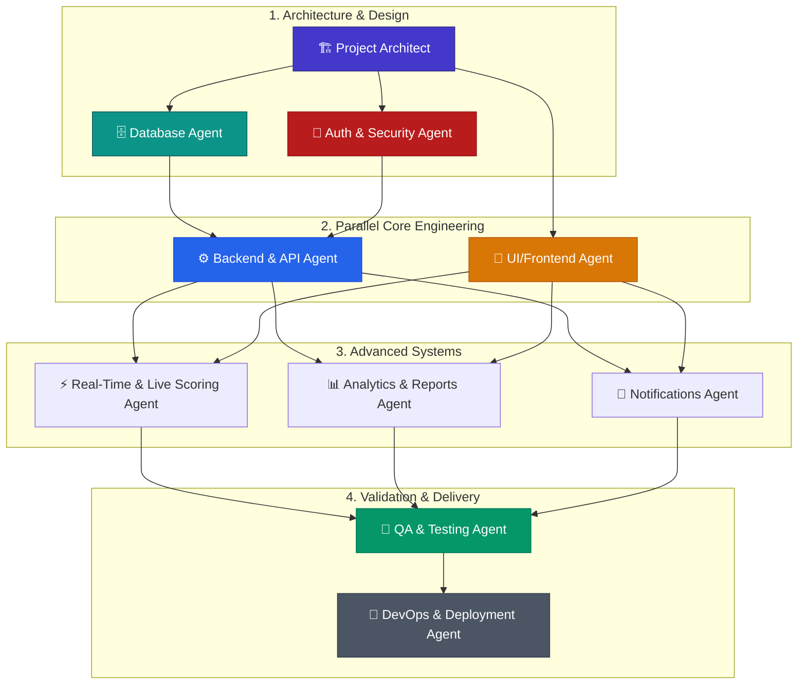

# PlayOps — Multi-Agent Engineering Architecture & Roles

This document defines the specialized AI Agent roles, protocols, collaboration workflows, and responsibilities for building and maintaining the **PlayOps — KK Wagh Sports Portal**.

---

## 📑 Table of Contents
1. [Agent Architecture & Workflow](#agent-architecture--workflow)
2. [Specialized Agent Roles](#specialized-agent-roles)
3. [Agent Collaboration Matrix](#agent-collaboration-matrix)
4. [Agent Communication Protocols](#agent-communication-protocols)
5. [Quality Assurance & Handoff Checklist](#quality-assurance--handoff-checklist)

---

## Agent Architecture & Workflow

The PlayOps project uses a modular multi-agent workflow where specialized agents execute tasks within well-defined operational boundaries.

---

## Specialized Agent Roles

### 1. 🏗️ Project Architect Agent
* **Role Summary:** System design, architecture definition, folder structure, tech stack alignment.
* **Core Responsibilities:**
  * Enforce architectural integrity across Next.js App Router conventions.
  * Define data flow patterns and state management conventions (Zustand + React Server Components).
  * Maintain clean interfaces between modules.
* **Key Deliverables:** Architecture schemas, boundary definitions, interface contracts.

---

### 2. 🗄️ Database & Schema Agent
* **Role Summary:** PostgreSQL schema modeling, Supabase migrations, RLS security policies, index optimization.
* **Core Responsibilities:**
  * Write declarative, idempotent SQL migrations in `supabase/migrations/`.
  * Establish Row-Level Security (RLS) policies for all 14 core tables.
  * Design database triggers for automatic points table updates and match status changes.
  * Optimize relational indexes for high-frequency queries (e.g., live matches, team rosters).
* **Key Deliverables:** SQL migration scripts, seed data generators, RLS verification tests.

---

### 3. 🔐 Auth & Security Agent
* **Role Summary:** Authentication lifecycle, session security, Role-Based Access Control (RBAC).
* **Core Responsibilities:**
  * Configure Supabase Auth with PKCE flow and Google OAuth.
  * Implement Next.js Middleware route guards for `admin`, `player`, and `viewer` roles.
  * Ensure password hashing, JWT validation, CSRF protections, and Zod input sanitization.
* **Key Deliverables:** `middleware.ts`, Auth context providers, RBAC server action utilities.

---

### 4. ⚙️ Backend & API Agent
* **Role Summary:** REST API route handlers, Server Actions, business logic pipelines.
* **Core Responsibilities:**
  * Build Server Actions for type-safe form submissions with Zod validation.
  * Implement REST API routes (`/api/v1/...`) with standard JSON envelopes.
  * Implement tournament fixture generation algorithms (Knockout single elimination & Round Robin).
  * Build points table calculation logic with sport-specific rules (Cricket NRR, Football Goal Diff).
* **Key Deliverables:** API routes in `src/app/api/`, server actions in `src/lib/actions/`, validation schemas in `src/lib/validations/`.

---

### 5. 🎨 UI & Frontend Agent
* **Role Summary:** Modern UI components, responsive layout systems, accessible design tokens.
* **Core Responsibilities:**
  * Build responsive layouts with Tailwind CSS and shadcn/ui components.
  * Design public landing pages, player portals, and administrative dashboards.
  * Ensure 100% mobile responsiveness for touch devices (match officials on field).
  * Implement interactive tournament bracket viewers and live scoreboard widgets.
* **Key Deliverables:** Component library in `src/components/`, pages in `src/app/`.

---

### 6. ⚡ Real-Time & Live Scoring Agent
* **Role Summary:** Supabase Realtime subscriptions, live scoreboard updates, match event broadcasting.
* **Core Responsibilities:**
  * Establish WebSocket channels for live score streams (`matches:live:<match_id>`).
  * Build match official live scoring controls (quick increment buttons, event tagging).
  * Implement optimistic UI updates with automatic fallback sync.
* **Key Deliverables:** Live scoreboard components, Supabase Realtime listeners, scorer control panel.

---

### 7. 📊 Analytics & Reports Agent
* **Role Summary:** Statistical visualizers, performance dashboards, PDF certificate generation.
* **Core Responsibilities:**
  * Build Recharts visualizations for player stats, win/loss ratios, and department participation.
  * Generate dynamic, downloadable PDF certificates using `@react-pdf/renderer`.
  * Create exportable administrative tournament summary reports.
* **Key Deliverables:** Chart widgets in `src/components/charts/`, PDF templates in `src/components/certificates/`.

---

### 8. 🔔 Notifications Agent
* **Role Summary:** In-app notification center and transactional email delivery.
* **Core Responsibilities:**
  * In-app notification feed with unread count badges and mark-as-read actions.
  * Resend email integration for match schedule alerts, tournament registrations, and results.
  * Template design for institutional announcements.
* **Key Deliverables:** Notification drop-down, email templates in `src/lib/emails/`.

---

### 9. 🧪 QA & Testing Agent
* **Role Summary:** Unit testing, component testing, end-to-end integration flows.
* **Core Responsibilities:**
  * Vitest suite for pure business logic (fixture generator, points table math).
  * Playwright E2E suites for auth flows, registration, match score updating.
  * Accessibility and responsive viewport auditing.
* **Key Deliverables:** Test suites in `__tests__/` and `e2e/`.

---

### 10. 🚀 DevOps & Deployment Agent
* **Role Summary:** CI/CD pipeline, Vercel deployment, environment configurations, monitoring.
* **Core Responsibilities:**
  * Configure GitHub Actions workflow for linting, type-checking, and testing.
  * Manage Vercel deployment configurations and Supabase environment variables.
  * Monitor performance and Core Web Vitals.
* **Key Deliverables:** `.github/workflows/ci.yml`, Vercel config, health check endpoint.

---

## Agent Collaboration Matrix

| Feature Module | Lead Agent | Supporting Agents | Reviewing Agent |
| :--- | :--- | :--- | :--- |
| **Database & Migrations** | 🗄️ Database Agent | 🏗️ Architect | 🔐 Security Agent |
| **Authentication & RBAC** | 🔐 Auth Agent | 🎨 Frontend Agent | 🗄️ Database Agent |
| **Player Registration & QR** | 🎨 Frontend Agent | ⚙️ Backend Agent | 🔐 Security Agent |
| **Tournament Fixtures** | ⚙️ Backend Agent | 🎨 Frontend Agent | 🧪 QA Agent |
| **Live Scoring & Realtime** | ⚡ Real-Time Agent | 🎨 Frontend Agent | ⚙️ Backend Agent |
| **Points Table Automation** | 🗄️ Database Agent | ⚙️ Backend Agent | 🧪 QA Agent |
| **Certificates & Reports** | 📊 Analytics Agent | 🎨 Frontend Agent | 🚀 DevOps Agent |
| **Notifications** | 🔔 Notifications Agent | ⚙️ Backend Agent | 🎨 Frontend Agent |

---

## Agent Communication Protocols

1. **Schema First:** No backend or frontend code is written until the Database Agent provides type-checked TypeScript schemas from Supabase.
2. **Type Sharing:** All interfaces must reside in `src/types/` and be imported by both frontend and backend modules.
3. **Zod Validation at Boundaries:** Every Server Action and API Route must validate payloads using Zod schemas before touching the database.
4. **Git Branching Rule:** Each agent works in designated feature branches (`feat/auth`, `feat/tournaments`, `feat/realtime-scores`).
