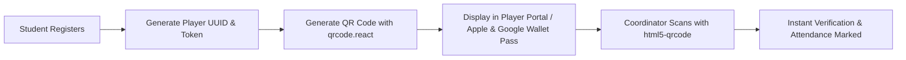
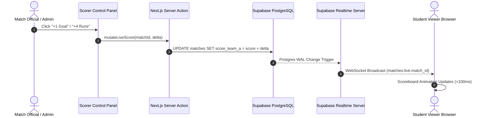

# PlayOps — Advanced Feature Specifications

This document contains in-depth technical specifications, algorithmic designs, data flows, and acceptance criteria for the smart & advanced features of the **PlayOps — KK Wagh Sports Portal**.

---

## 📑 Table of Contents
1. [Feature 1: QR-Based Player Registration & Identity Pass](#1-qr-based-player-registration--identity-pass)
2. [Feature 2: Automatic Tournament Fixture Generation](#2-automatic-tournament-fixture-generation)
3. [Feature 3: Dynamic Points Table & Standings Engine](#3-dynamic-points-table--standings-engine)
4. [Feature 4: Supabase Realtime Live Scoring Engine](#4-supabase-realtime-live-scoring-engine)
5. [Feature 5: Player Performance & Multi-Sport Analytics](#5-player-performance--multi-sport-analytics)
6. [Feature 6: Multi-Channel Smart Notification Hub](#6-multi-channel-smart-notification-hub)
7. [Feature 7: Digital Certificates Generator](#7-digital-certificates-generator)
8. [Feature 8: Smart Venue & Ground Scheduler](#8-smart-venue--ground-scheduler)

---

## 1. QR-Based Player Registration & Identity Pass

### Overview
Every registered student receives a dynamic, tamper-evident digital Sports ID card featuring a QR code. On match days, coordinators scan the QR code via smartphone browser to verify player eligibility and log attendance in under 2 seconds.



### Technical Specs
* **QR Generation Library:** `qrcode.react` (SVG mode with KK Wagh center logo embed).
* **Payload Structure:**
  ```json
  {
    "pid": "550e8400-e29b-41d4-a716-446655440000",
    "regNo": "KKW2024CS045",
    "vSig": "hmac_sha256_signature"
  }
  ```
* **Scanner Component:** HTML5 Camera API (`html5-qrcode`) with torch support and audible beep on successful validation.

### Acceptance Criteria
- [x] QR code renders crisp SVG at any screen resolution and downloads as PNG.
- [x] Scanning instantly opens player profile modal with photo, department, and active tournament registrations.
- [x] Unauthorized tampering displays a red "Invalid Player Pass" alert.

---

## 2. Automatic Tournament Fixture Generation

### Overview
Automated generation of match schedules for both Single Elimination (Knockout) and Round Robin (League) tournaments, with automatic bracket bye handling and venue conflict resolution.

```mermaid
flowchart TD
    A[Tournament Teams: N] --> B{Format Check}
    B -- Knockout --> C[Calculate Next Power of 2: 2^K]
    C --> D[Assign Byes: 2^K - N]
    D --> E[Seed Teams & Generate Tree Brackets]
    B -- League --> F[Round-Robin Polygon Algorithm]
    F --> G[Generate N * (N - 1) / 2 Matches]
    E & G --> H[Assign Date, Time Slots & Ground Venues]
```

### Knockout Bracket Algorithm (TypeScript)
```typescript
export function generateKnockoutFixtures(
  tournamentId: string,
  teamIds: string[],
  startDate: Date,
  venueIds: string[]
): MatchFixture[] {
  const n = teamIds.length;
  const powerOfTwo = Math.pow(2, Math.ceil(Math.log2(n)));
  const numByes = powerOfTwo - n;
  
  // Seed teams with byes
  const seeded = [...teamIds];
  for (let i = 0; i < numByes; i++) {
    seeded.push('BYE');
  }

  const matches: MatchFixture[] = [];
  let matchNumber = 1;
  
  // Round 1 pairs
  for (let i = 0; i < seeded.length; i += 2) {
    const teamA = seeded[i];
    const teamB = seeded[i + 1];
    
    matches.push({
      tournamentId,
      round: 'Round of ' + powerOfTwo,
      matchNumber: matchNumber++,
      teamAId: teamA === 'BYE' ? null : teamA,
      teamBId: teamB === 'BYE' ? null : teamB,
      status: teamA === 'BYE' || teamB === 'BYE' ? 'completed' : 'scheduled',
      winnerId: teamA === 'BYE' ? teamB : (teamB === 'BYE' ? teamA : null),
      matchDate: new Date(startDate.getTime() + (matchNumber * 3600000)),
      venueId: venueIds[matchNumber % venueIds.length]
    });
  }
  return matches;
}
```

---

## 3. Dynamic Points Table & Standings Engine

### Overview
Automatic point computation triggered on match conclusion. Supports sport-specific tiebreakers:
- **Cricket:** Points $\rightarrow$ Net Run Rate (NRR) $\rightarrow$ Head-to-Head.
- **Football / Volleyball:** Points $\rightarrow$ Goal/Set Difference $\rightarrow$ Goals Scored $\rightarrow$ Head-to-Head.

### Standings Calculation Formula
$$\text{Points} = (\text{Wins} \times 3) + (\text{Draws} \times 1) + (\text{Losses} \times 0)$$
$$\text{NRR}_{\text{Cricket}} = \frac{\text{Total Runs Scored}}{\text{Total Overs Faced}} - \frac{\text{Total Runs Conceded}}{\text{Total Overs Bowled}}$$
$$\text{GD}_{\text{Football}} = \text{Goals For (GF)} - \text{Goals Against (GA)}$$

---

## 4. Supabase Realtime Live Scoring Engine

### Overview
Zero-latency score updates for audience and students via Supabase Postgres Changes and WebSocket Broadcast channels.



---

## 5. Player Performance & Multi-Sport Analytics

### Overview
Aggregated performance profiling providing:
- Radar charts for multi-attribute player skills (Attack, Defense, Stamina, Consistency, MVP score).
- Form guide (Last 5 matches: `W W L W W`).
- Head-to-head team comparison visualizer with win probability.

---

## 6. Multi-Channel Smart Notification Hub

### Overview
Trigger-driven notification pipeline:
1. **Tournament Announcement:** Email broadcast to all department captains.
2. **Match Reschedule:** SMS/Email alert to affected team players.
3. **Live Match Start:** In-app browser toast to tournament followers.
4. **Result Publication:** Instant notification with scorecard link.

---

## 7. Digital Certificates Generator

### Overview
On tournament completion, the platform automatically renders signed, high-resolution certificates for Winners, Runners-up, and Best Player awardees.

* **Engine:** `@react-pdf/renderer`
* **Features:**
  * Embedded vector seal of KK Wagh Institute.
  * Digital signature of Principal & Physical Director.
  * Cryptographic verification URL & QR code on the footer of each certificate.
  * Direct one-click PDF download & email dispatch.
