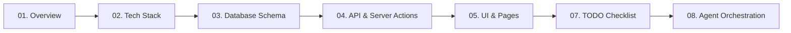

# 🏆 PlayOps — KK Wagh Sports Portal Documentation Suite

Welcome to the comprehensive technical documentation for **PlayOps**, the official digital sports management and tournament ecosystem for **K. K. Wagh Institute of Engineering Education & Research**.

---

## 📚 Documentation Index

| # | Document | Purpose & Scope |
| :---: | :--- | :--- |
| **01** | [**01-PROJECT-OVERVIEW.md**](./01-PROJECT-OVERVIEW.md) | High-level vision, problem statement, core modules, user personas, flow diagrams & NFRs. |
| **02** | [**02-TECH-STACK.md**](./02-TECH-STACK.md) | Full architectural blueprint, Next.js 15 App Router, Supabase, Tailwind CSS, shadcn/ui & third-party tools. |
| **03** | [**03-DATABASE-SCHEMA.md**](./03-DATABASE-SCHEMA.md) | Complete PostgreSQL schema, 14 tables, ER diagrams, foreign key relationships, and RLS security policies. |
| **04** | [**04-API-DESIGN.md**](./04-API-DESIGN.md) | RESTful API endpoints, request/response models, HTTP status codes, and Server Actions patterns. |
| **05** | [**05-PAGES-AND-UI.md**](./05-PAGES-AND-UI.md) | Complete UI map, route groups, wireframes, player & admin dashboard layouts, and design tokens. |
| **06** | [**06-DEVELOPMENT-PHASES.md**](./06-DEVELOPMENT-PHASES.md) | 7-phase agile sprint roadmap from foundational setup to production deployment across 12 weeks. |
| **07** | [**07-TODO.md**](./07-TODO.md) | Granular, prioritized checklist (P0, P1, P2) of all actionable development tasks with status boxes. |
| **08** | [**08-AGENTS.md**](./08-AGENTS.md) | Multi-agent collaboration matrix, engineering roles, handoff protocols, and AI development workflows. |
| **09** | [**09-FEATURE-SPECS.md**](./09-FEATURE-SPECS.md) | In-depth technical specifications for smart features (QR IDs, live scoring, auto-fixtures, points engine, PDF certs). |
| **10** | [**10-CODING-STANDARDS.md**](./10-CODING-STANDARDS.md) | TypeScript guidelines, naming conventions, directory structure, error handling, and security checklist. |

---

## 🚀 Quick Start & Development Flow

---

## 👥 User Roles Summary
1. **Admin / Sports Department:** Full governance, sports creation, tournament & venue management, live scoring, reports.
2. **Player / Student:** Registration, digital QR sports pass, team roster, match schedule, performance radar, certificates.
3. **Viewer / Audience:** Real-time live scoreboard, tournament brackets, points table standings, match highlights.
